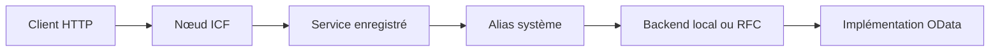

# 2. COMPRENDRE ALIAS, RFC ET ICF

## 2.A RÉSULTAT ATTENDU

Relier une URL OData au service enregistré, à son alias système[^terme-alias] et au backend qui exécute la logique.

## 2.B PRÉREQUIS

- Nom technique et version du service.
- Mandant du système Gateway.
- Autorisation d’afficher `/IWFND/MAINT_SERVICE`, `SICF` et la configuration RFC.

## 2.C CHAÎNE TECHNIQUE

Le nœud ICF[^terme-icf] rend le chemin HTTP accessible. L’enregistrement Gateway associe le nom technique du service à un alias. Dans un scénario hub, cet alias conduit au backend via RFC.

## 2.D RESPONSABILITÉS

| Composant | Preuve attendue | Ne prouve pas |
|---|---|---|
| ICF actif | Le chemin peut être pris en charge | Le service est enregistré |
| Service enregistré | Modèle et service sont affectés | Le backend répond correctement |
| Alias | Une cible logique est sélectionnée | La RFC fonctionne |
| Test RFC | La connexion technique aboutit | L’utilisateur possède les droits métier |
| `$metadata` | Le contrat est accessible | Chaque opération CRUD fonctionne |

## 2.E PROCESS

### 2.E.1 ÉTAPE 1 — RELEVER L’ENREGISTREMENT

1. Vérifier le service dans `/IWFND/MAINT_SERVICE`.
2. Relever le nom technique, la version et l’alias.

### 2.E.2 ÉTAPE 2 — CONTRÔLER ICF

3. Ouvrir l’ICF node associé et contrôler son activation.

### 2.E.3 ÉTAPE 3 — CONTRÔLER LE ROUTAGE

4. Pour un alias distant, tester la destination sans modifier ses identifiants.

### 2.E.4 ÉTAPE 4 — TESTER LE CONTRAT

5. Tester `$metadata` avec `/IWFND/GW_CLIENT`.

## 2.F CONTRÔLE POSITIF

L’appel `$metadata` retourne `200`, l’alias correspond à l’architecture documentée et le code exécuté se trouve dans le backend identifié.

## 2.G CONTRÔLE NÉGATIF

- Désactiver ou modifier un service n’est pas un test acceptable sur un système partagé.
- Utiliser une URI volontairement inconnue pour distinguer un `404` de routage d’une erreur backend.
- Tester l’accès avec un utilisateur sans droit métier pour prouver que le routage ne contourne pas l’autorisation.

## 2.H ERREURS FRÉQUENTES

| Symptôme | Cause possible | Contrôle |
|---|---|---|
| `404` | ICF ou enregistrement absent | Service catalog et nœud |
| Erreur RFC | Alias ou destination | Test technique et journal backend |
| Metadata ancien | Cache ou mauvaise version | Comparer enregistrement et modèle actif |
| `403` | Autorisation | Trace avec l’utilisateur réel |

## 2.I CRITÈRE DE SORTIE

Le diagnostic est terminé lorsque l’URL, le service enregistré, l’alias et le backend sont identifiés sans ambiguïté.

## 2.J COMPATIBILITÉ S/4HANA

La configuration exacte des alias, RFC et modes de traitement dépend du paysage et de la version de `SAP_GWFND`. Ne recopier aucun alias d’un autre environnement.

## 2.K RÉFÉRENCES OFFICIELLES SAP

- [Describing SAP Gateway Deployment Options — SAP Learning](https://learning.sap.com/courses/building-odata-services-with-sap-gateway/describing-sap-gateway-deployment-options)
- [Activate OData Service in the SAP Gateway Hub — SAP Help Portal, 2025 FPS01](https://help.sap.com/docs/PRODUCT_ID/cc0c305d2fab47bd808adcad3ca7ee9d/1b023c1cad774eeb8b85b25c86d94f87.html)

[^terme-alias]: **ALIAS SYSTÈME.** Nom logique utilisé par Gateway pour choisir le système de traitement. Voir [le lexique](<../🧩 00 ├── LEXIQUE ODATA ET SAP GATEWAY/03 ├── SAP GATEWAY ET ADMINISTRATION.md#system-alias>).
[^terme-icf]: **ICF.** Infrastructure ABAP fournissant les nœuds et handlers HTTP. Voir [le lexique](<../🧩 00 ├── LEXIQUE ODATA ET SAP GATEWAY/03 ├── SAP GATEWAY ET ADMINISTRATION.md#icf>).
