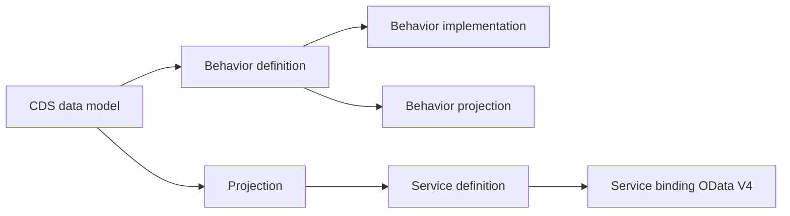

# 1. COMPRENDRE L’EXPOSITION ODATA V4 AVEC RAP

## 1.A RÉSULTAT ATTENDU

Situer OData V4 dans la chaîne de conception RAP[^terme-rap] et son business object[^terme-bo-rap] sans chercher un projet SEGW.

Le résultat est atteint lorsque chaque élément visible dans le metadata peut être relié à sa projection CDS et chaque capacité transactionnelle à son behavior.

## 1.B PRÉREQUIS

- ABAP Development Tools connecté au système cible.
- Version ABAP Platform prenant en charge les artefacts RAP requis.
- Notions CDS, behavior definition et projection.
- Type de consommateur identifié : UI ou Web API.

## 1.C CHAÎNE RAP



La service definition sélectionne les entités exposées. Le service binding relie cette définition à un protocole, notamment OData V4 UI ou Web API. La logique transactionnelle appartient au business object RAP, pas au binding.

## 1.D RESPONSABILITÉS

| Artefact | Responsabilité |
|---|---|
| CDS interface/root view entity | Modèle du business object |
| Behavior definition | Opérations, verrouillage, autorisation, validations et actions |
| Behavior implementation | Code des comportements non fournis par le runtime |
| Projection CDS | Contrat spécifique au service |
| Behavior projection | Comportements rendus publics |
| Metadata extension | Annotations propres à la consommation |
| Service definition | Liste et alias des entités exposées |
| Service binding | Protocole, type de service et endpoint |

## 1.E CHOIX DU BINDING

- **UI** : consommation orientée SAP Fiori elements.
- **Web API** : contrat destiné à une consommation d’API.
- **V4** : à privilégier pour un nouveau service transactionnel lorsque le consommateur et la plateforme le supportent.
- **V2** : utiliser lorsqu’une contrainte de consommateur ou de compatibilité l’impose.

## 1.F EXEMPLE DE BEHAVIOR PROJECTION

```abap
projection;
strict ( 2 );

define behavior for ZC_SalesOrder alias SalesOrder
use etag
{
  use create;
  use update;
  use delete;
  use action release;
  use association _Items { create; }
}

define behavior for ZC_SalesOrderItem alias SalesOrderItem
use etag
{
  use update;
  use delete;
  use association _SalesOrder;
}
```

Ce fragment suppose que les comportements, l’action `release`, les associations et l’ETag existent dans le behavior d’interface. Retirer toute capacité qui ne doit pas appartenir au contrat public.

## 1.G PROCESS

### 1.G.1 ÉTAPE 1 — PARTIR DU BESOIN

Définir ressources, opérations, consommateur, exigences draft et version OData. Ne pas choisir V4 uniquement parce qu’il est plus récent.

### 1.G.2 ÉTAPE 2 — SUIVRE LE BUSINESS OBJECT

Ouvrir la projection, remonter au modèle d’interface et lire le behavior. Relever managed/unmanaged, draft, verrouillage, ETag, authorization et actions.

### 1.G.3 ÉTAPE 3 — SUIVRE L’EXPOSITION

Ouvrir la service definition, relever les alias, puis ouvrir le binding et relever son type exact.

### 1.G.4 ÉTAPE 4 — CONTRÔLER LE CONTRAT

Publier localement lorsque cela est autorisé, lire le metadata, tester une lecture puis les comportements exposés.

## 1.H CONTRÔLE

Le service est traçable depuis le binding vers la service definition, les projections, le business object et les entités CDS sources.

Cas négatif : une action non projetée ne doit pas apparaître dans le contrat. Une entité CDS non exposée dans la service definition ne doit pas devenir adressable par le binding.

## 1.I ERREURS FRÉQUENTES

- Implémenter de la logique métier dans la couche d’exposition.
- Exposer directement les entités d’interface au lieu d’une projection stable.
- Oublier la behavior projection.
- Confondre publication locale et activation productive.
- Choisir un binding UI pour une API d’intégration sans analyser le contrat.

## 1.J COMPATIBILITÉ S/4HANA

SAP Learning indique que les service definitions et service bindings sont disponibles à partir d’ABAP Platform 7.54. Les fonctionnalités RAP exactes dépendent de la release. SAP Help recommande OData V4 lorsque possible pour les services transactionnels.

## 1.K RÉFÉRENCES OFFICIELLES SAP

- [Understanding RAP — SAP Learning](https://learning.sap.com/courses/building-transactional-apps-with-the-abap-restful-application-programming-model/exploring-the-concept-and-architecture-of-rap)
- [Explaining SAP Gateway Services Based on CDS Views — SAP Learning](https://learning.sap.com/courses/building-odata-services-with-sap-gateway/explaining-sap-gateway-services-based-on-cds-views)
- [Service Binding — ABAP RESTful Application Programming Model](https://help.sap.com/docs/abap-cloud/abap-rap/service-binding)

[^terme-rap]: **RAP.** ABAP RESTful Application Programming Model fondé sur CDS, ABAP et des business services. Voir [le lexique](<../🧩 00 ├── LEXIQUE ODATA ET SAP GATEWAY/06 └── RAP ET ODATA V4.md#rap>).
[^terme-bo-rap]: **BUSINESS OBJECT RAP.** Ensemble d’entités CDS et de comportements formant une unité cohérente. Voir [le lexique](<../🧩 00 ├── LEXIQUE ODATA ET SAP GATEWAY/06 └── RAP ET ODATA V4.md#business-object-rap>).
