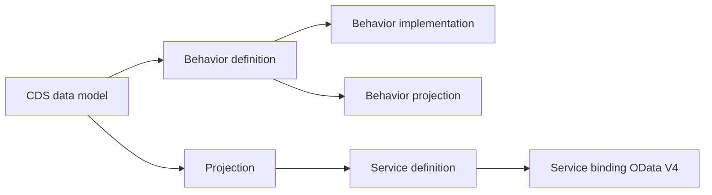

# 1. COMPRENDRE L’EXPOSITION ODATA V4 AVEC RAP

## 1.A RÉSULTAT ATTENDU

Situer OData V4 dans la chaîne de conception RAP sans chercher un projet SEGW.

## 1.B CHAÎNE RAP

La service definition sélectionne les entités exposées. Le service binding relie cette définition à un protocole, notamment OData V4 UI ou Web API. La logique transactionnelle appartient au business object RAP, pas au binding.

## 1.C CHOIX DU BINDING

- **UI** : consommation orientée SAP Fiori elements.
- **Web API** : contrat destiné à une consommation d’API.
- **V4** : à privilégier pour un nouveau service transactionnel lorsque le consommateur et la plateforme le supportent.
- **V2** : utiliser lorsqu’une contrainte de consommateur ou de compatibilité l’impose.

## 1.D CONTRÔLE

Le service est traçable depuis le binding vers la service definition, les projections, le business object et les entités CDS sources.

## 1.E RÉFÉRENCE OFFICIELLE SAP

- [Service Binding — ABAP RESTful Application Programming Model](https://help.sap.com/docs/abap-cloud/abap-rap/service-binding)
