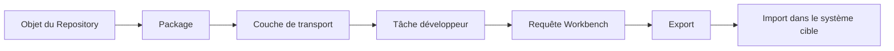
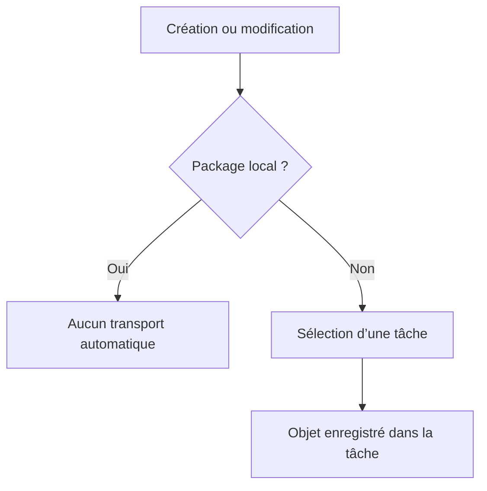

# PACKAGES ET ORDRES DE TRANSPORT

## RÉSULTAT ATTENDU

- Comprendre le rôle d’un package ABAP
- Distinguer objet local et objet transportable
- Comprendre la structure requête/tâche d’un ordre de transport
- Différencier requête Workbench et requête de Customizing
- Appliquer une séquence de transport sûre

## VUE D’ENSEMBLE



## PACKAGE ABAP

Un package organise les objets du Repository qui appartiennent à un même périmètre technique ou applicatif.

Il porte notamment des informations utiles pour :

- la structuration du Repository ;
- l’affectation à un composant applicatif ;
- le transport des objets ;
- les dépendances entre packages lorsque le concept de package est utilisé complètement.

> [!IMPORTANT]
> Le package n’est pas un simple dossier visuel. Il participe au cycle de vie et au transport des objets.

## PACKAGE LOCAL `$TMP`

Le package `$TMP` est destiné aux objets locaux non transportés.

Utilisations adaptées :

- prototype jetable ;
- test personnel ;
- programme temporaire ;
- démonstration qui ne doit pas quitter le système.

Utilisations inadaptées :

- correction devant être livrée ;
- objet consommé par une application transportée ;
- développement devant passer en qualité ou en production.

Un objet local peut être réaffecté ultérieurement à un package transportable avec les outils du Workbench.

## PACKAGE TRANSPORTABLE

Lors de la création d’un objet dans un package transportable, SAP demande généralement un ordre de transport.

Le package détermine la couche de transport et donc la route logique utilisée dans le paysage SAP.



## STRUCTURE D’UN ORDRE DE TRANSPORT

Une requête Workbench contient généralement une ou plusieurs tâches.

```text
Requête Workbench
├── Tâche du développeur A
│   ├── Objet 1
│   └── Objet 2
└── Tâche du développeur B
    └── Objet 3
```

| Niveau         | Rôle                                           |
| -------------- | ---------------------------------------------- |
| Requête        | Regroupe la livraison transportable            |
| Tâche          | Enregistre les modifications d’un propriétaire |
| Liste d’objets | Contient les entrées techniques à exporter     |

La tâche doit être libérée avant la requête parente.

## WORKBENCH ET CUSTOMIZING

### REQUÊTE WORKBENCH

Elle transporte principalement les objets du Repository et certaines données dépendantes de la configuration technique.

Exemples :

- programmes ;
- classes ;
- objets du Dictionnaire ;
- modules fonction ;
- objets de service ou d’extension selon leur technologie.

### REQUÊTE DE CUSTOMIZING

Elle transporte principalement du paramétrage dépendant du mandant lorsque ce paramétrage est enregistré dans le système de transport.

> [!NOTE]
> Un développeur ABAP travaille surtout avec des requêtes Workbench, mais doit reconnaître les deux catégories pour éviter de mélanger code et paramétrage sans justification.

## TRANSACTIONS PRINCIPALES

| Transaction | Usage principal                                                             |
| ----------- | --------------------------------------------------------------------------- |
| `SE09`      | Transport Organizer orienté Workbench                                       |
| `SE10`      | Vue étendue du Transport Organizer                                          |
| `SE03`      | Outils d’administration et d’analyse du système de transport                |
| `STMS`      | Administration des routes et imports, généralement gérée par l’équipe Basis |

Les fonctions exactes accessibles dépendent des autorisations.

## SÉQUENCE DE TRAVAIL

1. identifier le package cible ;
2. sélectionner ou créer la requête adaptée au périmètre de livraison ;
3. affecter la modification à sa propre tâche ;
4. contrôler la liste d’objets ;
5. terminer les développements et les tests ;
6. libérer les tâches ;
7. libérer la requête ;
8. faire importer la requête selon le processus projet ;
9. vérifier les journaux d’export et d’import.


## CONTRÔLES AVANT LIBÉRATION

- la requête correspond au bon projet ou ticket ;
- aucun objet sans rapport n’est présent ;
- les objets dépendants sont inclus ;
- les objets sont activés ;
- les contrôles techniques ont été exécutés ;
- les dépendances avec d’autres transports sont connues ;
- l’ordre d’import est défini si plusieurs requêtes sont liées.

> [!CAUTION]
> Après libération d’une requête, sa liste d’objets ne doit plus être considérée comme un espace de travail modifiable. Une correction supplémentaire doit être enregistrée dans une autre requête selon le processus du projet.

## ERREURS FRÉQUENTES

| Erreur                                              | Conséquence                                      |
| --------------------------------------------------- | ------------------------------------------------ |
| Développer dans `$TMP` par défaut                   | Objet absent du transport                        |
| Réutiliser une requête sans contrôler son périmètre | Livraison de changements non liés                |
| Oublier un objet dépendant                          | Erreur d’activation ou d’exécution dans la cible |
| Libérer dans le mauvais ordre                       | Dépendance non satisfaite                        |
| Transporter sans test après import                  | Défaut découvert tardivement                     |

## PROCÉDURE PAS À PAS

1. Lors de la sauvegarde d’un objet, saisir le package fourni par le projet ; utiliser `$TMP` uniquement pour un objet local autorisé.
2. Sélectionner une tâche existante ou créer l’ordre demandé selon les règles de l’équipe.
3. Ouvrir `/nSE09` ou `/nSE10`.
4. Rechercher l’ordre par propriétaire ou numéro.
5. Développer la tâche et contrôler la liste des objets enregistrés.
6. Vérifier que les objets dépendants nécessaires sont inclus dans un ordre cohérent.
7. Avant libération, effectuer contrôle syntaxique, activation et tests.
8. Libérer d’abord la tâche, puis l’ordre parent uniquement lorsque la livraison est autorisée.

## VÉRIFICATION

- Le lecteur peut expliquer la différence entre cette notion et les concepts proches.
- Le choix technique est justifié par un besoin concret, pas uniquement par habitude.
- Les limites liées à la release, aux autorisations et au contexte d’exécution sont identifiées.

## FICHE DE CONTRÔLE À COPIER

```text
Système / SID       :
Mandant             :
Utilisateur         :
Transaction / outil :
Objet technique     :
Jeu de données      :
Résultat attendu    :
Résultat observé    :
Horodatage          :
Ordre de transport  :
```

## TERMES DU LEXIQUE

- [Package](<../🧩 00 ├── LEXIQUE SAP ET ABAP/03 ├── REPOSITORY PACKAGES ET TRANSPORTS.md#package>)
- [Système SAP](<../🧩 00 ├── LEXIQUE SAP ET ABAP/01 ├── SYSTEMES ENVIRONNEMENTS ET MANDANTS.md#systeme-sap>)
- [Mandant](<../🧩 00 ├── LEXIQUE SAP ET ABAP/01 ├── SYSTEMES ENVIRONNEMENTS ET MANDANTS.md#mandant>)
- [SAP GUI](<../🧩 00 ├── LEXIQUE SAP ET ABAP/02 ├── SAP GUI NAVIGATION ET TRANSACTIONS.md#sap-gui>)
- [Transaction](<../🧩 00 ├── LEXIQUE SAP ET ABAP/02 ├── SAP GUI NAVIGATION ET TRANSACTIONS.md#transaction>)
- [Repository ABAP](<../🧩 00 ├── LEXIQUE SAP ET ABAP/03 ├── REPOSITORY PACKAGES ET TRANSPORTS.md#repository-abap>)

## RÉFÉRENCES OFFICIELLES SAP

- [Transport Organizer — Concept](https://help.sap.com/docs/ABAP_PLATFORM_BW4HANA/4a368c163b08418890a406d413933ba7/5738dd924eb711d182bf0000e829fbfe.html)
- [Object Directory](https://help.sap.com/docs/ABAP_PLATFORM_NEW/4a368c163b08418890a406d413933ba7/5738e06c4eb711d182bf0000e829fbfe.html)
- [Creating Main Packages](https://help.sap.com/docs/ABAP_PLATFORM_NEW/bd833c8355f34e96a6e83096b38bf192/eac05d8cf01011d3964000a0c94260a5.html)
- [Assigning an Object to a Different Package](https://help.sap.com/docs/SAP_NETWEAVER_AS_ABAP_752/bd833c8355f34e96a6e83096b38bf192/d1801972454211d189710000e8322d00.html)


---

[Chapitre suivant — ÉDITEURS ABAP `SE38` ET `SE80`](<./04 ├── EDITEURS ABAP SE38 ET SE80.md>)
