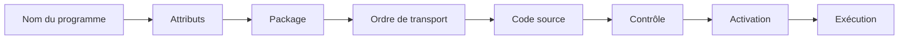
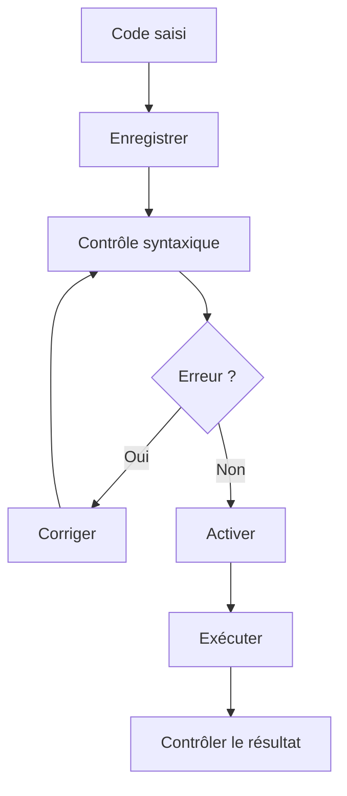

# CRÉATION D’UN PREMIER PROGRAMME

## RÉSULTAT ATTENDU

- Créer un programme exécutable dans SAP GUI
- L’affecter au bon package et au bon ordre de transport
- Saisir un code ABAP minimal
- Contrôler, activer et exécuter le programme
- Identifier les artefacts créés autour du programme

## VUE D’ENSEMBLE



## PRÉREQUIS

Avant de créer le programme, disposer de :

- l’environnement de développement correct ;
- l’autorisation de créer des objets du Repository ;
- la convention de nommage du projet ;
- un package cible ;
- une requête Workbench adaptée ;
- un objectif de test clairement défini.

## NOM DU PROGRAMME

Un développement client utilise généralement un nom commençant par `Z` ou `Y`, sauf utilisation d’un espace de noms enregistré.

Exemple :

```text
ZDEMO_FONDAMENTAUX_ABAP
```

Le nom doit être :

- explicite ;
- stable ;
- cohérent avec le projet ;
- conforme aux règles internes ;
- suffisamment spécifique pour éviter les collisions.

## CRÉATION AVEC `SE38`

1. ouvrir la transaction `SE38` ;
2. saisir le nom du programme ;
3. choisir **Créer** ;
4. renseigner une description courte ;
5. sélectionner le type **Programme exécutable** ;
6. enregistrer ;
7. affecter le programme au package prévu ;
8. sélectionner la tâche de transport ;
9. saisir le code source ;
10. contrôler, activer et exécuter.

Les libellés exacts peuvent varier selon la version du système et la langue de connexion.

## CRÉATION AVEC `SE80`

1. ouvrir la transaction `SE80` ;
2. sélectionner le Repository Browser ;
3. afficher le package cible ;
4. créer un programme depuis le menu contextuel du package ;
5. renseigner les attributs ;
6. affecter l’objet à la tâche de transport ;
7. ouvrir le code source ;
8. contrôler, activer et exécuter.

Cette approche permet de créer directement l’objet dans son contexte applicatif.

## CODE MINIMAL

```abap
REPORT zdemo_fondamentaux_abap.

WRITE / 'Premier programme ABAP'.
```

### ANALYSE

```abap
REPORT zdemo_fondamentaux_abap.
```

- `REPORT` introduit un programme exécutable ;
- le nom doit correspondre au programme du Repository ;
- l’instruction se termine par un point.

```abap
WRITE / 'Premier programme ABAP'.
```

- `WRITE` produit une sortie de liste classique ;
- `/` commence une nouvelle ligne ;
- le texte est un littéral caractère.

> [!NOTE]
> Ce programme utilise volontairement une sortie de liste classique. Les technologies d’interface utilisateur et de restitution structurée seront traitées séparément.

## VERSION AVEC PARAMÈTRE

```abap
REPORT zdemo_fondamentaux_abap.

PARAMETERS p_name TYPE c LENGTH 30 LOWER CASE.

START-OF-SELECTION.
  WRITE: / 'Bonjour', p_name.
```

Ce programme :

1. génère un écran de sélection standard ;
2. récupère une valeur dans `p_name` ;
3. exécute le bloc `START-OF-SELECTION` ;
4. affiche le résultat dans une liste classique.

## CONTRÔLE, ACTIVATION ET EXÉCUTION



L’exécution n’est pas une preuve de conformité fonctionnelle. Elle confirme uniquement que le scénario testé a pu atteindre un résultat sans erreur bloquante visible.

## OBJETS ET INFORMATIONS À CONTRÔLER

Après création :

- nom et description du programme ;
- type de programme ;
- package ;
- tâche de transport ;
- statut actif ;
- textes de sélection si des paramètres existent ;
- documentation technique si le projet l’exige ;
- autorisations nécessaires à l’exécution.

## ERREURS FRÉQUENTES

| Situation                           | Cause probable                                     |
| ----------------------------------- | -------------------------------------------------- |
| Le programme n’est pas transporté   | Affectation à `$TMP`                               |
| L’ancienne version s’exécute        | Modifications enregistrées mais non activées       |
| Le programme ne s’exécute pas       | Type de programme incorrect ou erreur d’activation |
| Le texte du paramètre est technique | Texte de sélection non maintenu                    |
| La création est refusée             | Autorisation, verrou ou client non modifiable      |

## PROCÉDURE PAS À PAS

1. Saisir `/nSE38`.
2. Entrer `ZREF_HELLO_WORLD` puis choisir **Créer**.
3. Saisir un titre et sélectionner le type **Programme exécutable**.
4. Affecter `$TMP` pour un exercice local autorisé, ou le package et l’ordre fournis par le projet.
5. Saisir le code du snippet du chapitre.
6. Exécuter le contrôle syntaxique avec `Ctrl+F2` et corriger chaque erreur.
7. Activer avec `Ctrl+F3`.
8. Exécuter avec `F8`.
9. Vérifier la sortie puis modifier une valeur, réactiver et confirmer que la version exécutée change.

## VÉRIFICATION

- Le contrôle syntaxique réussit.
- La version active correspond au code sauvegardé.
- L’exécution produit le résultat décrit dans le chapitre.
- Les cas vide, limite et erreur sont testés séparément lorsque la syntaxe le permet.

## SNIPPET À RÉUTILISER

> [!NOTE]
> Adapter les noms `Z*`, les types DDIC, les données et les autorisations au système cible. Effectuer un contrôle syntaxique avant activation.

```abap
REPORT zdemo_fondamentaux_abap.

PARAMETERS p_name TYPE c LENGTH 30 LOWER CASE.

START-OF-SELECTION.
  WRITE: / 'Bonjour', p_name.
```

## TERMES DU LEXIQUE

- [Système SAP](<../🧩 00 ├── LEXIQUE SAP ET ABAP/01 ├── SYSTEMES ENVIRONNEMENTS ET MANDANTS.md#systeme-sap>)
- [Mandant](<../🧩 00 ├── LEXIQUE SAP ET ABAP/01 ├── SYSTEMES ENVIRONNEMENTS ET MANDANTS.md#mandant>)
- [SAP GUI](<../🧩 00 ├── LEXIQUE SAP ET ABAP/02 ├── SAP GUI NAVIGATION ET TRANSACTIONS.md#sap-gui>)
- [Transaction](<../🧩 00 ├── LEXIQUE SAP ET ABAP/02 ├── SAP GUI NAVIGATION ET TRANSACTIONS.md#transaction>)
- [Repository ABAP](<../🧩 00 ├── LEXIQUE SAP ET ABAP/03 ├── REPOSITORY PACKAGES ET TRANSPORTS.md#repository-abap>)
- [Package](<../🧩 00 ├── LEXIQUE SAP ET ABAP/03 ├── REPOSITORY PACKAGES ET TRANSPORTS.md#package>)

## RÉFÉRENCES OFFICIELLES SAP

- [Creating a Program](https://help.sap.com/docs/ABAP_PLATFORM_NEW/bd833c8355f34e96a6e83096b38bf192/d1801a47454211d189710000e8322d00-65.html)
- [REPORT — ABAP Keyword Documentation](https://help.sap.com/doc/abapdocu_latest_index_htm/latest/en-US/ABAPREPORT.html)
- [ABAP Source Code Editor](https://help.sap.com/docs/ABAP_PLATFORM_NEW/c238d694b825421f940829321ffa326a/9ac600a0fad14967aaf2964be5a21963.html)


---

[Chapitre suivant — STRUCTURE D’UN PROGRAMME ABAP](<./06 ├── STRUCTURE D UN PROGRAMME ABAP.md>)
