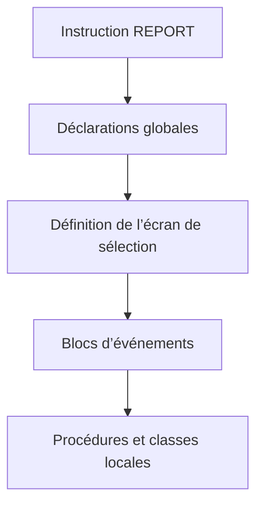
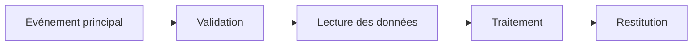

# 6. STRUCTURE D’UN PROGRAMME ABAP

## 6.A RÉSULTAT ATTENDU

- Identifier les grandes parties d’un programme exécutable
- Distinguer partie déclarative et blocs de traitement
- Comprendre le rôle de l’instruction d’introduction
- Organiser le code dans un ordre lisible
- Éviter les traitements implicites difficiles à maintenir

## 6.B VUE D’ENSEMBLE



## 6.C INSTRUCTION D’INTRODUCTION

Un programme autonome commence par une instruction d’introduction correspondant à son type.

Pour un programme exécutable :

```abap
REPORT znom_du_programme.
```

`REPORT` doit être la première instruction du programme autonome après résolution des éventuels includes.

## 6.D PARTIE DÉCLARATIVE

La partie déclarative définit les types et objets de données nécessaires au programme.

Exemple :

```abap
REPORT zdemo_structure.

CONSTANTS gc_limit TYPE i VALUE 100.

DATA gv_counter TYPE i.
DATA gv_text    TYPE string.
```

Les déclarations peuvent être globales au programme ou locales à une procédure. Les règles complètes de portée seront traitées dans le dossier consacré aux types et objets de données.

## 6.E ÉCRAN DE SÉLECTION

Dans un programme exécutable, les instructions suivantes peuvent définir l’écran de sélection standard :

- `PARAMETERS` ;
- `SELECT-OPTIONS` ;
- `SELECTION-SCREEN`.

Exemple :

```abap
PARAMETERS p_limit TYPE i DEFAULT 10.
```

Ces instructions appartiennent à la partie déclarative globale du programme.

## 6.F BLOCS DE TRAITEMENT

Le comportement d’un programme ABAP est organisé en blocs de traitement.

Principales catégories :

- blocs d’événements ;
- procédures ;
- modules de dialogue ;
- méthodes.

Dans un programme exécutable simple, le bloc principal est généralement :

```abap
START-OF-SELECTION.
  WRITE / 'Traitement principal'.
```

Un bloc d’événement commence par un mot-clé d’événement et se termine au début du bloc suivant.

## 6.G ORDRE RECOMMANDÉ

```abap
REPORT zdemo_structure.

" Types locaux
TYPES ty_code TYPE c LENGTH 10.

" Constantes
CONSTANTS gc_default_limit TYPE i VALUE 10.

" Données globales
DATA gv_count TYPE i.

" Écran de sélection
PARAMETERS p_limit TYPE i DEFAULT gc_default_limit.

" Initialisation de l’écran
INITIALIZATION.
  p_limit = gc_default_limit.

" Validation de l’écran
AT SELECTION-SCREEN ON p_limit.
  IF p_limit <= 0.
    MESSAGE 'La limite doit être supérieure à zéro' TYPE 'E'.
  ENDIF.

" Traitement principal
START-OF-SELECTION.
  gv_count = p_limit.
  WRITE: / 'Limite :', gv_count.
```

Cette organisation rend le cycle d’exécution visible sans parcourir tout le programme.

## 6.H TRAITEMENT IMPLICITE

Dans un programme exécutable, des instructions exécutables placées avant le premier bloc d’événement peuvent être affectées à un bloc implicite `START-OF-SELECTION`.

Exemple à éviter :

```abap
REPORT zdemo_implicite.

DATA gv_value TYPE i VALUE 5.

WRITE gv_value.

START-OF-SELECTION.
  WRITE / 'Suite'.
```

Préférer un bloc explicite :

```abap
REPORT zdemo_explicite.

DATA gv_value TYPE i VALUE 5.

START-OF-SELECTION.
  WRITE: / gv_value,
         / 'Suite'.
```

> [!IMPORTANT]
> Le code explicite réduit les ambiguïtés sur l’ordre d’exécution.

## 6.I INCLUDES

Une instruction `INCLUDE` insère le contenu d’un include dans le programme lors de la génération.

```abap
INCLUDE zdemo_top.
INCLUDE zdemo_f01.
```

Les includes sont fréquents dans les développements classiques, notamment les programmes avec écrans. Ils peuvent améliorer la navigation d’un programme volumineux, mais ne constituent pas une modularisation d’exécution à eux seuls.

> [!CAUTION]
> Un découpage excessif en includes peut masquer les dépendances globales et rendre le programme difficile à analyser.

## 6.J PROGRAMME PRINCIPAL ET PROCÉDURES

Un programme maintenable sépare :

- l’orchestration ;
- les validations ;
- les accès aux données ;
- les traitements métier ;
- la restitution.

Dans les développements modernes, cette séparation repose principalement sur des classes et méthodes. Les mécanismes procéduraux classiques seront documentés dans un dossier dédié.



## 6.K RÈGLES D’ORGANISATION

- placer les déclarations avant les blocs de traitement ;
- rendre les événements principaux explicites ;
- limiter les données globales ;
- éviter le code métier directement dispersé dans plusieurs événements ;
- regrouper les responsabilités cohérentes ;
- ne pas utiliser un include pour contourner une conception insuffisante ;
- préférer des noms techniques explicites.

## 6.L VÉRIFICATION

- Le contrôle syntaxique réussit.
- La version active correspond au code sauvegardé.
- L’exécution produit le résultat décrit dans le chapitre.
- Les cas vide, limite et erreur sont testés séparément lorsque la syntaxe le permet.

## 6.M ERREURS FRÉQUENTES

- Copier un exemple sans adapter les types, noms d’objets et données disponibles dans le système.
- Tester uniquement le cas nominal et ignorer les valeurs initiales, absentes ou invalides.
- Intervenir dans le mauvais système ou mandant.
- Confondre sauvegarde et activation.

## 6.N SNIPPET À RÉUTILISER

> [!NOTE]
> Adapter les noms `Z*`, les types DDIC, les données et les autorisations au système cible. Effectuer un contrôle syntaxique avant activation.

```abap
REPORT zdemo_structure.

" Types locaux
TYPES ty_code TYPE c LENGTH 10.

" Constantes
CONSTANTS gc_default_limit TYPE i VALUE 10.

" Données globales
DATA gv_count TYPE i.

" Écran de sélection
PARAMETERS p_limit TYPE i DEFAULT gc_default_limit.

" Initialisation de l’écran
INITIALIZATION.
  p_limit = gc_default_limit.

" Validation de l’écran
AT SELECTION-SCREEN ON p_limit.
  IF p_limit <= 0.
    MESSAGE 'La limite doit être supérieure à zéro' TYPE 'E'.
  ENDIF.

" Traitement principal
START-OF-SELECTION.
  gv_count = p_limit.
  WRITE: / 'Limite :', gv_count.
```

## 6.O TERMES DU LEXIQUE

- [ABAP](<../🧩 00 ├── LEXIQUE SAP ET ABAP/10 └── ACRONYMES SAP.md#acro-abap>)
- [Structure](<../🧩 00 ├── LEXIQUE SAP ET ABAP/04 ├── LANGAGE ET DEVELOPPEMENT ABAP.md#structure-abap>)
- [Système SAP](<../🧩 00 ├── LEXIQUE SAP ET ABAP/01 ├── SYSTEMES ENVIRONNEMENTS ET MANDANTS.md#systeme-sap>)
- [Mandant](<../🧩 00 ├── LEXIQUE SAP ET ABAP/01 ├── SYSTEMES ENVIRONNEMENTS ET MANDANTS.md#mandant>)
- [SAP GUI](<../🧩 00 ├── LEXIQUE SAP ET ABAP/02 ├── SAP GUI NAVIGATION ET TRANSACTIONS.md#sap-gui>)
- [Transaction](<../🧩 00 ├── LEXIQUE SAP ET ABAP/02 ├── SAP GUI NAVIGATION ET TRANSACTIONS.md#transaction>)

## 6.P RÉFÉRENCES OFFICIELLES SAP

- [Program Layout — ABAP Keyword Documentation](https://help.sap.com/doc/abapdocu_750_index_htm/7.50/en-US/abenabap_program_layout.htm)
- [REPORT — ABAP Keyword Documentation](https://help.sap.com/doc/abapdocu_latest_index_htm/latest/en-US/ABAPREPORT.html)
- [Event Control](https://help.sap.com/docs/ABAP_PLATFORM_NEW/7bfe8cdcfbb040dcb6702dada8c3e2f0/0b32146b63054bb293de32877a6ebfe9.html)
- [ABAP Statements — Overview](https://help.sap.com/doc/abapdocu_latest_index_htm/latest/en-US/ABENABAP_STATEMENTS_OVERVIEW.html)


---

[Chapitre suivant — SYNTAXE DES INSTRUCTIONS](<./07 ├── SYNTAXE DES INSTRUCTIONS.md>)
