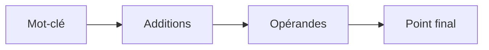

# SYNTAXE DES INSTRUCTIONS

## RÉSULTAT ATTENDU

- Comprendre la structure d’une instruction ABAP
- Utiliser correctement les points, espaces, littéraux et opérateurs
- Distinguer mots-clés, additions et opérandes
- Reconnaître les instructions chaînées
- Utiliser la documentation des mots-clés compatible avec le système

## VUE D’ENSEMBLE



## INSTRUCTION ABAP

Une instruction ABAP est composée de jetons syntaxiques :

- mots-clés ;
- additions ;
- opérandes ;
- opérateurs ;
- caractères spéciaux.

Elle se termine par un point.

```abap
DATA gv_total TYPE i.

gv_total = 2 + 3.
```

Dans cet exemple :

- `DATA` est un mot-clé déclaratif ;
- `TYPE` est une addition ;
- `gv_total` et `i` sont des opérandes selon le contexte ;
- `=` et `+` sont des opérateurs ;
- `.` termine l’instruction.

## ESPACES ET LIGNES

Les mots d’une instruction sont séparés par au moins un espace lorsqu’aucun caractère syntaxique ne joue ce rôle.

Une instruction peut tenir sur plusieurs lignes :

```abap
WRITE: / 'Système :', sy-sysid,
       / 'Mandant :', sy-mandt,
       / 'Utilisateur :', sy-uname.
```

Une ligne peut aussi contenir plusieurs instructions, mais cette forme réduit généralement la lisibilité :

```abap
DATA gv_a TYPE i. DATA gv_b TYPE i.
```

Préférer :

```abap
DATA gv_a TYPE i.
DATA gv_b TYPE i.
```

## CASSE

Les mots-clés et identifiants ABAP ne sont généralement pas sensibles à la casse.

Ces formes désignent le même identifiant :

```abap
gv_value = 1.
GV_VALUE = 1.
```

Le contenu des littéraux reste toutefois significatif :

```abap
DATA(gv_upper) = 'SAP'.
DATA(gv_lower) = 'sap'.
```

> [!NOTE]
> La déclaration inline ci-dessus dépend de la version ABAP. Elle est utilisée uniquement pour illustrer la différence de contenu entre deux littéraux.

## LITTÉRAUX

### LITTÉRAL CARACTÈRE

```abap
WRITE 'Texte'.
```

Les espaces finaux d’un littéral de type texte peuvent être traités selon les règles du type cible.

### LITTÉRAL CHAÎNE

```abap
DATA gv_text TYPE string.
gv_text = `Texte avec espaces finaux  `.
```

Les accents graves délimitent un littéral de type chaîne.

### MODÈLE DE CHAÎNE

```abap
DATA gv_name TYPE string VALUE `SAP`.
WRITE |Nom : { gv_name }|.
```

Les modèles de chaîne permettent d’insérer des expressions entre accolades. Leur disponibilité dépend de la version ABAP du système.

## INSTRUCTIONS CHAÎNÉES

Le caractère `:` permet de factoriser le début de plusieurs instructions, séparées par des virgules.

```abap
DATA: gv_count TYPE i,
      gv_text  TYPE string.
```

Équivalent :

```abap
DATA gv_count TYPE i.
DATA gv_text  TYPE string.
```

Chaînage de sortie :

```abap
WRITE: / 'A',
       / 'B'.
```

> [!CAUTION]
> Ne pas chaîner des instructions complexes uniquement pour réduire le nombre de lignes. La lisibilité prime sur la compacité.

## PONCTUATION ET SÉLECTEURS

| Élément | Usage courant                                                   |
| ------- | --------------------------------------------------------------- |
| `.`     | Fin d’instruction                                               |
| `,`     | Séparation dans une instruction chaînée ou une liste syntaxique |
| `:`     | Début de chaînage                                               |
| `-`     | Accès à un composant de structure, par exemple `sy-subrc`       |
| `->`    | Accès à un composant d’instance                                 |
| `=>`    | Accès à un composant statique                                   |
| `[]`    | Accès ou désignation liée aux tables internes selon la syntaxe  |
| `()`    | Appel fonctionnel ou regroupement selon le contexte             |

Les sélecteurs orientés objet et les expressions de table seront développés dans leurs dossiers dédiés.

## CONTRÔLE SYNTAXIQUE

Le contrôle syntaxique vérifie notamment :

- la conformité grammaticale ;
- l’existence des objets référencés ;
- la compatibilité de nombreux types ;
- certaines règles de contexte ;
- la complétude des blocs.

Il ne garantit pas :

- la justesse fonctionnelle ;
- la performance ;
- l’absence d’erreur d’autorisation ;
- la couverture de tous les cas de données ;
- la sécurité du traitement.

## DOCUMENTATION DES MOTS-CLÉS

La documentation accessible depuis le système doit être privilégiée pour vérifier la syntaxe disponible sur sa version ABAP.

Méthode :

1. placer le curseur sur le mot-clé ;
2. ouvrir l’aide ;
3. lire la syntaxe ;
4. consulter les effets, restrictions et exemples ;
5. vérifier les éventuelles indications de version ou d’obsolescence.

La transaction `ABAPHELP` peut également donner accès à la documentation des mots-clés selon le système.

## EXEMPLE ANALYSÉ

```abap
REPORT zdemo_syntaxe.

DATA gv_total TYPE i.

START-OF-SELECTION.
  gv_total = 10 + 5.

  IF gv_total > 10.
    WRITE: / 'Total :', gv_total.
  ENDIF.
```

- `REPORT` introduit le programme ;
- `DATA` déclare un objet de données ;
- `START-OF-SELECTION` ouvre un bloc d’événement ;
- `IF ... ENDIF` forme une structure de contrôle ;
- chaque instruction se termine par un point.

## PROCESS

### Étape 1 — Préparer le report de test

Ouvrir dans `SE38` un report Z réservé aux exercices. Confirmer son nom et son package avant de passer en modification afin de ne pas utiliser un programme applicatif.

### Étape 2 — Vérifier la terminaison d’une instruction

Saisir une instruction simple terminée par un point, enregistrer puis exécuter `Ctrl+F2`. Retirer ensuite le point et relancer le contrôle : le message doit localiser l’instruction incomplète. Restaurer le point avant de poursuivre.

### Étape 3 — Tester la mise en forme multiligne

Répartir la même instruction sur plusieurs lignes sans ajouter de point intermédiaire. Le contrôle doit rester positif, car le point et non le retour à la ligne termine l’instruction.

### Étape 4 — Lire la syntaxe de la release

Positionner le curseur sur le mot-clé, appuyer sur `F1` puis comparer la forme de base, les additions et les exemples. Si une addition documentée ailleurs est absente, ne pas l’utiliser avant d’avoir confirmé sa disponibilité sur cette release.

### Étape 5 — Valider

Relancer `Ctrl+F2`, traiter chaque erreur puis activer avec `Ctrl+F3`. Le contrôle est terminé lorsque la version active ne contient aucune erreur et que chaque addition utilisée apparaît dans l’aide du système.

## VÉRIFICATION

- Le contrôle syntaxique réussit.
- La version active correspond au code sauvegardé.
- L’exécution produit le résultat décrit dans le chapitre.
- Les cas vide, limite et erreur sont testés séparément lorsque la syntaxe le permet.

## ERREURS FRÉQUENTES

- Copier un exemple sans adapter les types, noms d’objets et données disponibles dans le système.
- Tester uniquement le cas nominal et ignorer les valeurs initiales, absentes ou invalides.
- Intervenir dans le mauvais système ou mandant.
- Confondre sauvegarde et activation.

## SNIPPET À RÉUTILISER

> [!NOTE]
> Adapter les noms `Z*`, les types DDIC, les données et les autorisations au système cible. Effectuer un contrôle syntaxique avant activation.

```abap
REPORT zdemo_syntaxe.

DATA gv_total TYPE i.

START-OF-SELECTION.
  gv_total = 10 + 5.

  IF gv_total > 10.
    WRITE: / 'Total :', gv_total.
  ENDIF.
```

## TERMES DU LEXIQUE

- [Système SAP](<../🧩 00 ├── LEXIQUE SAP ET ABAP/01 ├── SYSTEMES ENVIRONNEMENTS ET MANDANTS.md#systeme-sap>)
- [Mandant](<../🧩 00 ├── LEXIQUE SAP ET ABAP/01 ├── SYSTEMES ENVIRONNEMENTS ET MANDANTS.md#mandant>)
- [SAP GUI](<../🧩 00 ├── LEXIQUE SAP ET ABAP/02 ├── SAP GUI NAVIGATION ET TRANSACTIONS.md#sap-gui>)
- [Transaction](<../🧩 00 ├── LEXIQUE SAP ET ABAP/02 ├── SAP GUI NAVIGATION ET TRANSACTIONS.md#transaction>)
- [Repository ABAP](<../🧩 00 ├── LEXIQUE SAP ET ABAP/03 ├── REPOSITORY PACKAGES ET TRANSPORTS.md#repository-abap>)
- [Package](<../🧩 00 ├── LEXIQUE SAP ET ABAP/03 ├── REPOSITORY PACKAGES ET TRANSPORTS.md#package>)

## RÉFÉRENCES OFFICIELLES SAP

- [ABAP Syntax Overview](https://help.sap.com/docs/ABAP_PLATFORM_NEW/8132142fd1a144a59303663a03a7c2d4/4352eee7c454433cb926bd2b567e9f16.html)
- [Statements](https://help.sap.com/docs/ABAP_PLATFORM_NEW/8132142fd1a144a59303663a03a7c2d4/3a12ce73d4d445eca8143bd4cef92761.html)
- [ABAP Statements — Overview](https://help.sap.com/doc/abapdocu_latest_index_htm/latest/en-US/ABENABAP_STATEMENTS_OVERVIEW.html)

---

[Chapitre suivant — COMMENTAIRES ET CONVENTIONS](<./08 ├── COMMENTAIRES ET CONVENTIONS.md>)
