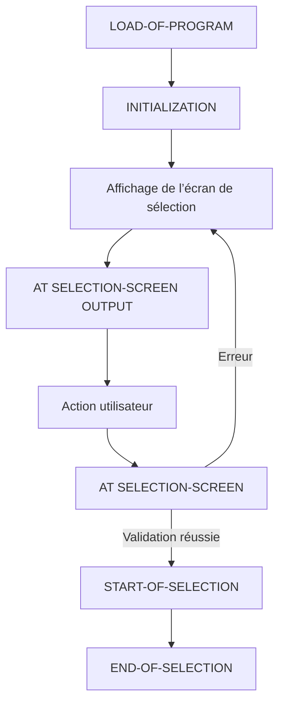

# ÉVÉNEMENTS D’UN PROGRAMME EXÉCUTABLE

## RÉSULTAT ATTENDU

- Comprendre le pilotage événementiel d’un programme exécutable classique
- Connaître l’ordre principal des événements liés à l’écran de sélection
- Utiliser `INITIALIZATION`, `AT SELECTION-SCREEN` et `START-OF-SELECTION`
- Comprendre le rôle limité de `END-OF-SELECTION`
- Éviter les blocs implicites et les validations placées au mauvais endroit

## VUE D’ENSEMBLE



## BLOC D’ÉVÉNEMENT

Un bloc d’événement commence par un mot-clé événementiel et se termine au début du bloc de traitement suivant.

```abap
START-OF-SELECTION.
  WRITE / 'Traitement principal'.
```

Le mot-clé n’est pas un appel explicite. L’environnement d’exécution déclenche l’événement au moment prévu.

## `LOAD-OF-PROGRAM`

`LOAD-OF-PROGRAM` est déclenché après le chargement du programme dans une session interne.

```abap
LOAD-OF-PROGRAM.
  " Initialisation technique exceptionnelle
```

Son usage explicite est rare dans un programme exécutable simple. Ne pas l’utiliser comme emplacement par défaut pour le traitement métier.

## `INITIALIZATION`

`INITIALIZATION` est déclenché avant l’affichage initial de l’écran de sélection standard.

Usage adapté :

- proposer des valeurs initiales ;
- calculer un intervalle par défaut ;
- initialiser des paramètres dépendant du contexte utilisateur.

```abap
PARAMETERS p_date TYPE sy-datum.

INITIALIZATION.
  p_date = sy-datum.
```

> [!CAUTION]
> Ne pas effectuer ici un traitement métier lourd. L’événement peut être redéclenché dans certains scénarios d’appel du programme.

## `AT SELECTION-SCREEN OUTPUT`

Cet événement intervient avant l’affichage de l’écran de sélection.

Usage adapté :

- modifier dynamiquement les propriétés des champs ;
- masquer ou rendre un champ non saisissable ;
- adapter l’écran selon un choix utilisateur.

```abap
AT SELECTION-SCREEN OUTPUT.
  LOOP AT SCREEN.
    IF screen-name = 'P_DETAIL'.
      screen-input = 0.
      MODIFY SCREEN.
    ENDIF.
  ENDLOOP.
```

La modification dynamique de l’écran doit rester limitée et compréhensible.

## `AT SELECTION-SCREEN`

Cet événement sert à valider les saisies de l’écran de sélection.

### VALIDATION D’UN CHAMP

```abap
PARAMETERS p_limit TYPE i.

AT SELECTION-SCREEN ON p_limit.
  IF p_limit <= 0.
    MESSAGE 'La limite doit être supérieure à zéro' TYPE 'E'.
  ENDIF.
```

### VALIDATION GLOBALE

```abap
AT SELECTION-SCREEN.
  " Contrôles portant sur plusieurs champs
```

Un message de type erreur renvoie généralement l’utilisateur sur l’écran de sélection afin qu’il corrige la saisie.

## `START-OF-SELECTION`

`START-OF-SELECTION` est le point d’entrée principal du traitement d’un programme exécutable après validation de l’écran de sélection.

```abap
START-OF-SELECTION.
  PERFORM execute_process.
```

Dans un programme structuré, ce bloc orchestre le traitement au lieu de contenir toute la logique métier.

> [!IMPORTANT]
> Les instructions exécutables placées avant le premier bloc d’événement peuvent former un bloc implicite `START-OF-SELECTION`. Utiliser un bloc explicite améliore la lisibilité.

## `END-OF-SELECTION`

`END-OF-SELECTION` est déclenché après le traitement de `START-OF-SELECTION` et après les événements d’une éventuelle base de données logique.

```abap
END-OF-SELECTION.
  " Traitement final éventuel
```

Il n’est pas obligatoire et ne doit pas être ajouté systématiquement comme équivalent d’un bloc `finally`.

Dans un programme sans base de données logique, la séparation entre `START-OF-SELECTION` et `END-OF-SELECTION` est souvent inutile.

## ÉVÉNEMENTS DE LISTE CLASSIQUE

Les programmes de liste classique peuvent également réagir à des événements tels que :

- `TOP-OF-PAGE` ;
- `END-OF-PAGE` ;
- `AT LINE-SELECTION` ;
- `AT USER-COMMAND`.

Ces mécanismes concernent les listes classiques interactives. Ils ne doivent pas être confondus avec les événements d’un écran de sélection.

## EXEMPLE COMPLET

```abap
REPORT zdemo_events.

PARAMETERS p_limit TYPE i.

INITIALIZATION.
  p_limit = 10.

AT SELECTION-SCREEN ON p_limit.
  IF p_limit < 1 OR p_limit > 100.
    MESSAGE 'Saisir une valeur comprise entre 1 et 100' TYPE 'E'.
  ENDIF.

START-OF-SELECTION.
  WRITE: / 'Valeur validée :', p_limit.
```

Flux :

1. `p_limit` reçoit `10` ;
2. l’écran de sélection est affiché ;
3. la saisie est validée ;
4. en cas d’erreur, l’écran est réaffiché ;
5. en cas de succès, le traitement principal s’exécute.

## RÈGLES DE CONCEPTION

- utiliser `INITIALIZATION` pour les valeurs initiales ;
- utiliser `AT SELECTION-SCREEN` pour les validations ;
- utiliser `START-OF-SELECTION` pour l’orchestration ;
- ne pas dupliquer le même contrôle dans plusieurs événements ;
- éviter les accès coûteux répétés à chaque affichage de l’écran ;
- ne pas utiliser `END-OF-SELECTION` sans besoin réel ;
- garder le flux visible et testable.

## PROCESS

### Étape 1 — Construire le scénario

Créer un report Z avec un `PARAMETERS` simple. Ajouter `INITIALIZATION`, `AT SELECTION-SCREEN` et `START-OF-SELECTION`, chacun contenant une instruction exécutable identifiable.

### Étape 2 — Instrumenter l’ordre d’exécution

Placer un breakpoint dans chaque bloc, activer puis exécuter. Noter l’ordre réel : initialisation avant affichage, validation après action sur l’écran, puis traitement principal après validation réussie.

### Étape 3 — Tester le chemin valide

Saisir une valeur acceptée et exécuter. Le débogueur doit atteindre `START-OF-SELECTION`. Si ce bloc n’est pas atteint, examiner le message ou la logique de validation exécutée auparavant.

### Étape 4 — Tester le chemin refusé

Saisir une valeur que `AT SELECTION-SCREEN` rejette. Vérifier que l’écran reste affiché et que `START-OF-SELECTION` n’est pas exécuté.

Le chapitre est validé lorsque les deux chemins prouvent l’ordre des événements et l’arrêt du traitement principal après une validation en erreur.

## VÉRIFICATION

- Le contrôle syntaxique réussit.
- La version active correspond au code sauvegardé.
- L’exécution produit le résultat décrit dans le chapitre.
- Les cas vide, limite et erreur sont testés séparément lorsque la syntaxe le permet.

## ERREURS FRÉQUENTES

- Copier un exemple sans adapter les types, noms d’objets et données disponibles dans le système.
- Tester uniquement le cas nominal et ignorer les valeurs initiales, absentes ou invalides.
- Intervenir dans le mauvais système ou mandant.
- Confondre sauvegarde et activation.

## SNIPPET À RÉUTILISER

> [!NOTE]
> Adapter les noms `Z*`, les types DDIC, les données et les autorisations au système cible. Effectuer un contrôle syntaxique avant activation.

```abap
REPORT zdemo_events.

PARAMETERS p_limit TYPE i.

INITIALIZATION.
  p_limit = 10.

AT SELECTION-SCREEN ON p_limit.
  IF p_limit < 1 OR p_limit > 100.
    MESSAGE 'Saisir une valeur comprise entre 1 et 100' TYPE 'E'.
  ENDIF.

START-OF-SELECTION.
  WRITE: / 'Valeur validée :', p_limit.
```

## TERMES DU LEXIQUE

- [Programme exécutable](<../🧩 00 ├── LEXIQUE SAP ET ABAP/06 ├── PROGRAMMES CLASSES ET OBJETS TECHNIQUES.md#programme-executable>)
- [Système SAP](<../🧩 00 ├── LEXIQUE SAP ET ABAP/01 ├── SYSTEMES ENVIRONNEMENTS ET MANDANTS.md#systeme-sap>)
- [Mandant](<../🧩 00 ├── LEXIQUE SAP ET ABAP/01 ├── SYSTEMES ENVIRONNEMENTS ET MANDANTS.md#mandant>)
- [SAP GUI](<../🧩 00 ├── LEXIQUE SAP ET ABAP/02 ├── SAP GUI NAVIGATION ET TRANSACTIONS.md#sap-gui>)
- [Transaction](<../🧩 00 ├── LEXIQUE SAP ET ABAP/02 ├── SAP GUI NAVIGATION ET TRANSACTIONS.md#transaction>)
- [Repository ABAP](<../🧩 00 ├── LEXIQUE SAP ET ABAP/03 ├── REPOSITORY PACKAGES ET TRANSPORTS.md#repository-abap>)

## RÉFÉRENCES OFFICIELLES SAP

- [Event Control](https://help.sap.com/docs/ABAP_PLATFORM_NEW/7bfe8cdcfbb040dcb6702dada8c3e2f0/0b32146b63054bb293de32877a6ebfe9.html)
- [START-OF-SELECTION — ABAP Keyword Documentation](https://help.sap.com/doc/abapdocu_latest_index_htm/latest/en-US/abapstart-of-selection.htm)
- [AT SELECTION-SCREEN](https://help.sap.com/docs/SAP_NETWEAVER_731_BW_ABAP/cfae740a0a21455dbe6e510c2d86e36a/9fdb9a2e35c111d1829f0000e829fbfe.html)
- [Description of Reporting Events](https://help.sap.com/docs/SAP_NETWEAVER_731_BW_ABAP/cfae740a0a21455dbe6e510c2d86e36a/9fdb9a1435c111d1829f0000e829fbfe.html)

---

[Chapitre suivant — ÉCRAN DE SÉLECTION SIMPLE](<./11 ├── ECRAN DE SELECTION SIMPLE.md>)
