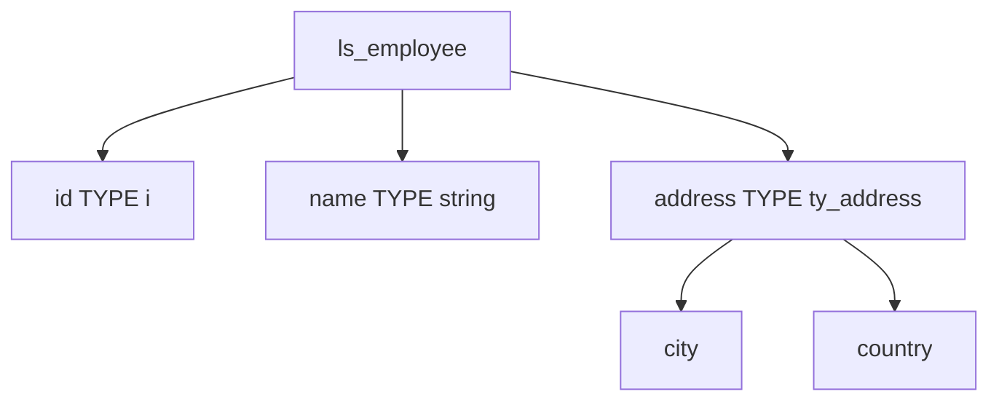

# 7. STRUCTURES

## 7.A RÉSULTAT ATTENDU

- Définir une structure locale
- Déclarer une structure de travail
- Accéder à ses composants
- Construire des structures imbriquées
- Comprendre les affectations entre structures compatibles

## 7.B DÉFINITION

Une structure regroupe plusieurs composants sous un même objet de données. Chaque composant possède son propre type.



## 7.C DÉFINITION DU TYPE

```abap
TYPES:
  BEGIN OF ty_product,
    product_id  TYPE c LENGTH 18,
    description TYPE c LENGTH 40,
    quantity    TYPE p LENGTH 7 DECIMALS 3,
    unit        TYPE c LENGTH 3,
  END OF ty_product.
```

Déclaration d’une structure :

```abap
DATA ls_product TYPE ty_product.
```

## 7.D ACCÈS AUX COMPOSANTS

Le tiret sépare le nom de la structure de celui du composant.

```abap
ls_product-product_id  = 'MAT-100'.
ls_product-description = 'Produit de démonstration'.
ls_product-quantity    = '12.500'.
ls_product-unit        = 'PC'.
```

Lecture :

```abap
WRITE: / ls_product-product_id,
         ls_product-description,
         ls_product-quantity,
         ls_product-unit.
```

## 7.E VALEUR INITIALE

Lors de sa déclaration, chaque composant reçoit la valeur initiale de son type.

```abap
CLEAR ls_product.
```

`CLEAR` réinitialise tous les composants.

Test :

```abap
IF ls_product IS INITIAL.
  WRITE / 'Structure vide'.
ENDIF.
```

Une structure est initiale uniquement si tous ses composants sont initiaux.

## 7.F STRUCTURE IMBRIQUÉE

```abap
TYPES:
  BEGIN OF ty_address,
    street  TYPE c LENGTH 60,
    city    TYPE c LENGTH 40,
    country TYPE c LENGTH 3,
  END OF ty_address.

TYPES:
  BEGIN OF ty_supplier,
    supplier_id TYPE c LENGTH 10,
    name        TYPE c LENGTH 60,
    address     TYPE ty_address,
  END OF ty_supplier.
```

Utilisation :

```abap
DATA ls_supplier TYPE ty_supplier.

ls_supplier-supplier_id    = '0000100001'.
ls_supplier-name           = 'Fournisseur Démo'.
ls_supplier-address-city   = 'Paris'.
ls_supplier-address-country = 'FRA'.
```

Chaque niveau est séparé par un tiret.

## 7.G INCLUSION D’UNE STRUCTURE

Dans une définition structurée, `INCLUDE TYPE` permet d’insérer les composants d’un autre type structuré.

```abap
TYPES:
  BEGIN OF ty_audit,
    created_by TYPE syuname,
    created_on TYPE d,
  END OF ty_audit.

TYPES:
  BEGIN OF ty_document,
    document_id TYPE c LENGTH 10,
    INCLUDE TYPE ty_audit,
  END OF ty_document.
```

Les composants inclus deviennent directement accessibles :

```abap
DATA ls_document TYPE ty_document.

ls_document-created_by = sy-uname.
```

Une structure imbriquée conserve au contraire un composant intermédiaire. Le choix dépend du modèle souhaité.

## 7.H AFFECTATION ENTRE STRUCTURES

Une affectation directe exige une compatibilité technique suffisante.

```abap
DATA ls_source TYPE ty_product.
DATA ls_target TYPE ty_product.

ls_target = ls_source.
```

Pour des structures de types différents possédant des composants de même nom, utiliser l’opérateur constructeur `CORRESPONDING` :

```abap
ls_target = CORRESPONDING #( ls_source ).
```

L’instruction historique `MOVE-CORRESPONDING` reste disponible, mais `CORRESPONDING` s’intègre aux expressions et permet d’expliciter des règles de mapping. Vérifier les conversions et les composants réellement copiés.

## 7.I STRUCTURE LOCALE OU GLOBALE

Une structure locale convient à un besoin interne au programme.

Une structure du Dictionnaire ABAP est adaptée lorsqu’elle doit notamment :

- être partagée par plusieurs objets ;
- servir de type d’interface ;
- porter des composants métier globaux ;
- être utilisée par certains outils déclaratifs SAP.

Une structure locale ne doit pas reproduire arbitrairement un objet standard existant sans justification.

## 7.J CONVENTIONS

| Préfixe courant | Signification habituelle       |
| --------------- | ------------------------------ |
| `ty_` ou `ts_`  | Type structuré                 |
| `ls_`           | Structure locale               |
| `gs_`           | Structure globale              |
| `is_`           | Paramètre d’import structuré   |
| `es_`           | Paramètre d’export structuré   |
| `cs_`           | Paramètre modifiable structuré |

Ces préfixes sont des conventions de projet.

## 7.K EXEMPLE COMPLET

```abap
REPORT zdemo_structures.

TYPES:
  BEGIN OF ty_result,
    successful TYPE abap_bool,
    code       TYPE i,
    message    TYPE string,
  END OF ty_result.

DATA ls_result TYPE ty_result.

ls_result-successful = abap_true.
ls_result-code       = 0.
ls_result-message    = `Traitement terminé`.

IF ls_result-successful = abap_true.
  WRITE: / ls_result-code, ls_result-message.
ENDIF.
```

Les constantes `abap_true` et `abap_false` sont couramment utilisées avec le type `abap_bool` lorsqu’il est disponible dans le système.

## 7.L VÉRIFICATION

- Le contrôle syntaxique réussit.
- La version active correspond au code sauvegardé.
- L’exécution produit le résultat décrit dans le chapitre.
- Les cas vide, limite et erreur sont testés séparément lorsque la syntaxe le permet.

## 7.M ERREURS FRÉQUENTES

- Copier un exemple sans adapter les types, noms d’objets et données disponibles dans le système.
- Tester uniquement le cas nominal et ignorer les valeurs initiales, absentes ou invalides.
- Choisir un type trop générique ou dépendant d’une variable existante sans justification.
- Utiliser une référence ou un field-symbol non lié.

## 7.N SNIPPET À RÉUTILISER

> [!NOTE]
> Adapter les noms `Z*`, les types DDIC, les données et les autorisations au système cible. Effectuer un contrôle syntaxique avant activation.

```abap
REPORT zdemo_structures.

TYPES:
  BEGIN OF ty_result,
    successful TYPE abap_bool,
    code       TYPE i,
    message    TYPE string,
  END OF ty_result.

DATA ls_result TYPE ty_result.

ls_result-successful = abap_true.
ls_result-code       = 0.
ls_result-message    = `Traitement terminé`.

IF ls_result-successful = abap_true.
  WRITE: / ls_result-code, ls_result-message.
ENDIF.
```

## 7.O TERMES DU LEXIQUE

- [Structure](<../🧩 00 ├── LEXIQUE SAP ET ABAP/04 ├── LANGAGE ET DEVELOPPEMENT ABAP.md#structure-abap>)
- [Type de données](<../🧩 00 ├── LEXIQUE SAP ET ABAP/04 ├── LANGAGE ET DEVELOPPEMENT ABAP.md#type-donnees>)
- [Objet de données](<../🧩 00 ├── LEXIQUE SAP ET ABAP/04 ├── LANGAGE ET DEVELOPPEMENT ABAP.md#objet-donnees>)
- [Table interne](<../🧩 00 ├── LEXIQUE SAP ET ABAP/04 ├── LANGAGE ET DEVELOPPEMENT ABAP.md#table-interne>)
- [Field-symbol](<../🧩 00 ├── LEXIQUE SAP ET ABAP/04 ├── LANGAGE ET DEVELOPPEMENT ABAP.md#field-symbol>)
- [Référence](<../🧩 00 ├── LEXIQUE SAP ET ABAP/04 ├── LANGAGE ET DEVELOPPEMENT ABAP.md#reference>)

## 7.P RÉFÉRENCES OFFICIELLES SAP

- [Structured Data Types — ABAP Keyword Documentation](https://help.sap.com/doc/abapdocu_latest_index_htm/latest/en-US/ABENSTRUCTURED_TYPES.html)
- [TYPES, BEGIN OF — ABAP Keyword Documentation](https://help.sap.com/doc/abapdocu_latest_index_htm/latest/en-US/ABAPTYPES_BEGIN_OF.html)
- [Data Objects, Structures — ABAP Keyword Documentation](https://help.sap.com/doc/abapdocu_latest_index_htm/latest/en-US/ABENDATA_OBJECTS_STRUCTURE.html)


---

[Chapitre suivant — TYPAGE AVEC `TYPE` ET `LIKE`](<./08 ├── TYPAGE AVEC TYPE ET LIKE.md>)
