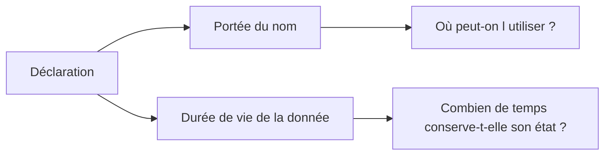

# 12. PORTÉE, DURÉE DE VIE ET `STATICS`

## 12.A RÉSULTAT ATTENDU

- Distinguer portée et durée de vie
- Identifier les données globales et locales
- Comprendre le comportement des blocs d’événement classiques
- Utiliser `STATICS` uniquement lorsque la conservation d’état est volontaire
- Limiter les dépendances provoquées par les données globales

## 12.B PORTÉE ET DURÉE DE VIE

La **portée** détermine les zones du code dans lesquelles un nom est visible.

La **durée de vie** détermine pendant combien de temps l’objet existe et conserve sa valeur.



Ces deux notions sont liées, mais elles ne sont pas identiques.

## 12.C DONNÉES GLOBALES D’UN PROGRAMME

```abap
REPORT zdemo_scope.

DATA gv_counter TYPE i.

START-OF-SELECTION.
  gv_counter = gv_counter + 1.
```

`gv_counter` appartient aux données globales du programme. Elle est accessible depuis les blocs de traitement et les procédures du programme, sous réserve des règles de visibilité applicables.

Les données globales existent pendant l’instance d’exécution du programme dans la session interne concernée.

> [!CAUTION]
> Une donnée globale peut être modifiée depuis plusieurs traitements. Cette facilité augmente les effets de bord et complique les tests.

## 12.D DONNÉES LOCALES D’UNE PROCÉDURE

```abap
FORM calculate_total USING    iv_net   TYPE i
                              iv_tax   TYPE i
                     CHANGING cv_total TYPE i.
  DATA lv_total TYPE i.

  lv_total = iv_net + iv_tax.
  cv_total = lv_total.
ENDFORM.
```

`lv_total` est locale à la procédure `FORM`. Elle n’est pas visible depuis le reste du programme et est recréée à chaque appel.

Les méthodes, modules fonction et sous-routines possèdent leurs propres contextes locaux.

## 12.E BLOCS D’ÉVÉNEMENT

Les blocs tels que `START-OF-SELECTION` ne sont pas des procédures locales autonomes.

```abap
START-OF-SELECTION.
  DATA lv_value TYPE i.
```

Dans un programme exécutable classique, il est préférable de placer clairement les déclarations globales dans la partie déclarative et d’encapsuler les traitements dans des procédures lorsque des données locales sont nécessaires.

Cette organisation évite de donner l’impression qu’une déclaration située visuellement dans un bloc d’événement possède une portée locale comparable à celle d’une méthode.

## 12.F MASQUAGE DE NOMS

Une donnée locale peut porter le même nom qu’une donnée déclarée dans un contexte externe selon les règles du langage. Le nom local masque alors l’autre objet dans sa portée.

```abap
DATA gv_value TYPE i VALUE 10.

FORM display_value.
  DATA gv_value TYPE i VALUE 20.

  WRITE / gv_value.
ENDFORM.
```

Cette pratique est techniquement possible, mais produit une ambiguïté inutile. Utiliser des noms distincts.

## 12.G `STATICS`

`STATICS` déclare une donnée locale statique dans une procédure. Sa valeur est conservée entre les appels de cette procédure au sein de la session interne.

```abap
FORM count_calls.
  STATICS sv_call_count TYPE i.

  sv_call_count = sv_call_count + 1.
  WRITE / sv_call_count.
ENDFORM.
```

Appels :

```abap
PERFORM count_calls.
PERFORM count_calls.
PERFORM count_calls.
```

Sortie :

```text
1
2
3
```

Une variable locale déclarée avec `DATA` aurait été réinitialisée à chaque appel.

## 12.H LIMITES DE `STATICS`

Une donnée statique introduit un état caché dans la procédure.

Risques :

- résultat dépendant des appels précédents ;
- tests difficiles à isoler ;
- comportement complexe en récursion ;
- dépendance à la session interne ;
- réutilisation involontaire d’une valeur obsolète.

Utiliser `STATICS` uniquement lorsque la conservation entre appels constitue explicitement le comportement attendu.

## 12.I INITIALISATION

Une variable locale `DATA` reçoit sa valeur initiale à chaque entrée dans la procédure.

```abap
FORM demo_local.
  DATA lv_counter TYPE i.

  lv_counter = lv_counter + 1.
  WRITE / lv_counter.
ENDFORM.
```

Chaque appel affiche `1`.

Une donnée `STATICS` est initialisée lors de sa première création, puis conserve sa valeur.

## 12.J DONNÉES GLOBALES OU PARAMÈTRES

Préférer les paramètres lorsqu’une procédure a besoin d’une donnée externe :

```abap
FORM display_message USING iv_message TYPE string.
  WRITE / iv_message.
ENDFORM.
```

Plutôt qu’une lecture implicite d’une variable globale :

```abap
DATA gv_message TYPE string.

FORM display_message.
  WRITE / gv_message.
ENDFORM.
```

Les dépendances explicites améliorent la compréhension, le test et la réutilisation.

## 12.K SYNTHÈSE

| Déclaration                   | Portée habituelle    | Conservation entre appels             |
| ----------------------------- | -------------------- | ------------------------------------- |
| `DATA` globale au programme   | Programme            | Oui pendant l’exécution du programme  |
| `DATA` locale à une procédure | Procédure            | Non                                   |
| `STATICS` dans une procédure  | Procédure            | Oui dans la session interne           |
| Constante locale              | Procédure            | Valeur immuable pendant son existence |
| Objet anonyme référencé       | Selon les références | Tant qu’il reste accessible           |

## 12.L EXEMPLE COMPLET

```abap
REPORT zdemo_lifetime.

PARAMETERS p_text TYPE c LENGTH 30 DEFAULT 'ABAP'.

START-OF-SELECTION.
  PERFORM display_call USING p_text.
  PERFORM display_call USING p_text.

FORM display_call USING iv_text TYPE c.
  STATICS sv_call_count TYPE i.
  DATA lv_message TYPE string.

  sv_call_count = sv_call_count + 1.
  lv_message = |Appel { sv_call_count }: { iv_text }|.

  WRITE / lv_message.
ENDFORM.
```

`lv_message` est recréée à chaque appel. `sv_call_count` conserve son état entre les deux appels.

## 12.M VÉRIFICATION

- Le contrôle syntaxique réussit.
- La version active correspond au code sauvegardé.
- L’exécution produit le résultat décrit dans le chapitre.
- Les cas vide, limite et erreur sont testés séparément lorsque la syntaxe le permet.

## 12.N ERREURS FRÉQUENTES

- Copier un exemple sans adapter les types, noms d’objets et données disponibles dans le système.
- Tester uniquement le cas nominal et ignorer les valeurs initiales, absentes ou invalides.
- Choisir un type trop générique ou dépendant d’une variable existante sans justification.
- Utiliser une référence ou un field-symbol non lié.

## 12.O SNIPPET À RÉUTILISER

> [!NOTE]
> Adapter les noms `Z*`, les types DDIC, les données et les autorisations au système cible. Effectuer un contrôle syntaxique avant activation.

```abap
REPORT zdemo_lifetime.

PARAMETERS p_text TYPE c LENGTH 30 DEFAULT 'ABAP'.

START-OF-SELECTION.
  PERFORM display_call USING p_text.
  PERFORM display_call USING p_text.

FORM display_call USING iv_text TYPE c.
  STATICS sv_call_count TYPE i.
  DATA lv_message TYPE string.

  sv_call_count = sv_call_count + 1.
  lv_message = |Appel { sv_call_count }: { iv_text }|.

  WRITE / lv_message.
ENDFORM.
```

## 12.P TERMES DU LEXIQUE

- [Type de données](<../🧩 00 ├── LEXIQUE SAP ET ABAP/04 ├── LANGAGE ET DEVELOPPEMENT ABAP.md#type-donnees>)
- [Objet de données](<../🧩 00 ├── LEXIQUE SAP ET ABAP/04 ├── LANGAGE ET DEVELOPPEMENT ABAP.md#objet-donnees>)
- [Structure](<../🧩 00 ├── LEXIQUE SAP ET ABAP/04 ├── LANGAGE ET DEVELOPPEMENT ABAP.md#structure-abap>)
- [Table interne](<../🧩 00 ├── LEXIQUE SAP ET ABAP/04 ├── LANGAGE ET DEVELOPPEMENT ABAP.md#table-interne>)
- [Field-symbol](<../🧩 00 ├── LEXIQUE SAP ET ABAP/04 ├── LANGAGE ET DEVELOPPEMENT ABAP.md#field-symbol>)
- [Référence](<../🧩 00 ├── LEXIQUE SAP ET ABAP/04 ├── LANGAGE ET DEVELOPPEMENT ABAP.md#reference>)

## 12.Q RÉFÉRENCES OFFICIELLES SAP

- [Validity and Lifetime of Data Objects — ABAP Keyword Documentation](https://help.sap.com/doc/abapdocu_latest_index_htm/latest/en-US/ABENLIFETIME_DATA_OBJECTS.html)
- [Visibility of Data Objects — ABAP Keyword Documentation](https://help.sap.com/doc/abapdocu_latest_index_htm/latest/en-US/ABENVISIBILITY_DATA_OBJECTS.html)
- [STATICS — ABAP Keyword Documentation](https://help.sap.com/doc/abapdocu_latest_index_htm/latest/en-US/ABAPSTATICS.html)
- [Local and Global Data — ABAP Keyword Documentation](https://help.sap.com/doc/abapdocu_latest_index_htm/latest/en-US/ABENLOCAL_GLOBAL_DATA.html)
