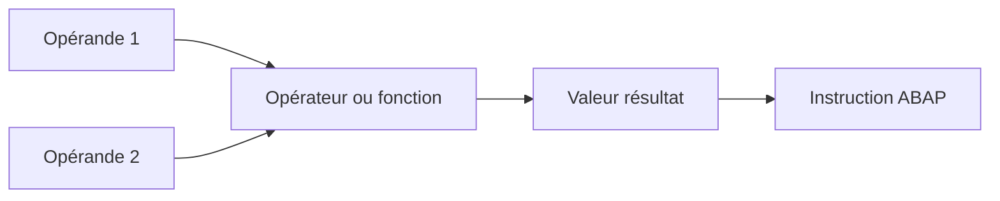
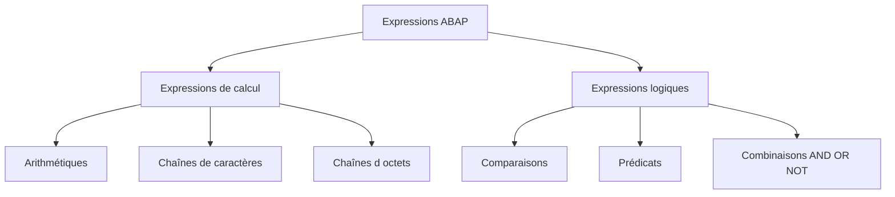

# OPÉRANDES ET EXPRESSIONS

## RÉSULTAT ATTENDU

- Distinguer une instruction, une expression et un opérande
- Identifier les positions de lecture et d’écriture
- Comprendre comment ABAP détermine le type d’un résultat
- Lire une expression complexe sans ambiguïté
- Éviter les effets de bord inutiles dans les expressions

## NOTIONS FONDAMENTALES

Un **opérande** fournit une valeur à une instruction ou à une expression.

Un **opérateur** décrit le traitement appliqué à un ou plusieurs opérandes.

Une **expression** combine des opérandes, des opérateurs et éventuellement des fonctions afin de produire une valeur.



Exemple :

```abap
DATA lv_net_amount   TYPE p LENGTH 8 DECIMALS 2 VALUE '100.00'.
DATA lv_tax_rate     TYPE p LENGTH 5 DECIMALS 2 VALUE '20.00'.
DATA lv_gross_amount TYPE p LENGTH 8 DECIMALS 2.

lv_gross_amount = lv_net_amount * ( 1 + lv_tax_rate / 100 ).
```

| Élément                     | Rôle                             |
| --------------------------- | -------------------------------- |
| `lv_net_amount`             | Opérande                         |
| `*`, `+`, `/`               | Opérateurs arithmétiques         |
| `( 1 + lv_tax_rate / 100 )` | Sous-expression                  |
| Partie droite de `=`        | Expression arithmétique complète |
| `lv_gross_amount`           | Destination de l’affectation     |

## POSITIONS DE LECTURE ET D’ÉCRITURE

Une **position de lecture** utilise la valeur d’un objet de données.

```abap
lv_total = lv_price * lv_quantity.
```

`lv_price` et `lv_quantity` sont lus.

Une **position d’écriture** modifie la valeur d’un objet de données.

```abap
lv_total = 0.
```

`lv_total` est écrit.

Certaines positions sont à la fois lues et modifiées :

```abap
lv_counter = lv_counter + 1.
```

## CATÉGORIES D’EXPRESSIONS



Ce dossier traite principalement :

- des expressions arithmétiques ;
- des expressions logiques ;
- des expressions de chaînes ;
- des conversions ;
- des fonctions intégrées de traitement.

Les expressions tabulaires seront traitées dans le dossier consacré aux tables internes.

## TYPE DU RÉSULTAT

Le type d’une expression dépend notamment :

- du type des opérandes ;
- de l’opérateur ;
- de la position dans laquelle l’expression est utilisée ;
- d’un éventuel type cible explicite.

```abap
DATA lv_integer_a TYPE i VALUE 5.
DATA lv_integer_b TYPE i VALUE 2.
DATA lv_decimal   TYPE p LENGTH 5 DECIMALS 2.

lv_decimal = lv_integer_a / lv_integer_b.
```

Le calcul est influencé par les types numériques impliqués. Pour rendre le résultat attendu explicite, utiliser un opérande ou une conversion du type approprié :

```abap
lv_decimal = CONV decfloat34( lv_integer_a ) / lv_integer_b.
```

> [!IMPORTANT]
> Une déclaration inline peut déduire un type inattendu lorsque tous les opérandes sont des littéraux entiers. Le type cible doit être rendu explicite lorsque la précision du calcul est importante.

## PARENTHÈSES ET LISIBILITÉ

Les parenthèses permettent :

- d’imposer un ordre de calcul ;
- de rendre l’intention plus visible ;
- d’éviter de dépendre uniquement des règles de priorité.

```abap
lv_result = ( lv_base + lv_surcharge ) * lv_quantity.
```

Préférer plusieurs affectations intermédiaires lorsqu’une expression devient difficile à vérifier :

```abap
DATA(lv_unit_amount) = lv_base + lv_surcharge.
lv_result = lv_unit_amount * lv_quantity.
```

## VÉRIFICATION

- Le contrôle syntaxique réussit.
- La version active correspond au code sauvegardé.
- L’exécution produit le résultat décrit dans le chapitre.
- Les cas vide, limite et erreur sont testés séparément lorsque la syntaxe le permet.

## ERREURS FRÉQUENTES

- Copier un exemple sans adapter les types, noms d’objets et données disponibles dans le système.
- Tester uniquement le cas nominal et ignorer les valeurs initiales, absentes ou invalides.
- S’appuyer sur une conversion implicite pouvant tronquer ou arrondir.
- Ignorer l’encodage et les formats externes.

## SNIPPET À RÉUTILISER

> [!NOTE]
> Adapter les noms `Z*`, les types DDIC, les données et les autorisations au système cible. Effectuer un contrôle syntaxique avant activation.

```abap
DATA(lv_unit_amount) = lv_base + lv_surcharge.
lv_result = lv_unit_amount * lv_quantity.
```

## TERMES DU LEXIQUE

- [Expression](<../🧩 00 ├── LEXIQUE SAP ET ABAP/04 ├── LANGAGE ET DEVELOPPEMENT ABAP.md#expression>)
- [Instruction ABAP](<../🧩 00 ├── LEXIQUE SAP ET ABAP/04 ├── LANGAGE ET DEVELOPPEMENT ABAP.md#instruction-abap>)
- [Type de données](<../🧩 00 ├── LEXIQUE SAP ET ABAP/04 ├── LANGAGE ET DEVELOPPEMENT ABAP.md#type-donnees>)

## RÉFÉRENCES OFFICIELLES SAP

- [Expressions and Functions — SAP Help Portal](https://help.sap.com/docs/ABAP_PLATFORM_NEW/7bfe8cdcfbb040dcb6702dada8c3e2f0/3175650fd7a54df89f2018150024db22.html)
- [Extended Functional Operand Positions — ABAP Keyword Documentation](https://help.sap.com/doc/abapdocu_latest_index_htm/latest/en-US/ABENEXTENDED_FUNCTIONAL_POSITIONS.html)
- [Processing Data — SAP Learning](https://learning.sap.com/courses/basic-abap-programming/processing-data_b025c9e3-697d-423f-977a-43b9051a7c15)


---

[Chapitre suivant — AFFECTATIONS ET OPÉRATEURS D’AFFECTATION](<./02 ├── AFFECTATIONS ET OPERATEURS D AFFECTATION.md>)
