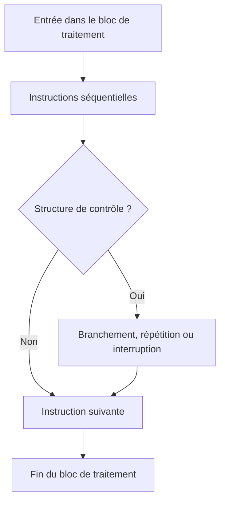
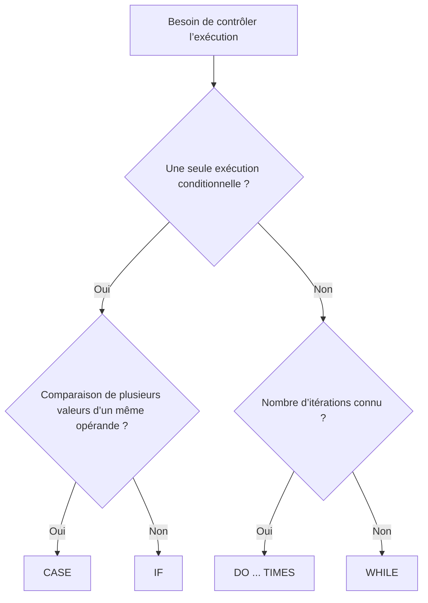

# 1. FLUX D’EXÉCUTION ET STRUCTURES DE CONTRÔLE

## 1.A RÉSULTAT ATTENDU

- Comprendre l’exécution séquentielle d’un bloc ABAP
- Identifier les structures de branchement et d’itération
- Distinguer une structure de contrôle d’un bloc de traitement
- Choisir entre exécution conditionnelle, répétition et interruption
- Préparer un code lisible et vérifiable dans le Debugger ABAP

## 1.B EXÉCUTION SÉQUENTIELLE

Dans un bloc de traitement ABAP, les instructions sont normalement exécutées de haut en bas.

```abap
DATA lv_price    TYPE p LENGTH 8 DECIMALS 2 VALUE '10.00'.
DATA lv_quantity TYPE i VALUE 3.
DATA lv_total    TYPE p LENGTH 8 DECIMALS 2.

lv_total = lv_price * lv_quantity.
WRITE: / 'Total :', lv_total.
```

Une structure de contrôle modifie cet ordre :

- elle sélectionne un bloc à exécuter ;
- elle répète un bloc ;
- elle ignore une partie du traitement ;
- elle interrompt une boucle ou le bloc courant.



## 1.C DEUX FAMILLES PRINCIPALES

| Famille                  | Instructions principales | Finalité                                           |
| ------------------------ | ------------------------ | -------------------------------------------------- |
| Branchement conditionnel | `IF`, `CASE`             | Exécuter un bloc selon une condition ou une valeur |
| Itération                | `DO`, `WHILE`            | Répéter un bloc de code                            |

Des instructions complémentaires agissent sur le flux :

| Instruction | Effet principal                                                              |
| ----------- | ---------------------------------------------------------------------------- |
| `CHECK`     | Ignore la suite d’une itération ou quitte un bloc si la condition est fausse |
| `CONTINUE`  | Passe immédiatement à l’itération suivante                                   |
| `EXIT`      | Quitte la boucle active                                                      |
| `RETURN`    | Quitte le bloc de traitement courant                                         |

## 1.D STRUCTURE DE CONTRÔLE ET BLOC DE TRAITEMENT

Une structure de contrôle est **imbriquée dans un bloc de traitement**. Elle ne crée pas une nouvelle procédure.

```abap
START-OF-SELECTION.

  IF sy-uname IS NOT INITIAL.
    WRITE: / 'Utilisateur :', sy-uname.
  ENDIF.
```

Dans cet exemple :

- `START-OF-SELECTION` est un bloc d’événement ;
- `IF ... ENDIF` est une structure de contrôle située dans ce bloc.

> [!IMPORTANT]
> Les structures `IF`, `CASE`, `DO` et `WHILE` peuvent être imbriquées. Les blocs de traitement ABAP, tels que les événements et les procédures, obéissent à d’autres règles et seront étudiés dans les dossiers dédiés.

## 1.E DÉLIMITATION EXPLICITE

Chaque structure est fermée par un mot-clé spécifique :

| Ouverture | Fermeture  |
| --------- | ---------- |
| `IF`      | `ENDIF`    |
| `CASE`    | `ENDCASE`  |
| `DO`      | `ENDDO`    |
| `WHILE`   | `ENDWHILE` |

Chaque mot-clé constituant une instruction se termine par un point.

```abap
IF lv_quantity > 0.
  lv_total = lv_price * lv_quantity.
ENDIF.
```

## 1.F CHOISIR LE BON MÉCANISME



## 1.G PÉRIMÈTRE DU DOSSIER

Ce dossier couvre :

- `IF`, `ELSEIF`, `ELSE`, `ENDIF` ;
- `CASE`, `WHEN`, `WHEN OTHERS`, `ENDCASE` ;
- `COND` et `SWITCH` comme expressions conditionnelles complémentaires ;
- `DO`, `WHILE` et `sy-index` ;
- `CHECK`, `CONTINUE`, `EXIT` et `RETURN` ;
- l’imbrication, la lisibilité et la sécurisation des boucles.

Les sujets suivants seront traités ailleurs :

- `LOOP AT`, `AT`, `ENDAT` et les expressions tabulaires : dossier **TABLES INTERNES** ;
- `SELECT ... ENDSELECT` : dossier **OPEN SQL** ;
- `TRY ... CATCH ... ENDTRY` : dossier **MESSAGES ET GESTION DES ERREURS** ;
- appels de méthodes, modules fonction et sous-programmes : dossiers de modularisation.

## 1.H VÉRIFICATION

- Le contrôle syntaxique réussit.
- La version active correspond au code sauvegardé.
- L’exécution produit le résultat décrit dans le chapitre.
- Les cas vide, limite et erreur sont testés séparément lorsque la syntaxe le permet.

## 1.I ERREURS FRÉQUENTES

- Copier un exemple sans adapter les types, noms d’objets et données disponibles dans le système.
- Tester uniquement le cas nominal et ignorer les valeurs initiales, absentes ou invalides.
- Créer une boucle sans condition de sortie fiable.
- Utiliser `CHECK`, `CONTINUE`, `EXIT` ou `RETURN` sans rendre le flux lisible.

## 1.J SNIPPET À RÉUTILISER

> [!NOTE]
> Adapter les noms `Z*`, les types DDIC, les données et les autorisations au système cible. Effectuer un contrôle syntaxique avant activation.

```abap
START-OF-SELECTION.

  IF sy-uname IS NOT INITIAL.
    WRITE: / 'Utilisateur :', sy-uname.
  ENDIF.
```

## 1.K TERMES DU LEXIQUE

- [Structure](<../🧩 00 ├── LEXIQUE SAP ET ABAP/04 ├── LANGAGE ET DEVELOPPEMENT ABAP.md#structure-abap>)
- [Instruction ABAP](<../🧩 00 ├── LEXIQUE SAP ET ABAP/04 ├── LANGAGE ET DEVELOPPEMENT ABAP.md#instruction-abap>)
- [Expression](<../🧩 00 ├── LEXIQUE SAP ET ABAP/04 ├── LANGAGE ET DEVELOPPEMENT ABAP.md#expression>)

## 1.L RÉFÉRENCES OFFICIELLES SAP

- [Using Control Structures in ABAP — SAP Learning](https://learning.sap.com/courses/basic-abap-programming/using-control-structures-in-abap_a4d7803e-eac2-458e-acf9-8628289f3701)
- [Control Flow — SAP Help Portal](https://help.sap.com/docs/ABAP_PLATFORM_NEW/8132142fd1a144a59303663a03a7c2d4/94e1b1978adf45c1a72bd9d8075436d3.html)
- [ABAP Statements, Overview — ABAP Keyword Documentation](https://help.sap.com/doc/abapdocu_latest_index_htm/latest/en-US/ABENABAP_STATEMENTS_OVERVIEW.html)


---

[Chapitre suivant — CONDITIONS AVEC IF, ELSEIF ET ELSE](<./02 ├── CONDITIONS AVEC IF ELSEIF ET ELSE.md>)
