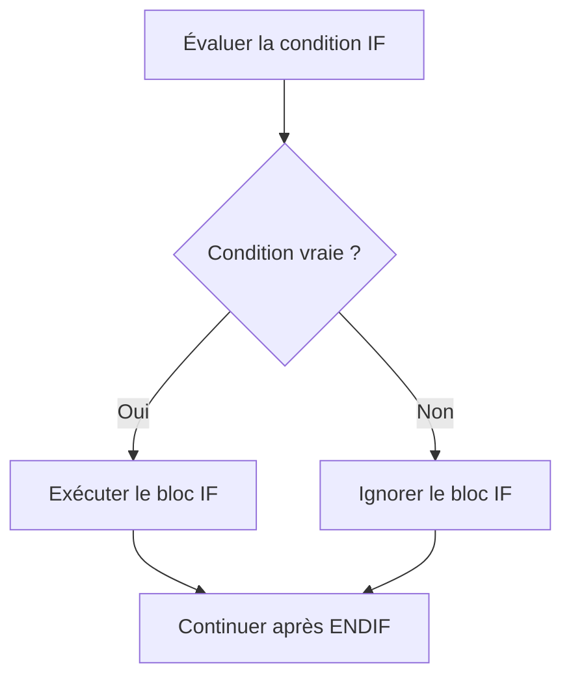
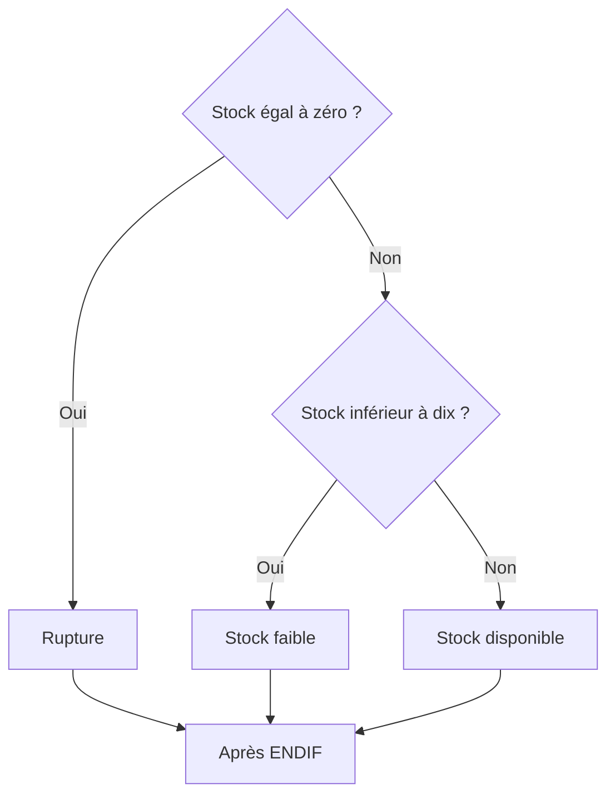

# 2. CONDITIONS AVEC IF, ELSEIF ET ELSE

## 2.A RÉSULTAT ATTENDU

- Exécuter un bloc selon une expression logique
- Construire une chaîne de conditions exclusive
- Comprendre l’ordre d’évaluation des branches
- Utiliser `ELSE` comme traitement par défaut
- Éviter les conditions redondantes et les imbrications inutiles

## 2.B STRUCTURE MINIMALE

La structure `IF ... ENDIF` exécute son bloc uniquement lorsque la condition est vraie.

```abap
PARAMETERS p_qty TYPE i DEFAULT 1.

START-OF-SELECTION.

  IF p_qty > 0.
    WRITE: / 'Quantité valide'.
  ENDIF.
```



## 2.C AJOUTER UNE BRANCHE ELSE

`ELSE` définit le traitement exécuté lorsque la condition du `IF` est fausse.

```abap
IF p_qty > 0.
  WRITE: / 'Quantité valide'.
ELSE.
  WRITE: / 'La quantité doit être supérieure à zéro'.
ENDIF.
```

Avec `ELSE`, exactement une des deux branches est exécutée.

## 2.D AJOUTER DES BRANCHES ELSEIF

`ELSEIF` permet de tester plusieurs conditions dans un ordre précis.

```abap
DATA lv_stock TYPE i VALUE 8.

IF lv_stock = 0.
  WRITE: / 'Rupture de stock'.
ELSEIF lv_stock < 10.
  WRITE: / 'Stock faible'.
ELSE.
  WRITE: / 'Stock disponible'.
ENDIF.
```

L’évaluation s’arrête dès qu’une condition est vraie.



## 2.E L’ORDRE DES CONDITIONS EST FONCTIONNEL

Les conditions doivent être classées de la plus spécifique à la plus générale.

Incorrect :

```abap
IF lv_stock < 10.
  WRITE: / 'Stock faible'.
ELSEIF lv_stock = 0.
  WRITE: / 'Rupture de stock'.
ENDIF.
```

La seconde branche ne sera jamais atteinte lorsque `lv_stock` vaut `0`, car `0 < 10` est déjà vrai.

Correct :

```abap
IF lv_stock = 0.
  WRITE: / 'Rupture de stock'.
ELSEIF lv_stock < 10.
  WRITE: / 'Stock faible'.
ENDIF.
```

## 2.F CONDITIONS COMBINÉES

Les opérateurs logiques permettent de combiner plusieurs critères.

```abap
DATA lv_active  TYPE abap_bool VALUE abap_true.
DATA lv_blocked TYPE abap_bool VALUE abap_false.

IF lv_active = abap_true AND lv_blocked = abap_false.
  WRITE: / 'Traitement autorisé'.
ENDIF.
```

Rendre la priorité explicite avec des parenthèses lorsque plusieurs opérateurs sont combinés :

```abap
IF ( lv_country = 'FR' OR lv_country = 'BE' )
   AND lv_active = abap_true.
  WRITE: / 'Périmètre autorisé'.
ENDIF.
```

## 2.G TESTS DE VALEUR INITIALE

```abap
IF lv_customer IS INITIAL.
  WRITE: / 'Client non renseigné'.
ENDIF.

IF lv_customer IS NOT INITIAL.
  WRITE: / 'Client :', lv_customer.
ENDIF.
```

Préférer les prédicats adaptés à l’intention plutôt qu’une comparaison artificielle avec une valeur vide.

## 2.H ÉVITER LES CONDITIONS INUTILEMENT IMBRIQUÉES

Version difficile à lire :

```abap
IF lv_authorized = abap_true.
  IF lv_quantity > 0.
    WRITE: / 'Traitement exécuté'.
  ENDIF.
ENDIF.
```

Version directe :

```abap
IF lv_authorized = abap_true AND lv_quantity > 0.
  WRITE: / 'Traitement exécuté'.
ENDIF.
```

L’imbrication reste pertinente lorsque les traitements intermédiaires ou les messages diffèrent.

## 2.I VÉRIFICATION

- Le contrôle syntaxique réussit.
- La version active correspond au code sauvegardé.
- L’exécution produit le résultat décrit dans le chapitre.
- Les cas vide, limite et erreur sont testés séparément lorsque la syntaxe le permet.

## 2.J ERREURS FRÉQUENTES

- Copier un exemple sans adapter les types, noms d’objets et données disponibles dans le système.
- Tester uniquement le cas nominal et ignorer les valeurs initiales, absentes ou invalides.
- Créer une boucle sans condition de sortie fiable.
- Utiliser `CHECK`, `CONTINUE`, `EXIT` ou `RETURN` sans rendre le flux lisible.

## 2.K SNIPPET À RÉUTILISER

> [!NOTE]
> Adapter les noms `Z*`, les types DDIC, les données et les autorisations au système cible. Effectuer un contrôle syntaxique avant activation.

```abap
DATA lv_stock TYPE i VALUE 8.

IF lv_stock = 0.
  WRITE: / 'Rupture de stock'.
ELSEIF lv_stock < 10.
  WRITE: / 'Stock faible'.
ELSE.
  WRITE: / 'Stock disponible'.
ENDIF.
```

## 2.L TERMES DU LEXIQUE

- [Instruction ABAP](<../🧩 00 ├── LEXIQUE SAP ET ABAP/04 ├── LANGAGE ET DEVELOPPEMENT ABAP.md#instruction-abap>)
- [Expression](<../🧩 00 ├── LEXIQUE SAP ET ABAP/04 ├── LANGAGE ET DEVELOPPEMENT ABAP.md#expression>)

## 2.M RÉFÉRENCES OFFICIELLES SAP

- [Using Control Structures in ABAP — SAP Learning](https://learning.sap.com/courses/basic-abap-programming/using-control-structures-in-abap_a4d7803e-eac2-458e-acf9-8628289f3701)
- [Control Flow — SAP Help Portal](https://help.sap.com/docs/ABAP_PLATFORM_NEW/8132142fd1a144a59303663a03a7c2d4/94e1b1978adf45c1a72bd9d8075436d3.html)
- [IF — ABAP Keyword Documentation](https://help.sap.com/doc/abapdocu_latest_index_htm/latest/en-US/index.htm?file=abapif.htm)


---

[Chapitre suivant — BRANCHEMENTS AVEC CASE](<./03 ├── BRANCHEMENTS AVEC CASE.md>)
