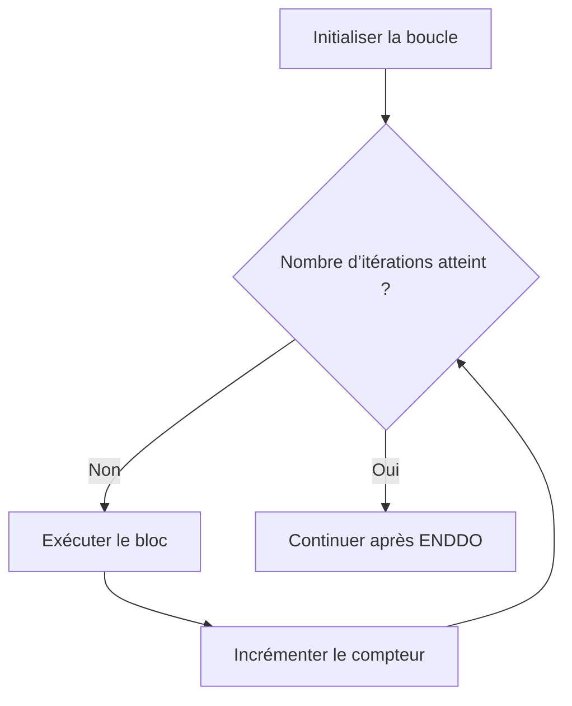

# 6. BOUCLES COMPTÉES AVEC DO

## 6.A RÉSULTAT ATTENDU

- Répéter un traitement un nombre déterminé de fois
- Utiliser `DO ... TIMES`
- Comprendre le comportement de `DO` sans limite
- Exploiter un compteur local fiable
- Éviter les boucles infinies

## 6.B BOUCLE DO ... TIMES

`DO n TIMES` répète le bloc au maximum `n` fois.

```abap
DO 3 TIMES.
  WRITE: / 'Itération', sy-index.
ENDDO.
```

Résultat attendu :

```text
Itération 1
Itération 2
Itération 3
```



## 6.C NOMBRE D’ITÉRATIONS DYNAMIQUE

```abap
PARAMETERS p_count TYPE i DEFAULT 5.

START-OF-SELECTION.

  IF p_count < 0.
    WRITE: / 'Le nombre d’itérations ne peut pas être négatif'.
    RETURN.
  ENDIF.

  DO p_count TIMES.
    WRITE: / 'Passage', sy-index.
  ENDDO.
```

Avec une valeur `0`, le bloc n’est pas exécuté.

## 6.D UTILISER UN COMPTEUR LOCAL

`sy-index` est pratique, mais un compteur local rend les dépendances explicites et résiste mieux aux imbrications.

```abap
DATA lv_iteration TYPE i.

DO 5 TIMES.
  lv_iteration = sy-index.
  WRITE: / 'Itération locale :', lv_iteration.
ENDDO.
```

Pour un compteur métier indépendant :

```abap
DATA lv_sequence TYPE i VALUE 100.

DO 3 TIMES.
  lv_sequence = lv_sequence + 10.
  WRITE: / 'Séquence :', lv_sequence.
ENDDO.
```

## 6.E DO SANS TIMES

`DO.` crée une boucle sans borne intégrée.

```abap
DATA lv_counter TYPE i.

DO.
  lv_counter = lv_counter + 1.

  IF lv_counter >= 5.
    EXIT.
  ENDIF.
ENDDO.
```

> [!WARNING]
> Une boucle `DO.` doit posséder un chemin de sortie garanti. Sans `EXIT`, `RETURN`, exception ou interruption externe, elle ne se termine pas.

## 6.F BORNER LE TRAITEMENT

Même lorsqu’une condition fonctionnelle doit arrêter la boucle, ajouter une limite technique lorsque le risque de boucle infinie existe.

```abap
CONSTANTS lc_max_attempts TYPE i VALUE 100.
DATA lv_found TYPE abap_bool VALUE abap_false.

DO lc_max_attempts TIMES.
  " Recherche ou appel contrôlé

  IF lv_found = abap_true.
    EXIT.
  ENDIF.
ENDDO.

IF lv_found = abap_false.
  WRITE: / 'Limite de tentatives atteinte'.
ENDIF.
```

## 6.G NE PAS UTILISER DO POUR PARCOURIR UNE TABLE

Le parcours métier d’une table interne doit utiliser les instructions dédiées, principalement `LOOP AT`.

À éviter :

```abap
DO lines( lt_items ) TIMES.
  " Lecture par indice non montrée ici
ENDDO.
```

Le dossier **TABLES INTERNES** détaillera les parcours adaptés aux types de table et aux clés.

## 6.H VÉRIFICATION

- Le contrôle syntaxique réussit.
- La version active correspond au code sauvegardé.
- L’exécution produit le résultat décrit dans le chapitre.
- Les cas vide, limite et erreur sont testés séparément lorsque la syntaxe le permet.

## 6.I ERREURS FRÉQUENTES

- Copier un exemple sans adapter les types, noms d’objets et données disponibles dans le système.
- Tester uniquement le cas nominal et ignorer les valeurs initiales, absentes ou invalides.
- Créer une boucle sans condition de sortie fiable.
- Utiliser `CHECK`, `CONTINUE`, `EXIT` ou `RETURN` sans rendre le flux lisible.

## 6.J SNIPPET À RÉUTILISER

> [!NOTE]
> Adapter les noms `Z*`, les types DDIC, les données et les autorisations au système cible. Effectuer un contrôle syntaxique avant activation.

```abap
PARAMETERS p_count TYPE i DEFAULT 5.

START-OF-SELECTION.

  IF p_count < 0.
    WRITE: / 'Le nombre d’itérations ne peut pas être négatif'.
    RETURN.
  ENDIF.

  DO p_count TIMES.
    WRITE: / 'Passage', sy-index.
  ENDDO.
```

## 6.K TERMES DU LEXIQUE

- [Instruction ABAP](<../🧩 00 ├── LEXIQUE SAP ET ABAP/04 ├── LANGAGE ET DEVELOPPEMENT ABAP.md#instruction-abap>)
- [Expression](<../🧩 00 ├── LEXIQUE SAP ET ABAP/04 ├── LANGAGE ET DEVELOPPEMENT ABAP.md#expression>)

## 6.L RÉFÉRENCES OFFICIELLES SAP

- [Using Control Structures in ABAP — SAP Learning](https://learning.sap.com/courses/basic-abap-programming/using-control-structures-in-abap_a4d7803e-eac2-458e-acf9-8628289f3701)
- [DO — ABAP Keyword Documentation](https://help.sap.com/doc/abapdocu_latest_index_htm/latest/en-US/index.htm?file=abapdo.htm)
- [ABAP Statements, Overview — ABAP Keyword Documentation](https://help.sap.com/doc/abapdocu_latest_index_htm/latest/en-US/ABENABAP_STATEMENTS_OVERVIEW.html)


---

[Chapitre suivant — BOUCLES CONDITIONNELLES AVEC WHILE](<./07 ├── BOUCLES CONDITIONNELLES AVEC WHILE.md>)
