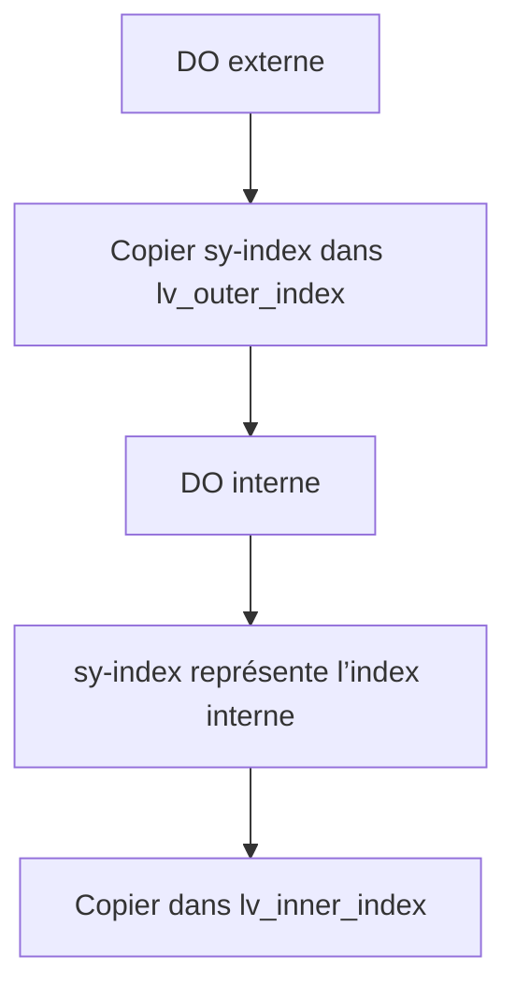

# COMPTEUR DE BOUCLE SY-INDEX

## RÉSULTAT ATTENDU

- Comprendre la valeur de `sy-index`
- L’utiliser dans les boucles `DO` et `WHILE`
- Identifier son comportement dans des boucles imbriquées
- Éviter de le considérer comme une variable métier
- Copier sa valeur lorsqu’elle doit être conservée

## RÔLE DE SY-INDEX

`sy-index` est un champ système qui contient le numéro du passage courant dans une boucle `DO` ou `WHILE`.

```abap
DO 3 TIMES.
  WRITE: / 'Passage :', sy-index.
ENDDO.
```

La première itération porte l’index `1`.

## UTILISATION AVEC WHILE

```abap
DATA lv_value TYPE i VALUE 10.

WHILE lv_value > 0.
  WRITE: / 'Itération :', sy-index,
           'Valeur :', lv_value.
  lv_value = lv_value - 2.
ENDWHILE.
```

`sy-index` compte les itérations ; il ne remplace pas la variable qui pilote la condition.

## BOUCLES IMBRIQUÉES

Dans une boucle imbriquée, `sy-index` représente la boucle la plus interne actuellement exécutée.

```abap
DATA lv_outer_index TYPE i.
DATA lv_inner_index TYPE i.

DO 2 TIMES.
  lv_outer_index = sy-index.

  DO 3 TIMES.
    lv_inner_index = sy-index.

    WRITE: / 'Externe :', lv_outer_index,
             'Interne :', lv_inner_index.
  ENDDO.
ENDDO.
```



Sans copie de l’index externe, sa valeur n’est pas directement disponible pendant l’exécution de la boucle interne.

## NE PAS UTILISER SY-INDEX COMME ÉTAT MÉTIER

À éviter :

```abap
DO 5 TIMES.
  IF sy-index = 3.
    lv_document_status = sy-index.
  ENDIF.
ENDDO.
```

Le statut métier doit avoir sa propre variable et son propre type.

```abap
CONSTANTS lc_status_processed TYPE c LENGTH 1 VALUE 'P'.

DO 5 TIMES.
  IF sy-index = 3.
    lv_document_status = lc_status_processed.
  ENDIF.
ENDDO.
```

## CONSERVER UNE VALEUR

Lorsque la valeur doit être utilisée après une imbrication ou transmise à un autre traitement, la copier immédiatement.

```abap
DATA lv_current_iteration TYPE i.

DO 10 TIMES.
  lv_current_iteration = sy-index.
  " Utiliser lv_current_iteration dans le traitement
ENDDO.
```

## SY-INDEX ET SY-TABIX

Ne pas confondre :

| Champ système | Contexte principal                                   |
| ------------- | ---------------------------------------------------- |
| `sy-index`    | Passage courant d’une boucle `DO` ou `WHILE`         |
| `sy-tabix`    | Index lié à certaines opérations sur tables internes |

`sy-tabix` sera traité avec les tables internes. Sa valeur ne correspond pas au compteur général d’une boucle `DO`.

## BONNES PRATIQUES

- utiliser `sy-index` uniquement dans le contexte immédiat de la boucle ;
- copier sa valeur avant une boucle imbriquée ;
- employer une variable métier lorsque le nombre possède une signification fonctionnelle ;
- ne pas dépendre de sa valeur après la fin de la boucle ;
- utiliser un nom explicite pour chaque niveau d’imbrication.

## VÉRIFICATION

- Le contrôle syntaxique réussit.
- La version active correspond au code sauvegardé.
- L’exécution produit le résultat décrit dans le chapitre.
- Les cas vide, limite et erreur sont testés séparément lorsque la syntaxe le permet.

## ERREURS FRÉQUENTES

- Copier un exemple sans adapter les types, noms d’objets et données disponibles dans le système.
- Tester uniquement le cas nominal et ignorer les valeurs initiales, absentes ou invalides.
- Créer une boucle sans condition de sortie fiable.
- Utiliser `CHECK`, `CONTINUE`, `EXIT` ou `RETURN` sans rendre le flux lisible.

## SNIPPET À RÉUTILISER

> [!NOTE]
> Adapter les noms `Z*`, les types DDIC, les données et les autorisations au système cible. Effectuer un contrôle syntaxique avant activation.

```abap
DATA lv_outer_index TYPE i.
DATA lv_inner_index TYPE i.

DO 2 TIMES.
  lv_outer_index = sy-index.

  DO 3 TIMES.
    lv_inner_index = sy-index.

    WRITE: / 'Externe :', lv_outer_index,
             'Interne :', lv_inner_index.
  ENDDO.
ENDDO.
```

## TERMES DU LEXIQUE

- [Instruction ABAP](<../🧩 00 ├── LEXIQUE SAP ET ABAP/04 ├── LANGAGE ET DEVELOPPEMENT ABAP.md#instruction-abap>)
- [Expression](<../🧩 00 ├── LEXIQUE SAP ET ABAP/04 ├── LANGAGE ET DEVELOPPEMENT ABAP.md#expression>)

## RÉFÉRENCES OFFICIELLES SAP

- [Using Control Structures in ABAP — SAP Learning](https://learning.sap.com/courses/basic-abap-programming/using-control-structures-in-abap_a4d7803e-eac2-458e-acf9-8628289f3701)
- [System Fields — ABAP Keyword Documentation](https://help.sap.com/doc/abapdocu_latest_index_htm/latest/en-US/index.htm?file=abensystem_fields.htm)
- [DO — ABAP Keyword Documentation](https://help.sap.com/doc/abapdocu_latest_index_htm/latest/en-US/index.htm?file=abapdo.htm)


---

[Chapitre suivant — FILTRER UNE ITÉRATION AVEC CHECK ET CONTINUE](<./09 ├── FILTRER UNE ITERATION AVEC CHECK ET CONTINUE.md>)
