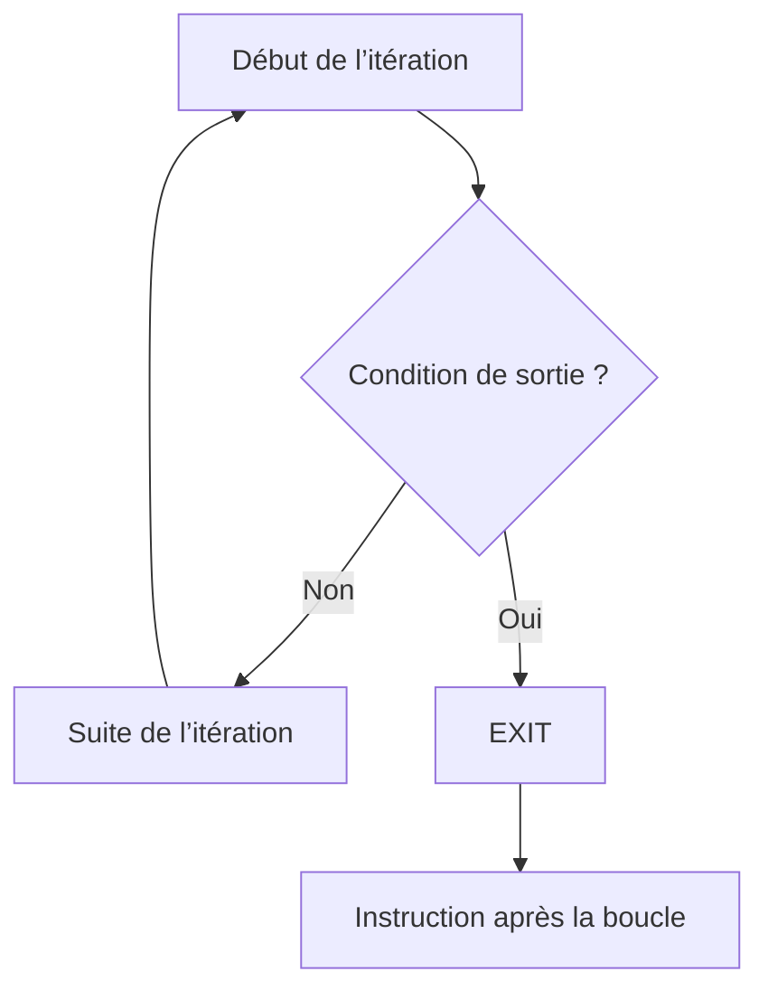

# 10. INTERROMPRE UNE BOUCLE AVEC EXIT

## 10.A RÉSULTAT ATTENDU

- Quitter immédiatement une boucle
- Comprendre la portée de `EXIT`
- Distinguer sortie normale et limite de sécurité
- Gérer les boucles imbriquées
- Éviter les sorties dispersées dans le code

## 10.B SORTIE D’UNE BOUCLE

Dans une boucle, `EXIT` arrête immédiatement la boucle active. L’exécution reprend après l’instruction de fermeture correspondante.

```abap
DO 10 TIMES.
  IF sy-index = 4.
    EXIT.
  ENDIF.

  WRITE: / 'Passage :', sy-index.
ENDDO.

WRITE: / 'Boucle terminée'.
```

Les valeurs `1`, `2` et `3` sont affichées. Le passage `4` déclenche la sortie avant le `WRITE`.



## 10.C RECHERCHE AVEC ARRÊT AU PREMIER RÉSULTAT

```abap
DATA lv_target TYPE i VALUE 7.
DATA lv_found  TYPE abap_bool VALUE abap_false.

DO 20 TIMES.
  IF sy-index = lv_target.
    lv_found = abap_true.
    EXIT.
  ENDIF.
ENDDO.

IF lv_found = abap_true.
  WRITE: / 'Valeur trouvée'.
ELSE.
  WRITE: / 'Valeur non trouvée'.
ENDIF.
```

L’indicateur permet de distinguer une sortie causée par un succès de la fin normale de la boucle.

## 10.D LIMITE DE SÉCURITÉ

```abap
CONSTANTS lc_max_attempts TYPE i VALUE 5.
DATA lv_success TYPE abap_bool VALUE abap_false.

DO lc_max_attempts TIMES.
  " Tentative de traitement

  IF lv_success = abap_true.
    EXIT.
  ENDIF.
ENDDO.

IF lv_success = abap_false.
  WRITE: / 'Échec après le nombre maximal de tentatives'.
ENDIF.
```

## 10.E BOUCLES IMBRIQUÉES

`EXIT` quitte uniquement la boucle dans laquelle il est exécuté.

```abap
DATA lv_outer_index TYPE i.

DO 2 TIMES.
  lv_outer_index = sy-index.

  DO 5 TIMES.
    IF sy-index = 3.
      EXIT.
    ENDIF.

    WRITE: / 'Externe :', lv_outer_index,
             'Interne :', sy-index.
  ENDDO.
ENDDO.
```

La boucle externe poursuit son exécution.

Pour quitter plusieurs niveaux, restructurer le traitement, utiliser un indicateur contrôlé ou quitter le bloc courant avec `RETURN` lorsque cette sortie correspond réellement à l’intention fonctionnelle.

## 10.F RÉSERVER EXIT AUX BOUCLES

Même lorsque certaines variantes syntaxiques permettent un effet hors boucle selon le contexte, utiliser `EXIT` comme instruction de sortie de boucle et `RETURN` pour quitter un bloc de traitement rend l’intention plus claire.

## 10.G ÉVITER LES SORTIES MULTIPLES DISPERSÉES

À éviter :

```abap
DO 100 TIMES.
  IF condition_1 = abap_true.
    EXIT.
  ENDIF.

  " Long traitement

  IF condition_2 = abap_true.
    EXIT.
  ENDIF.
ENDDO.
```

Préférer :

- des gardes regroupées en début d’itération ;
- une condition de sortie nommée ;
- un commentaire lorsque la sortie n’est pas évidente ;
- une procédure plus courte si la boucle contient trop de responsabilités.

## 10.H VÉRIFICATION

- Le contrôle syntaxique réussit.
- La version active correspond au code sauvegardé.
- L’exécution produit le résultat décrit dans le chapitre.
- Les cas vide, limite et erreur sont testés séparément lorsque la syntaxe le permet.

## 10.I ERREURS FRÉQUENTES

- Copier un exemple sans adapter les types, noms d’objets et données disponibles dans le système.
- Tester uniquement le cas nominal et ignorer les valeurs initiales, absentes ou invalides.
- Créer une boucle sans condition de sortie fiable.
- Utiliser `CHECK`, `CONTINUE`, `EXIT` ou `RETURN` sans rendre le flux lisible.

## 10.J SNIPPET À RÉUTILISER

> [!NOTE]
> Adapter les noms `Z*`, les types DDIC, les données et les autorisations au système cible. Effectuer un contrôle syntaxique avant activation.

```abap
DATA lv_target TYPE i VALUE 7.
DATA lv_found  TYPE abap_bool VALUE abap_false.

DO 20 TIMES.
  IF sy-index = lv_target.
    lv_found = abap_true.
    EXIT.
  ENDIF.
ENDDO.

IF lv_found = abap_true.
  WRITE: / 'Valeur trouvée'.
ELSE.
  WRITE: / 'Valeur non trouvée'.
ENDIF.
```

## 10.K TERMES DU LEXIQUE

- [Instruction ABAP](<../🧩 00 ├── LEXIQUE SAP ET ABAP/04 ├── LANGAGE ET DEVELOPPEMENT ABAP.md#instruction-abap>)
- [Expression](<../🧩 00 ├── LEXIQUE SAP ET ABAP/04 ├── LANGAGE ET DEVELOPPEMENT ABAP.md#expression>)

## 10.L RÉFÉRENCES OFFICIELLES SAP

- [EXIT — ABAP Keyword Documentation](https://help.sap.com/doc/abapdocu_latest_index_htm/latest/en-US/index.htm?file=abapexit.htm)
- [DO — ABAP Keyword Documentation](https://help.sap.com/doc/abapdocu_latest_index_htm/latest/en-US/index.htm?file=abapdo.htm)
- [WHILE — ABAP Keyword Documentation](https://help.sap.com/doc/abapdocu_latest_index_htm/latest/en-US/ABAPWHILE_SHORTREF.html)


---

[Chapitre suivant — QUITTER UN BLOC AVEC RETURN](<./11 ├── QUITTER UN BLOC AVEC RETURN.md>)
