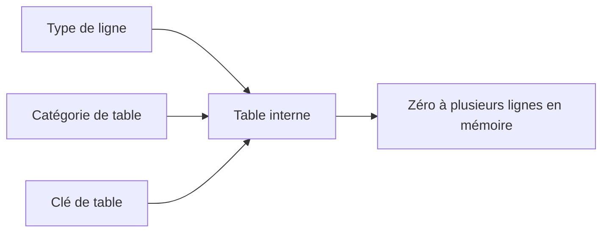
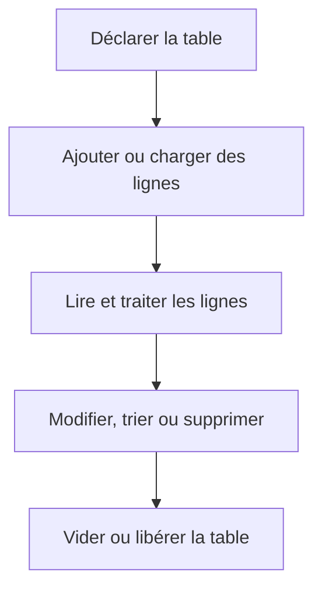

# PRINCIPES ET STRUCTURE D’UNE TABLE INTERNE

## RÉSULTAT ATTENDU

- Comprendre le rôle d’une table interne en ABAP
- Distinguer table interne, structure et table de base de données
- Identifier le type de ligne, la catégorie et la clé d’une table
- Comprendre le caractère dynamique de son nombre de lignes
- Choisir une représentation adaptée au traitement attendu

## DÉFINITION

Une table interne est un objet de données ABAP qui contient zéro, une ou plusieurs lignes de même type.

Elle est créée dans la mémoire de la session ABAP. Son contenu n’est pas automatiquement enregistré dans la base de données.



Une table interne est définie par trois propriétés principales :

| Propriété     | Rôle                                                                           |
| ------------- | ------------------------------------------------------------------------------ |
| Type de ligne | Définit la structure de chaque ligne                                           |
| Catégorie     | Définit l’organisation et les accès possibles                                  |
| Clé           | Définit les composants utilisés pour les accès par clé et l’unicité éventuelle |

## TABLE INTERNE ET STRUCTURE

Une structure représente une seule occurrence.

```abap
TYPES: BEGIN OF ty_product,
         matnr TYPE c LENGTH 18,
         maktx TYPE c LENGTH 40,
         stock TYPE i,
       END OF ty_product.

DATA ls_product TYPE ty_product.
```

Une table interne représente une collection d’occurrences du même type.

```abap
DATA lt_products TYPE STANDARD TABLE OF ty_product
                 WITH EMPTY KEY.
```

Convention fréquemment utilisée :

- `ls_...` : structure locale ou ligne de travail ;
- `lt_...` : table interne locale ;
- `ty_...` : type local.

Ces préfixes sont des conventions de nommage, pas des mots-clés ABAP.

## TABLE INTERNE ET TABLE DE BASE DE DONNÉES

| Table interne                                                    | Table de base de données              |
| ---------------------------------------------------------------- | ------------------------------------- |
| Objet de données en mémoire                                      | Objet persistant du Dictionnaire ABAP |
| Existe pendant l’exécution ou selon la portée de l’objet         | Existe indépendamment du programme    |
| Manipulée avec `APPEND`, `INSERT`, `READ TABLE`, `LOOP AT`, etc. | Lue ou modifiée avec ABAP SQL         |
| Nombre de lignes dynamique                                       | Données persistées en base            |

> [!IMPORTANT]
> Une table interne peut recevoir des données issues d’ABAP SQL, mais elle reste distincte de la table de base de données qui a servi de source.

## CYCLE DE VIE SIMPLIFIÉ



## PREMIER EXEMPLE

```abap
" Traiter la collection sans lecture SQL dans la boucle.
REPORT z_demo_itab_01.

TYPES: BEGIN OF ty_product,
         matnr TYPE c LENGTH 18,
         maktx TYPE c LENGTH 40,
       END OF ty_product.

DATA lt_products TYPE STANDARD TABLE OF ty_product
                 WITH EMPTY KEY.

APPEND VALUE #( matnr = 'MAT-001'
                maktx = 'Produit de démonstration' )
       TO lt_products.

LOOP AT lt_products INTO DATA(ls_product).
  WRITE: / ls_product-matnr, ls_product-maktx.
ENDLOOP.
```

## POINTS À RETENIR

- Une table interne ne contient que des lignes compatibles avec son type de ligne.
- Son nombre de lignes est dynamique.
- Sa catégorie et sa clé doivent être choisies selon les accès attendus.
- Une table interne n’est pas une table de base de données.
- Le contenu est généralement temporaire et propre à la session ABAP.

## VÉRIFICATION

- Le contrôle syntaxique réussit.
- La version active correspond au code sauvegardé.
- L’exécution produit le résultat décrit dans le chapitre.
- Les cas vide, limite et erreur sont testés séparément lorsque la syntaxe le permet.

## ERREURS FRÉQUENTES

- Copier un exemple sans adapter les types, noms d’objets et données disponibles dans le système.
- Tester uniquement le cas nominal et ignorer les valeurs initiales, absentes ou invalides.
- Utiliser une table standard pour des recherches massives par clé sans mesure.
- Modifier une copie de ligne alors que la table devait être mise à jour.

## SNIPPET À RÉUTILISER

> [!NOTE]
> Adapter les noms `Z*`, les types DDIC, les données et les autorisations au système cible. Effectuer un contrôle syntaxique avant activation.

```abap
" Traiter la collection sans lecture SQL dans la boucle.
REPORT z_demo_itab_01.

TYPES: BEGIN OF ty_product,
         matnr TYPE c LENGTH 18,
         maktx TYPE c LENGTH 40,
       END OF ty_product.

DATA lt_products TYPE STANDARD TABLE OF ty_product
                 WITH EMPTY KEY.

APPEND VALUE #( matnr = 'MAT-001'
                maktx = 'Produit de démonstration' )
       TO lt_products.

LOOP AT lt_products INTO DATA(ls_product).
  WRITE: / ls_product-matnr, ls_product-maktx.
ENDLOOP.
```

## TERMES DU LEXIQUE

- [Structure](<../🧩 00 ├── LEXIQUE SAP ET ABAP/04 ├── LANGAGE ET DEVELOPPEMENT ABAP.md#structure-abap>)
- [Table interne](<../🧩 00 ├── LEXIQUE SAP ET ABAP/04 ├── LANGAGE ET DEVELOPPEMENT ABAP.md#table-interne>)
- [Field-symbol](<../🧩 00 ├── LEXIQUE SAP ET ABAP/04 ├── LANGAGE ET DEVELOPPEMENT ABAP.md#field-symbol>)
- [Référence](<../🧩 00 ├── LEXIQUE SAP ET ABAP/04 ├── LANGAGE ET DEVELOPPEMENT ABAP.md#reference>)

## RÉFÉRENCES OFFICIELLES SAP

- [Working with Simple Internal Tables — SAP Learning](https://learning.sap.com/courses/basic-abap-programming/working-with-simple-internal-tables_a4beb937-0c7b-45b9-92be-ff26a5159fad)
- [Working with Complex Internal Tables — SAP Learning](https://learning.sap.com/courses/basic-abap-programming/working-with-complex-internal-tables_f8c923f3-6f95-4b47-960f-557001f13977)
- [Internal Tables — ABAP Keyword Documentation](https://help.sap.com/doc/abapdocu_latest_index_htm/latest/en-US/ABENITAB.html)


---

[Chapitre suivant — DÉCLARATION DES TYPES ET TABLES INTERNES](<./02 ├── DECLARATION DES TYPES ET TABLES INTERNES.md>)
