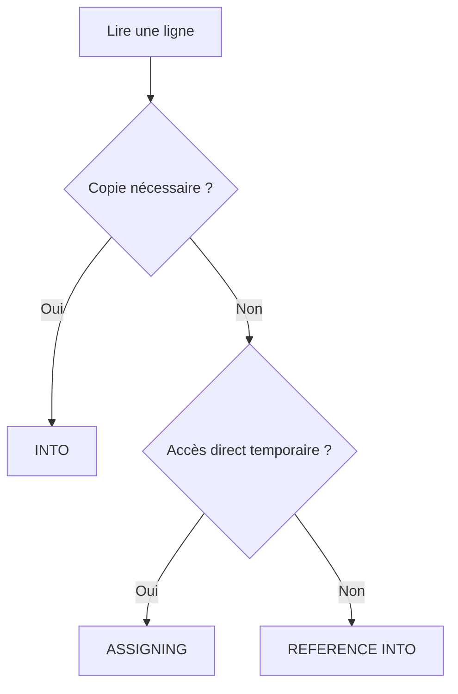

# 6. LIRE UNE LIGNE AVEC READ TABLE

## 6.A RÉSULTAT ATTENDU

- Lire une ligne par index ou par clé
- Utiliser `INTO`, `ASSIGNING` et `REFERENCE INTO`
- Interpréter `sy-subrc` et `sy-tabix`
- Distinguer `WITH KEY` et `WITH TABLE KEY`
- Éviter les lectures ambiguës

## 6.B LECTURE PAR INDEX

```abap
" Exemple à éviter : comparer avec la correction décrite après le bloc.
READ TABLE lt_products
  INTO DATA(ls_product)
  INDEX 1.

IF sy-subrc = 0.
  WRITE: / ls_product-matnr.
ENDIF.
```

L’accès par index est disponible pour les tables standard et triées, pas pour l’index primaire d’une table hachée.

## 6.C LECTURE PAR CLÉ LIBRE

```abap
" Accéder à la ligne par une clé adaptée au besoin.
READ TABLE lt_products
  INTO DATA(ls_product)
  WITH KEY matnr = 'MAT-001'.
```

`WITH KEY` décrit une clé de recherche libre. La stratégie utilisée dépend de la catégorie, de la clé de table et des composants fournis.

## 6.D LECTURE AVEC LA CLÉ DE TABLE

```abap
" Accéder à la ligne par une clé adaptée au besoin.
READ TABLE lt_products
  INTO DATA(ls_product)
  WITH TABLE KEY matnr = 'MAT-001'.
```

Cette syntaxe exprime explicitement un accès au moyen de la clé de table correspondante.

Pour une clé nommée :

```abap
" Accéder à la ligne par une clé adaptée au besoin.
READ TABLE lt_products
  INTO DATA(ls_product)
  WITH TABLE KEY primary_key
  COMPONENTS matnr = 'MAT-001'.
```

## 6.E CONTRÔLE DU RÉSULTAT

Après `READ TABLE` :

- `sy-subrc = 0` : ligne trouvée ;
- `sy-subrc <> 0` : aucune ligne correspondante ;
- `sy-tabix` contient l’index concerné pour les accès où un index est défini ;
- pour une table hachée, `sy-tabix` n’est pas un index de ligne exploitable.

```abap
" Accéder à la ligne par une clé adaptée au besoin.
READ TABLE lt_products
  INTO ls_product
  WITH KEY matnr = p_matnr.

IF sy-subrc <> 0.
  MESSAGE 'Produit absent de la table interne' TYPE 'I'.
  RETURN.
ENDIF.
```

## 6.F TRANSPORTING NO FIELDS

Lorsque seule l’existence ou la position est nécessaire, éviter de copier la ligne.

```abap
" Exemple à éviter : comparer avec la correction décrite après le bloc.
READ TABLE lt_products
  TRANSPORTING NO FIELDS
  WITH KEY matnr = 'MAT-001'.

IF sy-subrc = 0.
  WRITE: / 'Produit trouvé'.
ENDIF.
```

## 6.G LECTURE PAR ASSIGNING

```abap
" Exemple à éviter : comparer avec la correction décrite après le bloc.
READ TABLE lt_products
  ASSIGNING FIELD-SYMBOL(<ls_product>)
  WITH KEY matnr = 'MAT-001'.

IF sy-subrc = 0.
  WRITE: / <ls_product>-maktx.
ENDIF.
```

Le symbole de champ désigne directement la ligne trouvée.

## 6.H LECTURE PAR RÉFÉRENCE

```abap
" Accéder à la ligne par une clé adaptée au besoin.
READ TABLE lt_products
  REFERENCE INTO DATA(lr_product)
  WITH KEY matnr = 'MAT-001'.

IF sy-subrc = 0.
  WRITE: / lr_product->maktx.
ENDIF.
```

## 6.I CHOIX DE LA VARIANTE



## 6.J ERREUR FRÉQUENTE

Ne pas utiliser la zone de travail sans contrôler le résultat.

```abap
READ TABLE lt_products INTO ls_product WITH KEY matnr = p_matnr.

IF sy-subrc = 0.
  " Utilisation sûre de ls_product
ENDIF.
```

## 6.K VÉRIFICATION

- Le contrôle syntaxique réussit.
- La version active correspond au code sauvegardé.
- L’exécution produit le résultat décrit dans le chapitre.
- Les cas vide, limite et erreur sont testés séparément lorsque la syntaxe le permet.

## 6.L ERREURS FRÉQUENTES

- Copier un exemple sans adapter les types, noms d’objets et données disponibles dans le système.
- Tester uniquement le cas nominal et ignorer les valeurs initiales, absentes ou invalides.
- Utiliser une table standard pour des recherches massives par clé sans mesure.
- Modifier une copie de ligne alors que la table devait être mise à jour.

## 6.M SNIPPET À RÉUTILISER

> [!NOTE]
> Adapter les noms `Z*`, les types DDIC, les données et les autorisations au système cible. Effectuer un contrôle syntaxique avant activation.

```abap
" Accéder à la ligne par une clé adaptée au besoin.
READ TABLE lt_products
  INTO ls_product
  WITH KEY matnr = p_matnr.

IF sy-subrc <> 0.
  MESSAGE 'Produit absent de la table interne' TYPE 'I'.
  RETURN.
ENDIF.
```

## 6.N TERMES DU LEXIQUE

- [Table interne](<../🧩 00 ├── LEXIQUE SAP ET ABAP/04 ├── LANGAGE ET DEVELOPPEMENT ABAP.md#table-interne>)
- [Structure](<../🧩 00 ├── LEXIQUE SAP ET ABAP/04 ├── LANGAGE ET DEVELOPPEMENT ABAP.md#structure-abap>)
- [Field-symbol](<../🧩 00 ├── LEXIQUE SAP ET ABAP/04 ├── LANGAGE ET DEVELOPPEMENT ABAP.md#field-symbol>)
- [Référence](<../🧩 00 ├── LEXIQUE SAP ET ABAP/04 ├── LANGAGE ET DEVELOPPEMENT ABAP.md#reference>)

## 6.O RÉFÉRENCES OFFICIELLES SAP

- [Working with Complex Internal Tables — SAP Learning](https://learning.sap.com/courses/basic-abap-programming/working-with-complex-internal-tables_f8c923f3-6f95-4b47-960f-557001f13977)
- [READ TABLE — ABAP Keyword Documentation](https://help.sap.com/doc/abapdocu_latest_index_htm/latest/en-US/ABAPREAD_TABLE.html)
- [Internal Tables, Key Accesses — ABAP Keyword Documentation](https://help.sap.com/doc/abapdocu_latest_index_htm/latest/en-US/ABENREAD_ITAB_USING_KEY_ABEXA.html)


---

[Chapitre suivant — EXPRESSIONS DE TABLE ET TEST D’EXISTENCE](<./07 ├── EXPRESSIONS DE TABLE ET TEST D EXISTENCE.md>)
