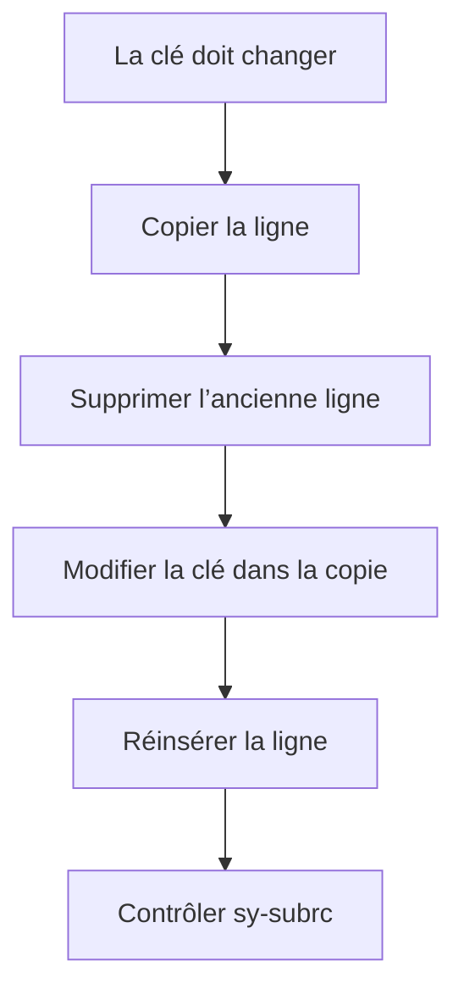

# 10. MODIFIER DES LIGNES

## 10.A RÉSULTAT ATTENDU

- Modifier une ligne par index ou par clé
- Utiliser `MODIFY ... TRANSPORTING`
- Modifier plusieurs lignes avec `WHERE`
- Modifier directement avec une expression de table
- Comprendre les restrictions portant sur les clés

## 10.B MODIFIER PAR INDEX

```abap
" Accéder à la ligne par une clé adaptée au besoin.
READ TABLE lt_products INTO DATA(ls_product) INDEX 1.

IF sy-subrc = 0.
  ls_product-stock = 100.
  MODIFY lt_products FROM ls_product INDEX 1.
ENDIF.
```

Cette variante concerne les tables d’index.

## 10.C MODIFIER PAR CLÉ

```abap
ls_product-matnr = 'MAT-001'.
ls_product-stock = 100.

MODIFY TABLE lt_products FROM ls_product.
```

La ligne cible est identifiée au moyen de la clé de table applicable.

## 10.D TRANSPORTING

`TRANSPORTING` limite les composants remplacés.

```abap
MODIFY lt_products
  FROM ls_product
  TRANSPORTING stock status
  WHERE category = 'A'.
```

Seuls `stock` et `status` sont modifiés pour les lignes qui respectent le filtre.

## 10.E MODIFIER DANS LOOP AVEC INTO

```abap
" Traiter la collection sans lecture SQL dans la boucle.
LOOP AT lt_products INTO DATA(ls_product)
     WHERE stock < 0.
  ls_product-stock = 0.
  MODIFY lt_products FROM ls_product INDEX sy-tabix.
ENDLOOP.
```

## 10.F MODIFIER DANS LOOP AVEC ASSIGNING

```abap
" Traiter la collection sans lecture SQL dans la boucle.
LOOP AT lt_products ASSIGNING FIELD-SYMBOL(<ls_product>)
     WHERE stock < 0.
  <ls_product>-stock = 0.
ENDLOOP.
```

Cette forme est plus directe lorsqu’aucune copie n’est nécessaire.

## 10.G EXPRESSION DE TABLE À GAUCHE

```abap
" Accéder à la ligne par une clé adaptée au besoin.
lt_products[ matnr = 'MAT-001' ]-stock = 100.
```

La ligne doit exister. Sinon, l’exception `CX_SY_ITAB_LINE_NOT_FOUND` est levée.

Approche contrôlée :

```abap
" Accéder à la ligne par une clé adaptée au besoin.
IF line_exists( lt_products[ matnr = 'MAT-001' ] ).
  lt_products[ matnr = 'MAT-001' ]-stock = 100.
ENDIF.
```

## 10.H MODIFIER UNE CLÉ

Pour une table triée ou hachée, ne pas modifier directement les composants de la clé primaire de manière à contredire l’organisation de la table.



## 10.I SY-SUBRC

Contrôler `sy-subrc` lorsqu’une modification peut ne trouver aucune ligne ou violer une contrainte de clé.

```abap
MODIFY TABLE lt_products FROM ls_product.

IF sy-subrc <> 0.
  WRITE: / 'Aucune ligne modifiée'.
ENDIF.
```

## 10.J CHOISIR LA TECHNIQUE

| Situation                           | Technique                           |
| ----------------------------------- | ----------------------------------- |
| Une ligne connue par index          | `MODIFY ... INDEX`                  |
| Une ligne connue par clé            | `MODIFY TABLE`                      |
| Plusieurs lignes filtrées           | `MODIFY ... TRANSPORTING ... WHERE` |
| Modification pendant un parcours    | `LOOP ... ASSIGNING`                |
| Modification concise d’un composant | Expression de table à gauche        |

## 10.K VÉRIFICATION

- Le contrôle syntaxique réussit.
- La version active correspond au code sauvegardé.
- L’exécution produit le résultat décrit dans le chapitre.
- Les cas vide, limite et erreur sont testés séparément lorsque la syntaxe le permet.

## 10.L ERREURS FRÉQUENTES

- Copier un exemple sans adapter les types, noms d’objets et données disponibles dans le système.
- Tester uniquement le cas nominal et ignorer les valeurs initiales, absentes ou invalides.
- Utiliser une table standard pour des recherches massives par clé sans mesure.
- Modifier une copie de ligne alors que la table devait être mise à jour.

## 10.M SNIPPET À RÉUTILISER

> [!NOTE]
> Adapter les noms `Z*`, les types DDIC, les données et les autorisations au système cible. Effectuer un contrôle syntaxique avant activation.

```abap
" Accéder à la ligne par une clé adaptée au besoin.
READ TABLE lt_products INTO DATA(ls_product) INDEX 1.

IF sy-subrc = 0.
  ls_product-stock = 100.
  MODIFY lt_products FROM ls_product INDEX 1.
ENDIF.
```

## 10.N TERMES DU LEXIQUE

- [Table interne](<../🧩 00 ├── LEXIQUE SAP ET ABAP/04 ├── LANGAGE ET DEVELOPPEMENT ABAP.md#table-interne>)
- [Structure](<../🧩 00 ├── LEXIQUE SAP ET ABAP/04 ├── LANGAGE ET DEVELOPPEMENT ABAP.md#structure-abap>)
- [Field-symbol](<../🧩 00 ├── LEXIQUE SAP ET ABAP/04 ├── LANGAGE ET DEVELOPPEMENT ABAP.md#field-symbol>)
- [Référence](<../🧩 00 ├── LEXIQUE SAP ET ABAP/04 ├── LANGAGE ET DEVELOPPEMENT ABAP.md#reference>)

## 10.O RÉFÉRENCES OFFICIELLES SAP

- [Modifying Table Content — SAP Help Portal](https://help.sap.com/docs/abap-cloud/abap-concepts/modifying-table-content)
- [MODIFY itab — ABAP Keyword Documentation](https://help.sap.com/doc/abapdocu_latest_index_htm/latest/en-US/ABAPMODIFY_ITAB.html)
- [Modifying Internal Tables in a Loop — ABAP Keyword Documentation](https://help.sap.com/doc/abapdocu_latest_index_htm/latest/en-US/ABENITAB_LOOP_CHANGE.html)


---

[Chapitre suivant — SUPPRIMER, VIDER ET LIBÉRER UNE TABLE](<./11 ├── SUPPRIMER VIDER ET LIBERER UNE TABLE.md>)
