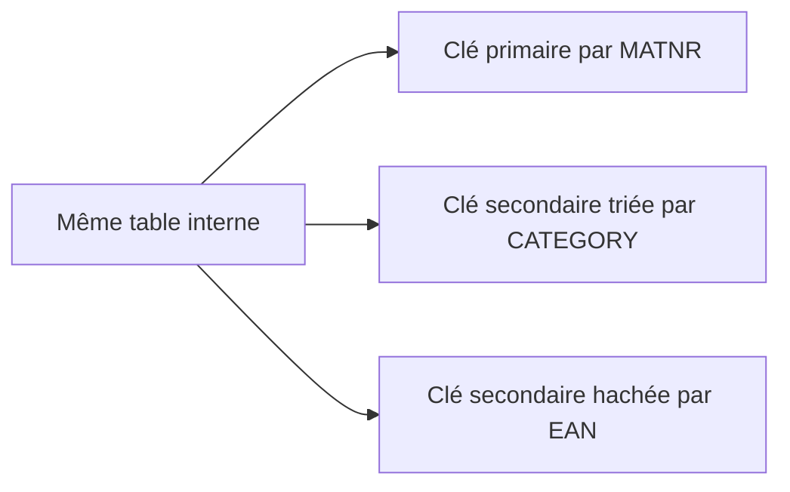

# CLÉS SECONDAIRES

## RÉSULTAT ATTENDU

- Comprendre l’intérêt d’une clé secondaire
- Déclarer une clé secondaire triée ou hachée
- Utiliser explicitement une clé avec `USING KEY` et `KEY`
- Comprendre le coût de maintenance des clés
- Éviter l’ajout systématique de clés secondaires

## POURQUOI UNE CLÉ SECONDAIRE

Une table possède une clé primaire, mais un traitement peut nécessiter plusieurs chemins d’accès.

Exemple :

- accès unique par `matnr` ;
- parcours de tous les produits d’une `category` ;
- recherche par `ean`.

Une clé secondaire permet d’optimiser un accès qui ne correspond pas à la clé primaire.



## DÉCLARATION

```abap
DATA lt_products TYPE HASHED TABLE OF ty_product
                 WITH UNIQUE KEY primary_key COMPONENTS matnr
                 WITH NON-UNIQUE SORTED KEY sk_category
                      COMPONENTS category
                 WITH UNIQUE HASHED KEY hk_ean
                      COMPONENTS ean.
```

Règles principales :

- une clé secondaire triée peut être unique ou non unique ;
- une clé secondaire hachée doit être unique ;
- chaque clé porte un nom ;
- chaque clé consomme de la mémoire et doit être maintenue lors des modifications.

## UTILISER UNE CLÉ DANS LOOP

```abap
" Traiter la collection sans lecture SQL dans la boucle.
LOOP AT lt_products
     INTO DATA(ls_product)
     USING KEY sk_category
     WHERE category = 'A'.
  WRITE: / ls_product-matnr.
ENDLOOP.
```

## UTILISER UNE CLÉ DANS READ TABLE

```abap
" Accéder à la ligne par une clé adaptée au besoin.
READ TABLE lt_products
  INTO DATA(ls_product)
  WITH TABLE KEY hk_ean
  COMPONENTS ean = p_ean.
```

## UTILISER UNE CLÉ DANS UNE EXPRESSION

```abap
" Accéder à la ligne par une clé adaptée au besoin.
IF line_exists( lt_products[
     KEY sk_category
     COMPONENTS category = 'A' ] ).
  WRITE: / 'Catégorie présente'.
ENDIF.
```

## COÛT DE MAINTENANCE

Une clé secondaire améliore certains accès, mais elle introduit :

- une consommation mémoire supplémentaire ;
- un coût de création de l’index ou de la structure de hachage ;
- un coût de mise à jour lors des insertions, suppressions ou modifications ;
- une complexité supplémentaire dans la déclaration et la maintenance du code.

Les clés secondaires non uniques peuvent être administrées de manière différée selon leur utilisation. Les clés uniques doivent garantir leur unicité en permanence.

## QUAND L’UTILISER

Ajouter une clé secondaire lorsque :

- la table est suffisamment volumineuse ;
- le même accès alternatif est répété ;
- l’accès sans clé est identifié comme coûteux ;
- la fréquence des lectures justifie le coût de maintenance ;
- la clé peut être réellement utilisée par les instructions concernées.

## QUAND NE PAS L’UTILISER

Ne pas ajouter une clé secondaire :

- pour une petite table parcourue une seule fois ;
- sans accès correspondant ;
- uniquement par anticipation ;
- sans mesure lorsque la performance est le seul motif.

## VÉRIFICATION

- Le contrôle syntaxique réussit.
- La version active correspond au code sauvegardé.
- L’exécution produit le résultat décrit dans le chapitre.
- Les cas vide, limite et erreur sont testés séparément lorsque la syntaxe le permet.

## ERREURS FRÉQUENTES

- Copier un exemple sans adapter les types, noms d’objets et données disponibles dans le système.
- Tester uniquement le cas nominal et ignorer les valeurs initiales, absentes ou invalides.
- Utiliser une table standard pour des recherches massives par clé sans mesure.
- Modifier une copie de ligne alors que la table devait être mise à jour.

## SNIPPET À RÉUTILISER

> [!NOTE]
> Adapter les noms `Z*`, les types DDIC, les données et les autorisations au système cible. Effectuer un contrôle syntaxique avant activation.

```abap
" Traiter la collection sans lecture SQL dans la boucle.
LOOP AT lt_products
     INTO DATA(ls_product)
     USING KEY sk_category
     WHERE category = 'A'.
  WRITE: / ls_product-matnr.
ENDLOOP.
```

## TERMES DU LEXIQUE

- [Table interne](<../🧩 00 ├── LEXIQUE SAP ET ABAP/04 ├── LANGAGE ET DEVELOPPEMENT ABAP.md#table-interne>)
- [Structure](<../🧩 00 ├── LEXIQUE SAP ET ABAP/04 ├── LANGAGE ET DEVELOPPEMENT ABAP.md#structure-abap>)
- [Field-symbol](<../🧩 00 ├── LEXIQUE SAP ET ABAP/04 ├── LANGAGE ET DEVELOPPEMENT ABAP.md#field-symbol>)
- [Référence](<../🧩 00 ├── LEXIQUE SAP ET ABAP/04 ├── LANGAGE ET DEVELOPPEMENT ABAP.md#reference>)

## RÉFÉRENCES OFFICIELLES SAP

- [Improving Internal Table Performance Using Secondary Keys — SAP Learning](https://learning.sap.com/courses/deepening-your-abap-programming-knowledge/improving-internal-table-performance-using-secondary-keys_b426a7ff-a881-4270-95d9-9933e03a37f1)
- [Secondary Table Keys — ABAP Keyword Documentation](https://help.sap.com/doc/abapdocu_latest_index_htm/latest/en-US/ABENITAB_KEY_SECONDARY.html)
- [Specifying Table Keys — SAP Help Portal](https://help.sap.com/docs/abap-cloud/abap-concepts/specifying-table-keys)


---

[Chapitre suivant — PERFORMANCE ET BONNES PRATIQUES](<./16 └── PERFORMANCE ET BONNES PRATIQUES.md>)
