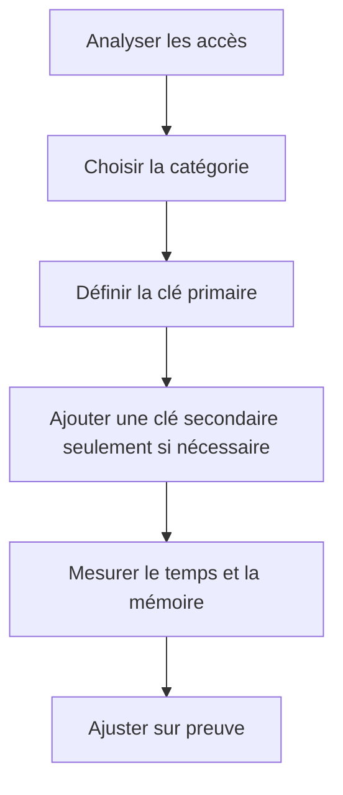

# 16. PERFORMANCE ET BONNES PRATIQUES

## 16.A RÉSULTAT ATTENDU

- Choisir une table interne selon les accès réels
- Réduire les copies et recherches inutiles
- Identifier les erreurs de performance courantes
- Concevoir des clés adaptées
- Mesurer avant d’optimiser

## 16.B PARTIR DU MODE D’ACCÈS

Le choix d’une table interne ne doit pas reposer uniquement sur le volume.

Analyser :

- comment les lignes sont ajoutées ;
- si l’ordre est important ;
- si les lectures sont complètes ou ciblées ;
- si une clé complète est disponible ;
- si les recherches sont uniques ou par plage ;
- si les lignes sont fréquemment modifiées.



## 16.C RÈGLES DE CHOIX

| Scénario                                                | Choix initial raisonnable                      |
| ------------------------------------------------------- | ---------------------------------------------- |
| Ajout séquentiel puis parcours complet                  | Table standard à clé vide                      |
| Accès répété par clé complète unique                    | Table hachée                                   |
| Accès par clé partielle ou parcours dans l’ordre de clé | Table triée                                    |
| Plusieurs chemins d’accès répétés                       | Clé primaire adaptée et clé secondaire mesurée |

## 16.D ÉVITER LES RECHERCHES LINÉAIRES RÉPÉTÉES

Problème :

```abap
" Exemple à éviter : comparer avec la correction décrite après le bloc.
LOOP AT lt_orders INTO DATA(ls_order).
  READ TABLE lt_customers
    INTO DATA(ls_customer)
    WITH KEY kunnr = ls_order-kunnr.
ENDLOOP.
```

Si `lt_customers` est une grande table standard sans clé adaptée, chaque recherche peut parcourir de nombreuses lignes.

Solutions possibles :

- table hachée avec clé unique `kunnr` ;
- table triée avec clé `kunnr` ;
- clé secondaire ;
- refonte du chargement ou du traitement.

## 16.E ÉVITER LES COPIES INUTILES

Pour modifier les lignes :

```abap
" Exemple à éviter : comparer avec la correction décrite après le bloc.
LOOP AT lt_products ASSIGNING FIELD-SYMBOL(<ls_product>).
  <ls_product>-stock = 0.
ENDLOOP.
```

Cette forme évite la copie dans une zone de travail puis le `MODIFY` de restitution.

Pour un simple test d’existence :

```abap
IF line_exists( lt_products[ matnr = p_matnr ] ).
  " Traitement
ENDIF.
```

Ou, sur une version plus ancienne :

```abap
" Accéder à la ligne par une clé adaptée au besoin.
READ TABLE lt_products
  TRANSPORTING NO FIELDS
  WITH KEY matnr = p_matnr.
```

## 16.F BINARY SEARCH

`READ TABLE ... BINARY SEARCH` ne doit être utilisé que sur une table standard correctement triée selon les composants et l’ordre requis par la recherche.

Une incohérence entre le tri et la clé de recherche produit un résultat incorrect ou incomplet.

Préférer une table triée avec clé explicite lorsque la recherche binaire fait partie du comportement permanent de la table.

## 16.G LIMITER LES BOUCLES IMBRIQUÉES

Une boucle imbriquée sur deux grandes tables peut multiplier fortement le nombre d’itérations.

Avant de conserver ce schéma :

- examiner les tailles maximales ;
- ajouter une clé adaptée à la table interne lue dans la boucle interne ;
- filtrer au plus tôt ;
- envisager une autre construction des données.

## 16.H NE PAS SUR-OPTIMISER

Une table hachée ou plusieurs clés secondaires ne sont pas automatiquement meilleures.

Elles ont aussi un coût :

- création ;
- insertion ;
- mise à jour ;
- mémoire ;
- complexité du code.

Pour une petite table parcourue une fois, une table standard peut être suffisante et plus lisible.

## 16.I MESURER

Utiliser les outils disponibles dans SAP GUI pour confirmer un problème :

- analyse du temps d’exécution avec la transaction `SAT` ;
- analyse ABAP classique avec `SE30` sur les systèmes qui l’utilisent encore ;
- débogueur pour vérifier les volumes et les accès ;
- ABAP Test Cockpit ou Code Inspector pour les contrôles statiques selon le système.

## 16.J CHECKLIST

- [ ] La catégorie correspond-elle au mode de lecture dominant ?
- [ ] La clé primaire représente-t-elle l’accès principal ?
- [ ] L’unicité est-elle exprimée dans le type lorsque nécessaire ?
- [ ] Les parcours utilisent-ils `WHERE` ou une clé adaptée ?
- [ ] Les modifications évitent-elles les copies inutiles ?
- [ ] Les clés secondaires répondent-elles à un accès réellement répété ?
- [ ] Les boucles imbriquées ont-elles été analysées avec les volumes réels ?
- [ ] L’optimisation repose-t-elle sur une mesure ?

## 16.K VÉRIFICATION

- Le contrôle syntaxique réussit.
- La version active correspond au code sauvegardé.
- L’exécution produit le résultat décrit dans le chapitre.
- Les cas vide, limite et erreur sont testés séparément lorsque la syntaxe le permet.

## 16.L ERREURS FRÉQUENTES

- Copier un exemple sans adapter les types, noms d’objets et données disponibles dans le système.
- Tester uniquement le cas nominal et ignorer les valeurs initiales, absentes ou invalides.
- Utiliser une table standard pour des recherches massives par clé sans mesure.
- Modifier une copie de ligne alors que la table devait être mise à jour.

## 16.M SNIPPET À RÉUTILISER

> [!NOTE]
> Adapter les noms `Z*`, les types DDIC, les données et les autorisations au système cible. Effectuer un contrôle syntaxique avant activation.

```abap
IF line_exists( lt_products[ matnr = p_matnr ] ).
  " Traitement
ENDIF.
```

## 16.N TERMES DU LEXIQUE

- [Table interne](<../🧩 00 ├── LEXIQUE SAP ET ABAP/04 ├── LANGAGE ET DEVELOPPEMENT ABAP.md#table-interne>)
- [Structure](<../🧩 00 ├── LEXIQUE SAP ET ABAP/04 ├── LANGAGE ET DEVELOPPEMENT ABAP.md#structure-abap>)
- [Field-symbol](<../🧩 00 ├── LEXIQUE SAP ET ABAP/04 ├── LANGAGE ET DEVELOPPEMENT ABAP.md#field-symbol>)
- [Référence](<../🧩 00 ├── LEXIQUE SAP ET ABAP/04 ├── LANGAGE ET DEVELOPPEMENT ABAP.md#reference>)

## 16.O RÉFÉRENCES OFFICIELLES SAP

- [Working with Sorted and Hashed Tables — SAP Learning](https://learning.sap.com/courses/deepening-your-abap-programming-knowledge/working-with-sorted-and-hashed-tables_de84be91-c7db-4166-95cf-2b036c8d5558)
- [Improving Internal Table Performance Using Secondary Keys — SAP Learning](https://learning.sap.com/courses/deepening-your-abap-programming-knowledge/improving-internal-table-performance-using-secondary-keys_b426a7ff-a881-4270-95d9-9933e03a37f1)
- [Technical Properties of Internal Tables — SAP Help Portal](https://help.sap.com/docs/abap-cloud/abap-concepts/internal-table-setup)
- [Internal Tables, Performance Notes — ABAP Keyword Documentation](https://help.sap.com/doc/abapdocu_latest_index_htm/latest/en-US/ABENITAB_PERFO.html)
