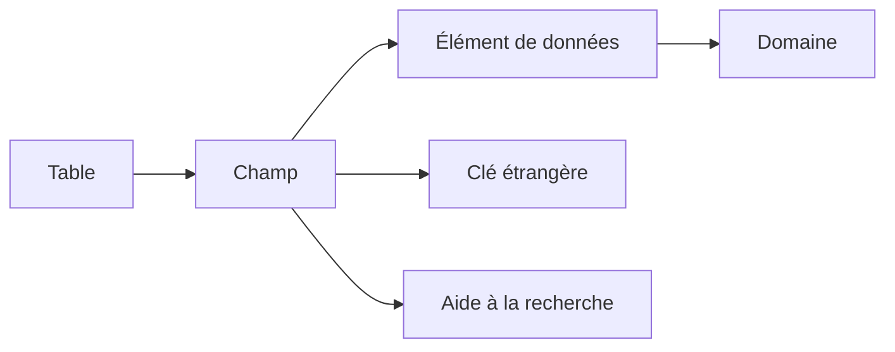

# NAVIGATION ET ANALYSE AVEC SE11

## RÉSULTAT ATTENDU

- Naviguer dans la transaction SE11
- Afficher un objet sans le modifier
- Suivre les dépendances entre objets DDIC
- Identifier les transactions complémentaires
- Analyser un objet standard avant une intervention

## ÉCRAN INITIAL DE SE11

La transaction `SE11` permet de créer, afficher et modifier les principaux objets du Dictionary.

Selon la version du système, l’écran propose notamment :

- table de base de données ;
- vue ;
- type de données ;
- domaine ;
- aide à la recherche ;
- objet de verrouillage.

Pour un type de données, le système demande ensuite s’il s’agit d’un élément de données, d’une structure ou d’un type de table.

## MODE AFFICHAGE AVANT MODE MODIFICATION

Lors d’une analyse, commencer par **Afficher**.

Le mode affichage permet de consulter :

- la définition active ;
- les attributs techniques ;
- la documentation ;
- les objets dépendants ;
- les versions disponibles ;
- l’entrée de répertoire et le package.

Ne jamais modifier directement un objet standard SAP pour corriger rapidement un besoin client. Vérifier d’abord les mécanismes d’extension disponibles.

## NAVIGATION PAR DOUBLE-CLIC

Dans les écrans DDIC, un double-clic sur un objet référencé ouvre généralement sa définition.

Exemples :

- double-clic sur un élément de données depuis un champ de table ;
- double-clic sur le domaine depuis un élément de données ;
- double-clic sur une table de contrôle depuis une clé étrangère ;
- double-clic sur une aide à la recherche affectée.



## OUTILS D’ANALYSE

| Fonction             | Usage                                                    |
| -------------------- | -------------------------------------------------------- |
| Liste d’utilisation  | Identifier les objets qui référencent l’objet courant    |
| Contrôle             | Vérifier la cohérence de la définition                   |
| Versions             | Comparer la version active avec des versions antérieures |
| Entrée de répertoire | Consulter le package et le responsable                   |
| Documentation        | Lire la documentation technique ou métier disponible     |
| Contenu              | Afficher les données d’une table ou d’une vue autorisée  |

La liste d’utilisation doit être consultée avant de modifier un objet fortement réutilisé.

## TRANSACTIONS COMPLÉMENTAIRES

| Transaction      | Usage principal                                           |
| ---------------- | --------------------------------------------------------- |
| `SE11`           | Définition des objets du Dictionary                       |
| `SE12`           | Affichage du Dictionary                                   |
| `SE14`           | Utilitaire de base de données et ajustements              |
| `SE16` / `SE16N` | Consultation des données selon les autorisations          |
| `SE54`           | Génération et administration des dialogues de maintenance |
| `SM30`           | Maintenance des données de tables ou vues générées        |
| `SE84`           | Recherche dans le Repository Information System           |

## MÉTHODE D’ANALYSE D’UN CHAMP

Pour comprendre un champ standard :

1. afficher la table ou la structure dans `SE11` ;
2. ouvrir l’élément de données ;
3. lire ses libellés et sa documentation ;
4. ouvrir le domaine ;
5. vérifier les valeurs fixes, la table de valeurs et la routine de conversion ;
6. revenir au champ et analyser sa clé étrangère ou son aide à la recherche ;
7. consulter la liste d’utilisation si une modification est envisagée.

## POINTS À RETENIR

- SE11 est l’outil central d’analyse des objets DDIC dans SAP GUI.
- Le mode affichage doit être privilégié pendant le diagnostic.
- La navigation suit les références entre table, élément de données et domaine.
- La liste d’utilisation permet d’évaluer l’impact d’une modification.
- SE14, SE54, SM30 et SE84 complètent SE11 pour des usages précis.

## PROCÉDURE PAS À PAS

1. Saisir `/nSE11`.
2. Choisir le type d’objet DDIC correspondant au chapitre.
3. Entrer le nom technique ; utiliser **Afficher** pour un objet existant ou **Créer** pour un objet Z autorisé.
4. Renseigner les attributs et composants en suivant les règles du chapitre.
5. Lancer le contrôle de cohérence.
6. Activer l’objet et traiter chaque message avant de poursuivre.
7. Utiliser la liste d’utilisation et, pour les tables, vérifier les paramètres techniques et la structure physique.

## VÉRIFICATION

- Le contrôle de cohérence ne retourne aucune erreur bloquante.
- L’objet est actif et son entrée de répertoire pointe vers le package attendu.
- La liste d’utilisation et les dépendances correspondent au périmètre prévu.
- Pour une table Z, la structure active et la structure de base sont cohérentes.

## ERREURS FRÉQUENTES

- Modifier un objet standard au lieu d’utiliser une extension.
- Activer une table sans vérifier clé, paramètres techniques et impact base.

## FICHE DE CONTRÔLE À COPIER

```text
Système / SID       :
Mandant             :
Utilisateur         :
Transaction / outil :
Objet technique     :
Jeu de données      :
Résultat attendu    :
Résultat observé    :
Horodatage          :
Ordre de transport  :
```

## TERMES DU LEXIQUE

- [ABAP Dictionary](<../🧩 00 ├── LEXIQUE SAP ET ABAP/05 ├── DONNEES DICTIONNAIRE ET BASE DE DONNEES.md#abap-dictionary>)
- [Domaine](<../🧩 00 ├── LEXIQUE SAP ET ABAP/05 ├── DONNEES DICTIONNAIRE ET BASE DE DONNEES.md#domaine>)
- [Élément de données](<../🧩 00 ├── LEXIQUE SAP ET ABAP/05 ├── DONNEES DICTIONNAIRE ET BASE DE DONNEES.md#element-donnees>)
- [Table transparente](<../🧩 00 ├── LEXIQUE SAP ET ABAP/05 ├── DONNEES DICTIONNAIRE ET BASE DE DONNEES.md#table-transparente>)
- [MANDT](<../🧩 00 ├── LEXIQUE SAP ET ABAP/05 ├── DONNEES DICTIONNAIRE ET BASE DE DONNEES.md#mandt>)

## RÉFÉRENCES OFFICIELLES SAP

- [ABAP Dictionary — SAP Help Portal](https://help.sap.com/docs/SAP_NETWEAVER_740/ec1c9c8191b74de98feb94001a95dd76/cf21ea0b446011d189700000e8322d00.html)
- [Repository Information System — SAP Help Portal](https://help.sap.com/docs/SAP_NETWEAVER_740/bd833c8355f34e96a6e83096b38bf192/d180198c454211d189710000e8322d00.html)


---

[Chapitre suivant — DOMAINES ET PLAGES DE VALEURS](<./03 ├── DOMAINES ET PLAGES DE VALEURS.md>)
