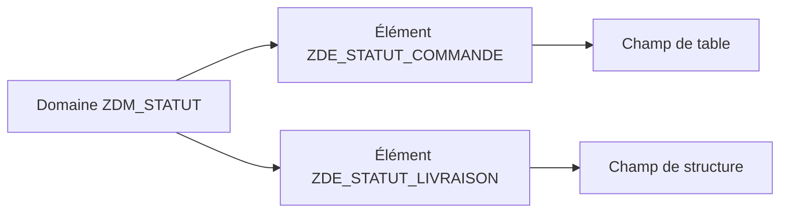
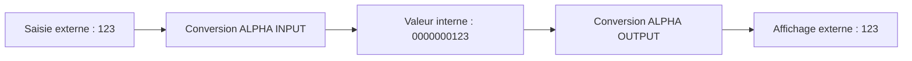

# DOMAINES ET PLAGES DE VALEURS

## RÉSULTAT ATTENDU

- Comprendre le rôle d’un domaine
- Définir les caractéristiques techniques d’une valeur
- Configurer une plage de valeurs
- Distinguer valeurs fixes, table de valeurs et table de contrôle
- Identifier le rôle des routines de conversion

## DÉFINITION

Un domaine définit les caractéristiques techniques communes d’une valeur :

- type de données ;
- longueur ;
- nombre de décimales ;
- signe éventuel ;
- gestion des minuscules ;
- longueur de sortie ;
- plage de valeurs ;
- routine de conversion éventuelle.

Un domaine n’est pas un type ABAP directement utilisable. Il est affecté à un ou plusieurs éléments de données.



## ATTRIBUTS TECHNIQUES

| Attribut           | Exemple | Effet                                                             |
| ------------------ | ------- | ----------------------------------------------------------------- |
| Type               | `CHAR`  | Représentation technique                                          |
| Longueur           | `1`     | Nombre de positions                                               |
| Décimales          | `0`     | Précision pour les types numériques concernés                     |
| Signe              | Activé  | Autorise les valeurs négatives lorsque pertinent                  |
| Minuscules         | Activé  | Évite la conversion automatique en majuscules pour les caractères |
| Longueur de sortie | `10`    | Longueur d’affichage proposée                                     |

## VALEURS FIXES

Les valeurs fixes définissent une liste ou des intervalles autorisés au niveau du domaine.

Exemple :

| Valeur | Texte    |
| ------ | -------- |
| `N`    | Nouveau  |
| `E`    | En cours |
| `T`    | Terminé  |
| `A`    | Annulé   |

Les textes peuvent être traduits. Dans les technologies classiques, ils peuvent être utilisés par les aides à la saisie et certains contrôles d’écran.

## TABLE DE VALEURS

La table de valeurs indique la table généralement associée au domaine.

Elle sert notamment de proposition lorsque le développeur définit une clé étrangère pour un champ utilisant ce domaine.

> Une table de valeurs ne crée pas à elle seule un contrôle d’intégrité. Le contrôle est défini par une clé étrangère sur le champ concerné.

## ROUTINES DE CONVERSION

Une routine de conversion transforme la représentation externe affichée à l’utilisateur et la représentation interne stockée ou traitée par ABAP.

Exemple classique : la routine `ALPHA` complète une valeur numérique représentée sous forme de caractères avec des zéros à gauche pour obtenir sa forme interne.



La routine doit correspondre au sens réel de la donnée. Elle ne doit pas être ajoutée uniquement pour modifier un affichage ponctuel.

## EXEMPLE DE CONCEPTION

Pour un statut de commande :

- domaine : `ZDM_ORDER_STATUS` ;
- type : `CHAR` ;
- longueur : `1` ;
- valeurs fixes : `N`, `E`, `T`, `A` ;
- un ou plusieurs éléments de données utilisent ce domaine selon leur sémantique métier.

## POINTS À RETENIR

- Le domaine centralise les propriétés techniques et la plage de valeurs.
- Plusieurs éléments de données peuvent utiliser le même domaine.
- Les valeurs fixes conviennent aux listes courtes et stables.
- La table de valeurs n’est pas une table de contrôle automatique.
- Une routine de conversion distingue format interne et format externe.

## PROCÉDURE PAS À PAS

1. Saisir `/nSE11`.
2. Choisir le type d’objet DDIC correspondant au chapitre.
3. Entrer le nom technique ; utiliser **Afficher** pour un objet existant ou **Créer** pour un objet Z autorisé.
4. Renseigner les attributs et composants en suivant les règles du chapitre.
5. Lancer le contrôle de cohérence.
6. Activer l’objet et traiter chaque message avant de poursuivre.
7. Utiliser la liste d’utilisation et, pour les tables, vérifier les paramètres techniques et la structure physique.

## VÉRIFICATION

- Le contrôle de cohérence ne retourne aucune erreur bloquante.
- L’objet est actif et son entrée de répertoire pointe vers le package attendu.
- La liste d’utilisation et les dépendances correspondent au périmètre prévu.
- Pour une table Z, la structure active et la structure de base sont cohérentes.

## ERREURS FRÉQUENTES

- Modifier un objet standard au lieu d’utiliser une extension.
- Activer une table sans vérifier clé, paramètres techniques et impact base.

## FICHE DE CONTRÔLE À COPIER

```text
Système / SID       :
Mandant             :
Utilisateur         :
Transaction / outil :
Objet technique     :
Jeu de données      :
Résultat attendu    :
Résultat observé    :
Horodatage          :
Ordre de transport  :
```

## TERMES DU LEXIQUE

- [Domaine](<../🧩 00 ├── LEXIQUE SAP ET ABAP/05 ├── DONNEES DICTIONNAIRE ET BASE DE DONNEES.md#domaine>)
- [ABAP Dictionary](<../🧩 00 ├── LEXIQUE SAP ET ABAP/05 ├── DONNEES DICTIONNAIRE ET BASE DE DONNEES.md#abap-dictionary>)
- [Élément de données](<../🧩 00 ├── LEXIQUE SAP ET ABAP/05 ├── DONNEES DICTIONNAIRE ET BASE DE DONNEES.md#element-donnees>)
- [Table transparente](<../🧩 00 ├── LEXIQUE SAP ET ABAP/05 ├── DONNEES DICTIONNAIRE ET BASE DE DONNEES.md#table-transparente>)
- [MANDT](<../🧩 00 ├── LEXIQUE SAP ET ABAP/05 ├── DONNEES DICTIONNAIRE ET BASE DE DONNEES.md#mandt>)

## RÉFÉRENCES OFFICIELLES SAP

- [Domains — SAP Help Portal](https://help.sap.com/docs/SAP_NETWEAVER_740/ec1c9c8191b74de98feb94001a95dd76/cf21ede5446011d189700000e8322d00.html)
- [Defining Domains and Data Elements — SAP Learning](https://learning.sap.com/courses/building-data-models-with-the-abap-dictionary-and-abap-core-data-services/defining-domains-and-data-elements_b65b511a-4ad1-4437-80f5-5ad689cab833)


---

[Chapitre suivant — ÉLÉMENTS DE DONNÉES ET SÉMANTIQUE](<./04 ├── ELEMENTS DE DONNEES ET SEMANTIQUE.md>)
