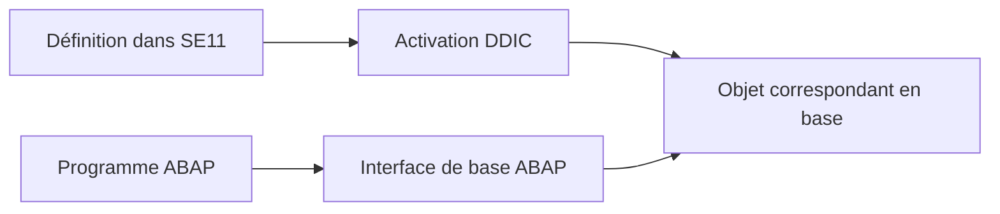

# 7. TABLES TRANSPARENTES ET CHAMPS

## 7.A RÉSULTAT ATTENDU

- Comprendre la relation entre définition DDIC et table physique
- Créer une table transparente dans SE11
- Définir les champs et la clé primaire
- Maintenir les propriétés fonctionnelles de la table
- Éviter les erreurs de modélisation courantes

## 7.B TABLE TRANSPARENTE

Une table transparente DDIC possède une représentation correspondante dans la base de données.

La définition est indépendante du système de base de données utilisé. L’interface de base ABAP exploite les métadonnées du Dictionary lors des accès Open SQL.



## 7.C PROCESS

### 7.C.1 Étape 1 — Définir la persistance

Lister la clé métier, les données persistées, le propriétaire fonctionnel et le cycle de vie. Décider si la table est dépendante du mandant ; dans ce cas, prévoir `MANDT` en première position de la clé.

### 7.C.2 Étape 2 — Créer l’objet table

1. Ouvrir `SE11`, choisir **Table de base de données** et saisir un nom client.
2. Choisir **Créer** et renseigner le texte court.
3. Sélectionner la classe de livraison correspondant au contenu : données applicatives, Customizing ou autre catégorie validée.
4. Définir l’autorisation d’affichage/maintenance conformément au mode d’administration prévu.

### 7.C.3 Étape 3 — Définir la clé et les champs

Ajouter les champs dans l’ordre prévu, avec des éléments de données actifs. Marquer la clé primaire sans rupture : tous les champs clés doivent précéder les champs non-clés.

Pour un montant ou une quantité, renseigner respectivement le champ de référence devise ou unité et vérifier que ce champ existe dans la table ou dans la structure de référence autorisée.

### 7.C.4 Étape 4 — Maintenir les propriétés physiques

Ouvrir les paramètres techniques, choisir la classe de données et la catégorie de taille selon le volume prévu. Activer une bufferisation uniquement après analyse du modèle de lecture et de mise à jour.

Définir ensuite la catégorie d’amélioration compatible avec les types de champs.

### 7.C.5 Étape 5 — Contrôler et activer

Exécuter le contrôle de cohérence et traiter chaque erreur. Activer la table puis vérifier le journal de création de l’objet physique.

### 7.C.6 Étape 6 — Tester sans modifier directement une table applicative standard

Dans un programme Z de test, insérer une ligne contrôlée dans la table client, relire par clé puis supprimer la donnée de test selon la procédure du projet. La création est validée lorsque clé, références, paramètres techniques et accès ABAP correspondent au modèle décidé.

## 7.D CHAMPS

Pour chaque champ, définir :

- un nom technique ;
- son appartenance éventuelle à la clé ;
- un élément de données ou un type technique approprié ;
- les références complémentaires pour les montants et quantités.

Préférer des éléments de données réutilisables pour les champs métier.

## 7.E CLÉ PRIMAIRE

Chaque table doit posséder une clé primaire qui identifie une ligne de manière unique.

Les champs de clé sont placés au début de la définition et doivent former un ensemble stable.

Exemple :

| Clé | Champ        | Élément de données   |
| --: | ------------ | -------------------- |
| Oui | `MANDT`      | `MANDT`              |
| Oui | `REQUEST_ID` | `ZDE_REQUEST_ID`     |
| Non | `STATUS`     | `ZDE_REQUEST_STATUS` |
| Non | `CREATED_BY` | `ERNAM`              |
| Non | `CREATED_ON` | `ERDAT`              |

## 7.F PROPRIÉTÉS FONCTIONNELLES

| Propriété                | Question associée                                                     |
| ------------------------ | --------------------------------------------------------------------- |
| Classe de livraison      | Quelle est la nature des données et leur comportement de transport ?  |
| Affichage/maintenance    | Les données peuvent-elles être maintenues par les outils génériques ? |
| Dépendance au mandant    | Les données sont-elles séparées par client SAP ?                      |
| Catégorie d’amélioration | L’objet peut-il être étendu et avec quels types de composants ?       |

## 7.G TABLES DE PERSONNALISATION ET DONNÉES APPLICATIVES

Une table de paramétrage n’a pas le même cycle de vie qu’une table transactionnelle.

Avant de choisir la classe de livraison, déterminer :

- qui crée les données ;
- dans quel système elles sont créées ;
- si elles doivent être transportées ;
- si elles dépendent du mandant ;
- si elles sont maintenues par SM30 ou par une application.

## 7.H POINTS À RETENIR

- Une table transparente définit un objet persistant en base.
- Chaque table possède une clé primaire cohérente et stable.
- Les champs métier doivent utiliser des types sémantiques adaptés.
- La classe de livraison et les paramètres techniques ne sont pas accessoires.
- La création n’est terminée qu’après contrôle et activation.

## 7.I PROCESS

### 7.I.1 Étape 1 — Vérifier l’objet actif

Rouvrir la table dans `SE11`, vérifier le statut actif et comparer les champs avec la définition attendue. Contrôler que `MANDT`, lorsqu’il existe, est correctement positionné dans la clé.

### 7.I.2 Étape 2 — Vérifier l’objet physique

Utiliser les fonctions de base de données de `SE11` pour comparer définition DDIC et structure physique. Si une différence est signalée, ne lancer aucune conversion en production ; analyser d’abord l’évolution et le volume avec l’équipe Basis.

### 7.I.3 Étape 3 — Examiner les données et utilisations

Afficher un échantillon avec les outils autorisés, puis consulter la liste d’utilisation. Vérifier qu’aucune donnée sensible n’est exportée et qu’aucun programme ne dépend d’un champ sur le point d’être modifié.

Le contrôle est terminé lorsque définition active, objet physique, contenu de test et dépendances sont cohérents.

## 7.J VÉRIFICATION

- Le contrôle de cohérence ne retourne aucune erreur bloquante.
- L’objet est actif et son entrée de répertoire pointe vers le package attendu.
- La liste d’utilisation et les dépendances correspondent au périmètre prévu.
- Pour une table Z, la structure active et la structure de base sont cohérentes.

## 7.K ERREURS FRÉQUENTES

- Modifier un objet standard au lieu d’utiliser une extension.
- Activer une table sans vérifier clé, paramètres techniques et impact base.

## 7.L FICHE DE CONTRÔLE À COPIER

```text
Système / SID       :
Mandant             :
Utilisateur         :
Transaction / outil :
Objet technique     :
Jeu de données      :
Résultat attendu    :
Résultat observé    :
Horodatage          :
Ordre de transport  :
```

## 7.M TERMES DU LEXIQUE

- [ABAP Dictionary](<../🧩 00 ├── LEXIQUE SAP ET ABAP/05 ├── DONNEES DICTIONNAIRE ET BASE DE DONNEES.md#abap-dictionary>)
- [Domaine](<../🧩 00 ├── LEXIQUE SAP ET ABAP/05 ├── DONNEES DICTIONNAIRE ET BASE DE DONNEES.md#domaine>)
- [Élément de données](<../🧩 00 ├── LEXIQUE SAP ET ABAP/05 ├── DONNEES DICTIONNAIRE ET BASE DE DONNEES.md#element-donnees>)
- [Table transparente](<../🧩 00 ├── LEXIQUE SAP ET ABAP/05 ├── DONNEES DICTIONNAIRE ET BASE DE DONNEES.md#table-transparente>)
- [MANDT](<../🧩 00 ├── LEXIQUE SAP ET ABAP/05 ├── DONNEES DICTIONNAIRE ET BASE DE DONNEES.md#mandt>)

## 7.N RÉFÉRENCES OFFICIELLES SAP

- [Creating Database Tables and Table Fields — SAP Help Portal](https://help.sap.com/docs/ABAP_PLATFORM_NEW/ec1c9c8191b74de98feb94001a95dd76/44f4ef984a1c2952e10000000a11466f.html)
- [Creating Database Tables — SAP Learning](https://learning.sap.com/courses/building-data-models-with-the-abap-dictionary-and-abap-core-data-services/creating-database-tables_ebc1477d-96ed-414b-82d4-4171da43f4a6)
- [Delivery Class — SAP Help Portal](https://help.sap.com/docs/SAP_NETWEAVER_731_BW_ABAP/ec1c9c8191b74de98feb94001a95dd76/4345860774b711d2959700a0c929b3c3.html)

---

[Chapitre suivant — CLÉS, INDEX ET DÉPENDANCE AU MANDANT](<./08 ├── CLES INDEX ET DEPENDANCE AU MANDANT.md>)
