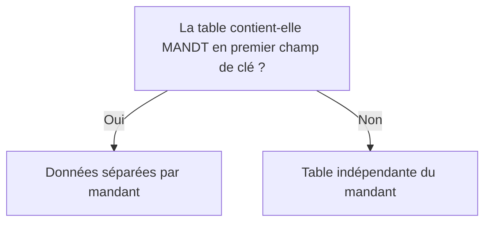
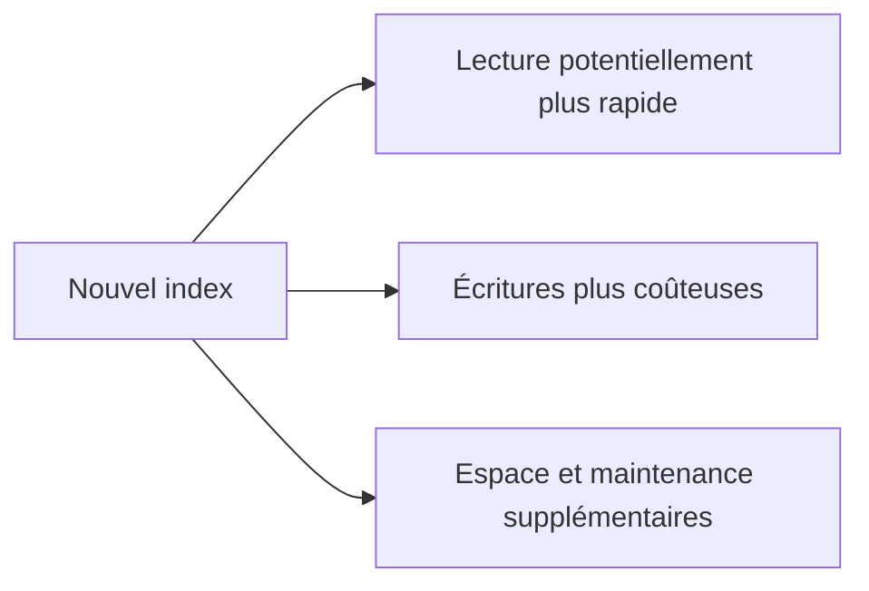

# 8. CLÉS, INDEX ET DÉPENDANCE AU MANDANT

## 8.A RÉSULTAT ATTENDU

- Concevoir une clé primaire cohérente
- Distinguer clé primaire et index secondaire
- Comprendre la dépendance au mandant
- Identifier le coût des index
- Préparer les futurs accès Open SQL

## 8.B CLÉ PRIMAIRE

La clé primaire identifie chaque ligne de manière unique.

Une bonne clé est :

- stable dans le temps ;
- aussi courte que possible sans perdre l’unicité ;
- fondée sur des données réellement obligatoires ;
- compatible avec les relations et accès prévus.

Éviter d’utiliser un libellé modifiable comme identifiant principal.

## 8.C DÉPENDANCE AU MANDANT

Une table classique est dépendante du mandant lorsque son premier champ de clé est de type client, généralement `MANDT`.



Une table indépendante du mandant partage ses données entre tous les clients du système. Ce choix doit être explicite et justifié.

## 8.D INDEX PRIMAIRE

Lors de la création de la table physique, la base dispose d’un index correspondant à la clé primaire.

Les accès qui fournissent les champs de gauche de la clé peuvent exploiter cet ordre, sous réserve des décisions de l’optimiseur de base.

## 8.E INDEX SECONDAIRES

Un index secondaire définit un autre ordre d’accès potentiel.

Il peut être utile lorsque :

- un volume important est lu fréquemment selon une combinaison de champs différente de la clé primaire ;
- la sélection est suffisamment discriminante ;
- l’amélioration est démontrée par une analyse de performance.

## 8.F COÛTS D’UN INDEX

Chaque index supplémentaire entraîne :

- de l’espace en base ;
- un coût lors des insertions, modifications et suppressions ;
- une maintenance supplémentaire ;
- un risque de redondance avec un index existant.



Ne pas créer un index uniquement parce qu’une clause `WHERE` contient plusieurs champs. L’intérêt doit être vérifié sur les données et le système cible.

## 8.G PROCESS

Depuis la table :

### 8.G.1 Étape 1 — Prouver le besoin d’un index

Relever la requête lente avec `ST05` ou un outil SQL adapté. Identifier les colonnes réellement utilisées dans les prédicats et l’ordre de sélectivité. Ne créer aucun index uniquement parce qu’un champ apparaît souvent dans le code.

### 8.G.2 Étape 2 — Vérifier les index existants

Ouvrir la table dans `SE11`, afficher ses index secondaires et comparer leurs champs avec le prédicat mesuré. Contrôler aussi la clé primaire ; un nouvel index redondant augmente le coût des écritures sans améliorer la lecture.

### 8.G.3 Étape 3 — Créer l’index client

1. Créer un identifiant d’index dans l’espace client.
2. Ajouter les champs dans l’ordre justifié par les accès mesurés.
3. Inclure `MANDT` selon la dépendance au mandant et la stratégie validée pour la base cible.
4. Activer l’unicité uniquement si elle représente une contrainte métier réelle déjà respectée par toutes les données.

### 8.G.4 Étape 4 — Activer et contrôler la création

Activer l’index et lire le journal. Vérifier avec les outils de base de données qu’il existe physiquement. En cas de doublons sur un index unique, corriger les données et la règle métier avant une nouvelle activation.

### 8.G.5 Étape 5 — Mesurer après création

Rejouer exactement la même requête et le même jeu de données dans `ST05`. Vérifier le plan d’accès, le nombre de lignes examinées et le temps. Conserver l’index uniquement si l’amélioration est prouvée et si le coût sur les écritures reste acceptable.

## 8.H POINTS À RETENIR

- La clé primaire garantit l’unicité logique d’une ligne.
- `MANDT` en premier champ de clé rend généralement la table dépendante du mandant.
- Un index secondaire n’est pas automatiquement utilisé par la base.
- Les index accélèrent certains accès mais ralentissent les écritures.
- Toute création d’index doit être justifiée par une analyse mesurable.

## 8.I PROCESS

### 8.I.1 Étape 1 — Contrôler la clé primaire

Vérifier l’ordre des champs clés, leur stabilité et leur capacité à identifier une ligne. Pour une table dépendante du mandant, confirmer que `MANDT` participe à la clé et que les accès ABAP SQL suivent les règles de gestion du client.

### 8.I.2 Étape 2 — Contrôler l’utilisation réelle de l’index

Mesurer une lecture représentative avant et après l’index. Un index actif mais jamais choisi par l’optimiseur n’atteint pas l’objectif ; analyser statistiques, sélectivité et prédicats plutôt que multiplier les index.

### 8.I.3 Étape 3 — Valider les effets de bord

Mesurer aussi une insertion ou mise à jour représentative. Le chapitre est validé lorsque l’unicité, l’isolation par mandant et le gain de lecture sont prouvés sans dégrader de manière injustifiée les écritures.

## 8.J VÉRIFICATION

- Le contrôle de cohérence ne retourne aucune erreur bloquante.
- L’objet est actif et son entrée de répertoire pointe vers le package attendu.
- La liste d’utilisation et les dépendances correspondent au périmètre prévu.
- Pour une table Z, la structure active et la structure de base sont cohérentes.

## 8.K ERREURS FRÉQUENTES

- Modifier un objet standard au lieu d’utiliser une extension.
- Activer une table sans vérifier clé, paramètres techniques et impact base.

## 8.L FICHE DE CONTRÔLE À COPIER

```text
Système / SID       :
Mandant             :
Utilisateur         :
Transaction / outil :
Objet technique     :
Jeu de données      :
Résultat attendu    :
Résultat observé    :
Horodatage          :
Ordre de transport  :
```

## 8.M TERMES DU LEXIQUE

- [Mandant](<../🧩 00 ├── LEXIQUE SAP ET ABAP/01 ├── SYSTEMES ENVIRONNEMENTS ET MANDANTS.md#mandant>)
- [ABAP Dictionary](<../🧩 00 ├── LEXIQUE SAP ET ABAP/05 ├── DONNEES DICTIONNAIRE ET BASE DE DONNEES.md#abap-dictionary>)
- [Domaine](<../🧩 00 ├── LEXIQUE SAP ET ABAP/05 ├── DONNEES DICTIONNAIRE ET BASE DE DONNEES.md#domaine>)
- [Élément de données](<../🧩 00 ├── LEXIQUE SAP ET ABAP/05 ├── DONNEES DICTIONNAIRE ET BASE DE DONNEES.md#element-donnees>)
- [Table transparente](<../🧩 00 ├── LEXIQUE SAP ET ABAP/05 ├── DONNEES DICTIONNAIRE ET BASE DE DONNEES.md#table-transparente>)
- [MANDT](<../🧩 00 ├── LEXIQUE SAP ET ABAP/05 ├── DONNEES DICTIONNAIRE ET BASE DE DONNEES.md#mandt>)

## 8.N RÉFÉRENCES OFFICIELLES SAP

- [Creating Database Tables — SAP Learning](https://learning.sap.com/courses/building-data-models-with-the-abap-dictionary-and-abap-core-data-services/creating-database-tables_ebc1477d-96ed-414b-82d4-4171da43f4a6)
- [Tables and Indexes — ABAP Dictionary — SAP Help Portal](https://help.sap.com/docs/SAP_NETWEAVER_740/ec1c9c8191b74de98feb94001a95dd76/cf21e9fe446011d189700000e8322d00.html)

---

[Chapitre suivant — PARAMÈTRES TECHNIQUES ET BUFFERISATION](<./09 ├── PARAMETRES TECHNIQUES ET BUFFERISATION.md>)
