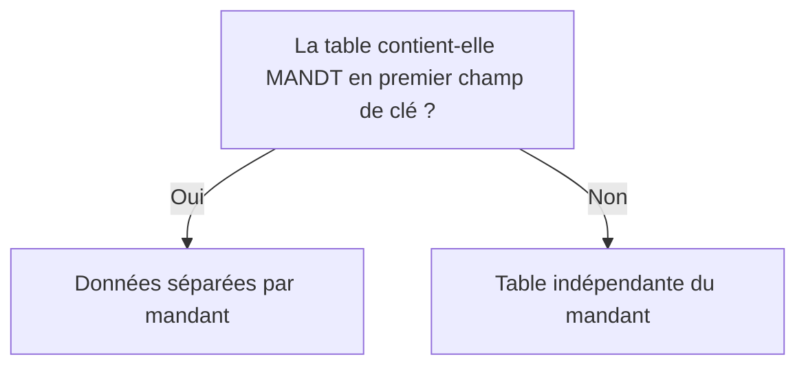
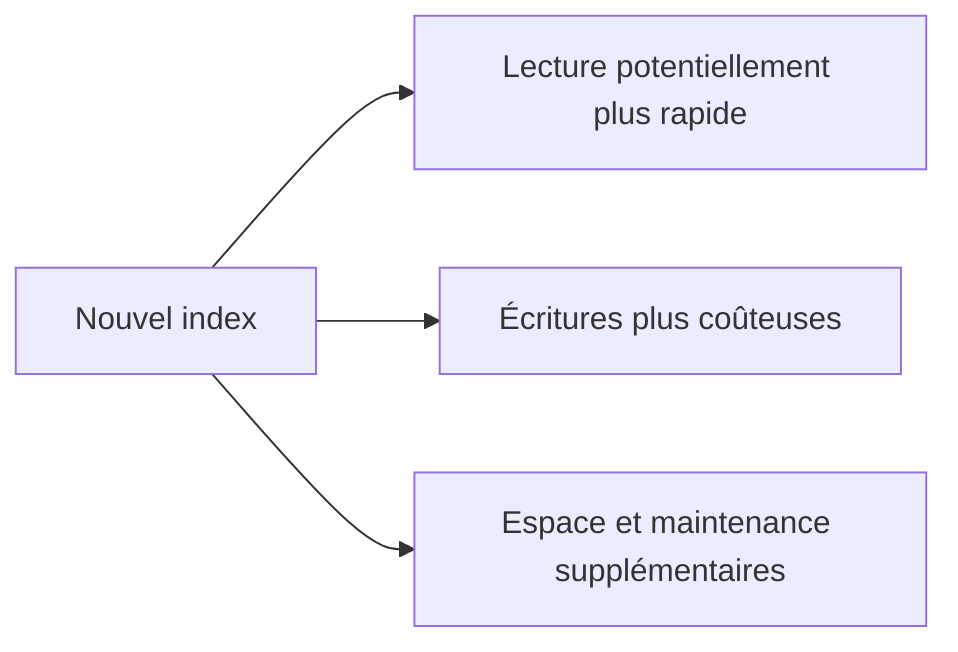

# CLÉS, INDEX ET DÉPENDANCE AU MANDANT

## RÉSULTAT ATTENDU

- Concevoir une clé primaire cohérente
- Distinguer clé primaire et index secondaire
- Comprendre la dépendance au mandant
- Identifier le coût des index
- Préparer les futurs accès Open SQL

## CLÉ PRIMAIRE

La clé primaire identifie chaque ligne de manière unique.

Une bonne clé est :

- stable dans le temps ;
- aussi courte que possible sans perdre l’unicité ;
- fondée sur des données réellement obligatoires ;
- compatible avec les relations et accès prévus.

Éviter d’utiliser un libellé modifiable comme identifiant principal.

## DÉPENDANCE AU MANDANT

Une table classique est dépendante du mandant lorsque son premier champ de clé est de type client, généralement `MANDT`.



Une table indépendante du mandant partage ses données entre tous les clients du système. Ce choix doit être explicite et justifié.

## INDEX PRIMAIRE

Lors de la création de la table physique, la base dispose d’un index correspondant à la clé primaire.

Les accès qui fournissent les champs de gauche de la clé peuvent exploiter cet ordre, sous réserve des décisions de l’optimiseur de base.

## INDEX SECONDAIRES

Un index secondaire définit un autre ordre d’accès potentiel.

Il peut être utile lorsque :

- un volume important est lu fréquemment selon une combinaison de champs différente de la clé primaire ;
- la sélection est suffisamment discriminante ;
- l’amélioration est démontrée par une analyse de performance.

## COÛTS D’UN INDEX

Chaque index supplémentaire entraîne :

- de l’espace en base ;
- un coût lors des insertions, modifications et suppressions ;
- une maintenance supplémentaire ;
- un risque de redondance avec un index existant.



Ne pas créer un index uniquement parce qu’une clause `WHERE` contient plusieurs champs. L’intérêt doit être vérifié sur les données et le système cible.

## CRÉATION DANS SE11

Depuis la table :

1. ouvrir les index ;
2. créer un identifiant d’index client ;
3. sélectionner les champs dans l’ordre utile ;
4. définir l’unicité uniquement si elle correspond à une règle réelle ;
5. activer l’index ;
6. contrôler sa création physique et son utilisation avec les outils adaptés.

## POINTS À RETENIR

- La clé primaire garantit l’unicité logique d’une ligne.
- `MANDT` en premier champ de clé rend généralement la table dépendante du mandant.
- Un index secondaire n’est pas automatiquement utilisé par la base.
- Les index accélèrent certains accès mais ralentissent les écritures.
- Toute création d’index doit être justifiée par une analyse mesurable.

## PROCÉDURE PAS À PAS

1. Saisir `/nSE11`.
2. Choisir le type d’objet DDIC correspondant au chapitre.
3. Entrer le nom technique ; utiliser **Afficher** pour un objet existant ou **Créer** pour un objet Z autorisé.
4. Renseigner les attributs et composants en suivant les règles du chapitre.
5. Lancer le contrôle de cohérence.
6. Activer l’objet et traiter chaque message avant de poursuivre.
7. Utiliser la liste d’utilisation et, pour les tables, vérifier les paramètres techniques et la structure physique.

## VÉRIFICATION

- Le contrôle de cohérence ne retourne aucune erreur bloquante.
- L’objet est actif et son entrée de répertoire pointe vers le package attendu.
- La liste d’utilisation et les dépendances correspondent au périmètre prévu.
- Pour une table Z, la structure active et la structure de base sont cohérentes.

## ERREURS FRÉQUENTES

- Modifier un objet standard au lieu d’utiliser une extension.
- Activer une table sans vérifier clé, paramètres techniques et impact base.

## FICHE DE CONTRÔLE À COPIER

```text
Système / SID       :
Mandant             :
Utilisateur         :
Transaction / outil :
Objet technique     :
Jeu de données      :
Résultat attendu    :
Résultat observé    :
Horodatage          :
Ordre de transport  :
```

## TERMES DU LEXIQUE

- [Mandant](<../🧩 00 ├── LEXIQUE SAP ET ABAP/01 ├── SYSTEMES ENVIRONNEMENTS ET MANDANTS.md#mandant>)
- [ABAP Dictionary](<../🧩 00 ├── LEXIQUE SAP ET ABAP/05 ├── DONNEES DICTIONNAIRE ET BASE DE DONNEES.md#abap-dictionary>)
- [Domaine](<../🧩 00 ├── LEXIQUE SAP ET ABAP/05 ├── DONNEES DICTIONNAIRE ET BASE DE DONNEES.md#domaine>)
- [Élément de données](<../🧩 00 ├── LEXIQUE SAP ET ABAP/05 ├── DONNEES DICTIONNAIRE ET BASE DE DONNEES.md#element-donnees>)
- [Table transparente](<../🧩 00 ├── LEXIQUE SAP ET ABAP/05 ├── DONNEES DICTIONNAIRE ET BASE DE DONNEES.md#table-transparente>)
- [MANDT](<../🧩 00 ├── LEXIQUE SAP ET ABAP/05 ├── DONNEES DICTIONNAIRE ET BASE DE DONNEES.md#mandt>)

## RÉFÉRENCES OFFICIELLES SAP

- [Creating Database Tables — SAP Learning](https://learning.sap.com/courses/building-data-models-with-the-abap-dictionary-and-abap-core-data-services/creating-database-tables_ebc1477d-96ed-414b-82d4-4171da43f4a6)
- [Tables and Indexes — ABAP Dictionary — SAP Help Portal](https://help.sap.com/docs/SAP_NETWEAVER_740/ec1c9c8191b74de98feb94001a95dd76/cf21e9fe446011d189700000e8322d00.html)


---

[Chapitre suivant — PARAMÈTRES TECHNIQUES ET BUFFERISATION](<./09 ├── PARAMETRES TECHNIQUES ET BUFFERISATION.md>)
