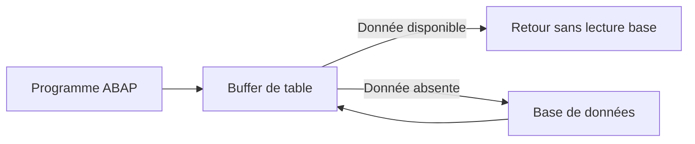

# PARAMÈTRES TECHNIQUES ET BUFFERISATION

## RÉSULTAT ATTENDU

- Comprendre le rôle des paramètres techniques
- Choisir une classe de données et une catégorie de taille
- Identifier les types de bufferisation
- Évaluer les risques de la journalisation
- Éviter les réglages systématiques sans analyse

## ACCÈS AUX PARAMÈTRES TECHNIQUES

Dans `SE11`, ouvrir la table puis accéder aux **Paramètres techniques**.

Ces paramètres influencent la création physique de la table et certains comportements d’accès depuis les serveurs d’application ABAP.

## PARAMÈTRES PRINCIPAUX

| Paramètre                     | Fonction                                                            |
| ----------------------------- | ------------------------------------------------------------------- |
| Classe de données             | Catégoriser la nature générale des données                          |
| Catégorie de taille           | Estimer le volume attendu pour l’allocation en base                 |
| Autorisation de bufferisation | Autoriser ou interdire le buffer de table ABAP                      |
| Type de buffer                | Définir la granularité de mise en cache                             |
| Journalisation                | Enregistrer certaines modifications dans `DBTABLOG` sous conditions |

La portée exacte de certains paramètres dépend du système de base de données. Ils doivent néanmoins être renseignés conformément aux règles du système.

## BUFFER DE TABLE ABAP

La bufferisation stocke des données de table dans la mémoire du serveur d’application afin d’éviter certains accès répétés à la base.



## TYPES DE BUFFERISATION CLASSIQUES

| Type                  | Principe                                                               |
| --------------------- | ---------------------------------------------------------------------- |
| Enregistrement unique | Mise en cache de lignes accédées par leur clé complète                 |
| Générique             | Mise en cache de groupes de lignes selon une partie initiale de la clé |
| Intégrale             | Mise en cache de l’ensemble de la table                                |

Le type disponible et son libellé peuvent varier selon la version.

## TABLES ADAPTÉES OU NON

La bufferisation est généralement envisagée pour des tables :

- lues fréquemment ;
- modifiées rarement ;
- de volume maîtrisé ;
- dont les données doivent être disponibles avec une cohérence compatible avec le mécanisme de buffer.

Elle est généralement inadaptée aux tables transactionnelles fortement modifiées ou aux très grandes tables.

## INVALIDATION ET COHÉRENCE

Une modification invalide les entrées concernées et doit être propagée aux serveurs d’application.

Une mauvaise stratégie peut provoquer :

- des invalidations fréquentes ;
- une consommation mémoire inutile ;
- une baisse de performance ;
- des lectures qui ne bénéficient pas réellement du buffer.

## JOURNALISATION

L’option de journalisation peut enregistrer les modifications de tables dans `DBTABLOG`, à condition que les prérequis système soient remplis.

Elle doit être réservée aux données importantes et peu modifiées. Elle génère un volume supplémentaire et peut créer de la contention.

La journalisation technique ne remplace pas une traçabilité applicative complète lorsque celle-ci est exigée par le métier.

## POINTS À RETENIR

- Les paramètres techniques participent à la conception de la table.
- La bufferisation concerne le buffer ABAP des serveurs d’application.
- Une table fréquemment modifiée est rarement une bonne candidate.
- La catégorie de taille est une estimation, pas une limite fonctionnelle.
- La journalisation doit être activée de manière ciblée.

## PROCESS

### Étape 1 — Relever le profil de la table

Identifier la nature des données, le volume initial, la croissance attendue, la fréquence de lecture, la fréquence de modification et la nécessité de lire immédiatement une mise à jour sur tous les serveurs. Ces informations déterminent les paramètres ; le nom de la table ne suffit pas.

### Étape 2 — Ouvrir les paramètres techniques

1. Afficher la table dans `SE11`.
2. Ouvrir **Options techniques**.
3. Relever la classe de données, la catégorie de taille et le mode de bufferisation actuel.
4. Comparer ces valeurs avec le profil défini à l’étape 1.

Si la table est standard, ne modifier aucune valeur sans instruction SAP explicite.

### Étape 3 — Définir classe de données et taille

Choisir la classe de données selon le rôle réel des enregistrements. Définir la catégorie de taille selon le nombre prévu de lignes et sa croissance, puis documenter l’hypothèse utilisée.

Une catégorie trop faible peut multiplier les extensions physiques ; une valeur surdimensionnée n’est pas une optimisation automatique.

### Étape 4 — Décider de la bufferisation

N’activer le buffer que pour une table adaptée : lectures fréquentes, modifications rares et tolérance au mécanisme d’invalidation. Choisir buffer complet, générique ou par enregistrement selon les clés de lecture observées.

Vérifier dans le code qu’aucun accès ne contourne volontairement le buffer sans justification et qu’aucun scénario n’exige une cohérence immédiate incompatible.

### Étape 5 — Activer et mesurer

Activer les paramètres, contrôler le journal puis exécuter une lecture représentative. Utiliser les outils de trace et de suivi du buffer disponibles pour confirmer les accès. La configuration est validée lorsque le comportement mesuré correspond au mode choisi et qu’aucune mise à jour ne retourne de donnée obsolète au scénario métier.

## VÉRIFICATION

- Le contrôle de cohérence ne retourne aucune erreur bloquante.
- L’objet est actif et son entrée de répertoire pointe vers le package attendu.
- La liste d’utilisation et les dépendances correspondent au périmètre prévu.
- Pour une table Z, la structure active et la structure de base sont cohérentes.

## ERREURS FRÉQUENTES

- Modifier un objet standard au lieu d’utiliser une extension.
- Activer une table sans vérifier clé, paramètres techniques et impact base.

## FICHE DE CONTRÔLE À COPIER

```text
Système / SID       :
Mandant             :
Utilisateur         :
Transaction / outil :
Objet technique     :
Jeu de données      :
Résultat attendu    :
Résultat observé    :
Horodatage          :
Ordre de transport  :
```

## TERMES DU LEXIQUE

- [ABAP Dictionary](<../🧩 00 ├── LEXIQUE SAP ET ABAP/05 ├── DONNEES DICTIONNAIRE ET BASE DE DONNEES.md#abap-dictionary>)
- [Domaine](<../🧩 00 ├── LEXIQUE SAP ET ABAP/05 ├── DONNEES DICTIONNAIRE ET BASE DE DONNEES.md#domaine>)
- [Élément de données](<../🧩 00 ├── LEXIQUE SAP ET ABAP/05 ├── DONNEES DICTIONNAIRE ET BASE DE DONNEES.md#element-donnees>)
- [Table transparente](<../🧩 00 ├── LEXIQUE SAP ET ABAP/05 ├── DONNEES DICTIONNAIRE ET BASE DE DONNEES.md#table-transparente>)
- [MANDT](<../🧩 00 ├── LEXIQUE SAP ET ABAP/05 ├── DONNEES DICTIONNAIRE ET BASE DE DONNEES.md#mandt>)

## RÉFÉRENCES OFFICIELLES SAP

- [Technical Settings — SAP Help Portal](https://help.sap.com/docs/SAP_NETWEAVER_740/ec1c9c8191b74de98feb94001a95dd76/cf21eba2446011d189700000e8322d00.html)
- [Creating Database Tables — Technical Table Settings — SAP Learning](https://learning.sap.com/courses/building-data-models-with-the-abap-dictionary-and-abap-core-data-services/creating-database-tables_ebc1477d-96ed-414b-82d4-4171da43f4a6)

---

[Chapitre suivant — CLÉS ÉTRANGÈRES, TABLES DE CONTRÔLE ET TABLES DE TEXTE](<./10 ├── CLES ETRANGERES TABLES DE CONTROLE ET TABLES DE TEXTE.md>)
