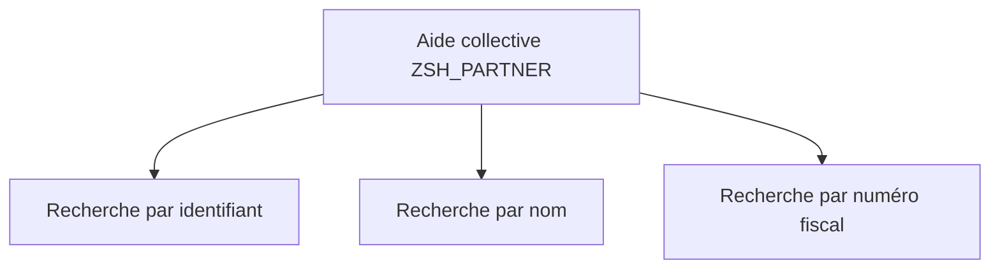

# 11. AIDES À LA RECHERCHE ÉLÉMENTAIRES ET COLLECTIVES

## 11.A RÉSULTAT ATTENDU

- Comprendre le fonctionnement d’une aide F4 DDIC
- Créer une aide élémentaire
- Regrouper plusieurs chemins dans une aide collective
- Configurer les paramètres d’import et d’export
- Choisir le niveau d’affectation approprié

## 11.B FONCTION

Une aide à la recherche définit un processus de sélection de valeurs pour un champ de saisie.

Elle indique :

- où lire les valeurs ;
- quels champs afficher ;
- quels critères proposer ;
- quelles valeurs recevoir depuis l’écran ;
- quelles valeurs retourner à l’écran.


## 11.C AIDE ÉLÉMENTAIRE

Une aide élémentaire décrit un seul chemin de recherche.

Elle contient notamment :

- une méthode de sélection : table, vue ou autre source compatible ;
- une interface de paramètres ;
- les positions dans la boîte de dialogue de sélection ;
- les positions dans la liste de résultats ;
- un comportement de dialogue ;
- éventuellement un exit d’aide à la recherche.

## 11.D PARAMÈTRES

| Indicateur            | Fonction                                                                  |
| --------------------- | ------------------------------------------------------------------------- |
| Import                | Reçoit une valeur déjà présente sur l’écran pour restreindre la sélection |
| Export                | Retourne une valeur vers le champ ou la structure appelante               |
| Position de sélection | Affiche le paramètre comme critère de recherche                           |
| Position de liste     | Affiche le paramètre dans la liste des résultats                          |

Un paramètre peut être à la fois import et export.

## 11.E AIDE COLLECTIVE

Une aide collective regroupe plusieurs aides élémentaires représentant des chemins alternatifs.

Exemple : rechercher un partenaire par :

- identifiant ;
- nom et ville ;
- numéro fiscal.



Les paramètres de l’aide collective doivent être affectés aux paramètres correspondants de chaque aide élémentaire incluse.

## 11.F NIVEAUX D’AFFECTATION

Une aide peut être affectée :

- à un élément de données ;
- à un champ de table ou de structure ;
- à une table de contrôle ;
- directement à un champ d’écran selon la technologie.

L’affectation la plus générale est généralement placée sur l’élément de données. Une affectation locale peut la remplacer pour un contexte spécifique.

## 11.G EXIT D’AIDE À LA RECHERCHE

Un exit permet d’adapter dynamiquement le processus :

- modifier les critères ;
- compléter les résultats ;
- filtrer les chemins disponibles ;
- implémenter une logique non couverte par la définition standard.

Il doit rester réservé aux besoins impossibles à exprimer par la configuration DDIC, car il augmente la complexité de maintenance.

## 11.H POINTS À RETENIR

- Une aide élémentaire définit un chemin de recherche.
- Une aide collective regroupe plusieurs aides élémentaires.
- Les paramètres d’import filtrent ; les paramètres d’export retournent les valeurs.
- Le niveau d’affectation détermine la portée de l’aide.
- Un exit est une extension avancée, pas le mécanisme par défaut.

## 11.I PROCESS

### 11.I.1 Étape 1 — Définir la valeur recherchée

Identifier le champ retourné à l’écran, les critères que l’utilisateur peut saisir, les colonnes utiles dans la liste et la table ou vue qui fournit les données. Écarter les colonnes techniques sans utilité pour le choix.

### 11.I.2 Étape 2 — Créer l’aide élémentaire

1. Ouvrir `SE11`, choisir **Aide à la recherche** et saisir un nom client.
2. Créer une aide élémentaire.
3. Saisir la méthode de sélection : table ou vue adaptée.
4. Ajouter les paramètres et marquer leur sens import/export.
5. Définir position de dialogue et position dans la liste de résultats.

Le paramètre export doit restituer la valeur attendue par le champ appelant. Un mauvais sens import/export produit une aide visible qui ne retourne rien.

### 11.I.3 Étape 3 — Activer et tester isolément

Utiliser la fonction de test de l’aide. Saisir un critère, exécuter, contrôler la liste puis sélectionner une ligne. Vérifier la valeur retournée avant de rattacher l’aide à un élément de données.

### 11.I.4 Étape 4 — Créer une aide collective si plusieurs stratégies existent

Créer l’aide collective, ajouter les aides élémentaires et affecter leurs paramètres communs. Tester chaque chemin de recherche séparément et vérifier que la même valeur de sortie est restituée.

### 11.I.5 Étape 5 — Rattacher et valider dans l’application

Associer l’aide au champ ou à l’élément de données selon la portée voulue. Tester `F4` depuis le véritable écran avec un cas trouvé, un critère sans résultat et un volume représentatif. La mise en place est terminée lorsque la sélection retourne la bonne valeur sans exposer de données inutiles.

## 11.J VÉRIFICATION

- Le contrôle de cohérence ne retourne aucune erreur bloquante.
- L’objet est actif et son entrée de répertoire pointe vers le package attendu.
- La liste d’utilisation et les dépendances correspondent au périmètre prévu.
- Pour une table Z, la structure active et la structure de base sont cohérentes.

## 11.K ERREURS FRÉQUENTES

- Modifier un objet standard au lieu d’utiliser une extension.
- Activer une table sans vérifier clé, paramètres techniques et impact base.

## 11.L FICHE DE CONTRÔLE À COPIER

```text
Système / SID       :
Mandant             :
Utilisateur         :
Transaction / outil :
Objet technique     :
Jeu de données      :
Résultat attendu    :
Résultat observé    :
Horodatage          :
Ordre de transport  :
```

## 11.M TERMES DU LEXIQUE

- [ABAP Dictionary](<../🧩 00 ├── LEXIQUE SAP ET ABAP/05 ├── DONNEES DICTIONNAIRE ET BASE DE DONNEES.md#abap-dictionary>)
- [Domaine](<../🧩 00 ├── LEXIQUE SAP ET ABAP/05 ├── DONNEES DICTIONNAIRE ET BASE DE DONNEES.md#domaine>)
- [Élément de données](<../🧩 00 ├── LEXIQUE SAP ET ABAP/05 ├── DONNEES DICTIONNAIRE ET BASE DE DONNEES.md#element-donnees>)
- [Table transparente](<../🧩 00 ├── LEXIQUE SAP ET ABAP/05 ├── DONNEES DICTIONNAIRE ET BASE DE DONNEES.md#table-transparente>)
- [MANDT](<../🧩 00 ├── LEXIQUE SAP ET ABAP/05 ├── DONNEES DICTIONNAIRE ET BASE DE DONNEES.md#mandt>)

## 11.N RÉFÉRENCES OFFICIELLES SAP

- [Search Helps — SAP Help Portal](https://help.sap.com/docs/ABAP_PLATFORM_NEW/ec1c9c8191b74de98feb94001a95dd76/cf21ee2b446011d189700000e8322d00.html?version=202310.latest)
- [Input Help from the ABAP Dictionary — SAP Help Portal](https://help.sap.com/docs/SAP_NETWEAVER_731_BW_ABAP/f68e489816e043f1add91d69a6842931/4a439ebd5a503f04e10000000a421937.html)

---

[Chapitre suivant — VUES CLASSIQUES DU DICTIONNAIRE](<./12 ├── VUES CLASSIQUES DU DICTIONNAIRE.md>)
