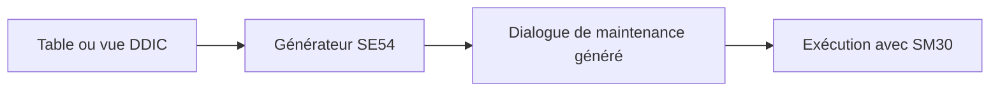

# GÉNÉRATEUR DE MAINTENANCE ET SM30

## RÉSULTAT ATTENDU

- Générer un dialogue standard de maintenance
- Distinguer SE54 et SM30
- Choisir un écran en une ou deux étapes
- Configurer le groupe de fonctions et l’autorisation
- Identifier les limites d’un dialogue généré

## PRINCIPE

Le générateur de maintenance crée un programme standard permettant d’afficher, créer, modifier ou supprimer les entrées d’une table ou d’une vue de maintenance.



## PRÉREQUIS

Avant la génération :

- la table ou la vue doit être active ;
- la maintenance doit être autorisée dans ses attributs ;
- la clé doit être correcte ;
- les relations et textes doivent être définis ;
- le besoin d’autorisation et de transport des données doit être clarifié.

## GÉNÉRATION

Le générateur est accessible :

- depuis `SE11` via les utilitaires ;
- directement avec `SE54`.

Les paramètres principaux sont :

| Paramètre                | Fonction                                               |
| ------------------------ | ------------------------------------------------------ |
| Groupe d’autorisations   | Regrouper les objets pour le contrôle d’accès          |
| Groupe de fonctions      | Contenir les écrans et modules générés                 |
| Type de maintenance      | Une étape ou deux étapes                               |
| Numéros d’écrans         | Identifier les dynpros générés                         |
| Routine d’enregistrement | Gérer le transport éventuel des données de paramétrage |

## UNE ÉTAPE OU DEUX ÉTAPES

| Mode        | Fonctionnement                          |
| ----------- | --------------------------------------- |
| Une étape   | Liste et modification sur un même écran |
| Deux étapes | Écran de synthèse puis écran de détail  |

Le mode une étape convient aux tables simples comportant peu de champs. Le mode deux étapes est plus adapté lorsque la ligne contient de nombreux champs ou nécessite un écran détaillé.

## EXÉCUTION AVEC SM30

Dans `SM30` :

1. saisir la table ou la vue ;
2. choisir **Afficher** ou **Gérer** selon les autorisations ;
3. utiliser **Nouvelles entrées** ou modifier les valeurs existantes ;
4. enregistrer ;
5. renseigner une demande de transport si la configuration l’exige.

## ÉVÉNEMENTS DU GÉNÉRATEUR

Le générateur propose des événements permettant d’ajouter des contrôles ou traitements spécifiques.

Exemples :

- contrôle avant sauvegarde ;
- initialisation de valeurs ;
- traitement après sauvegarde ;
- adaptation de l’affichage.

Ces extensions sont du code spécifique attaché à un objet généré. Elles doivent être documentées et testées après toute régénération.

## LIMITES

Un dialogue SM30 convient à la maintenance technique ou de paramétrage simple.

Il est insuffisant lorsque le processus exige :

- une logique métier complexe ;
- plusieurs étapes de validation ;
- des contrôles d’autorisation fins par ligne ;
- des pièces jointes ou traitements annexes ;
- une expérience utilisateur spécifique.

## POINTS À RETENIR

- SE54 génère ; SM30 exécute le dialogue de maintenance.
- Le choix une ou deux étapes dépend de la structure des données.
- Les autorisations et le transport des données doivent être conçus avant la génération.
- Les événements permettent des adaptations, mais augmentent la maintenance.
- SM30 ne remplace pas une application métier complexe.

## PROCÉDURE PAS À PAS

1. Saisir `/nSE11`.
2. Choisir le type d’objet DDIC correspondant au chapitre.
3. Entrer le nom technique ; utiliser **Afficher** pour un objet existant ou **Créer** pour un objet Z autorisé.
4. Renseigner les attributs et composants en suivant les règles du chapitre.
5. Lancer le contrôle de cohérence.
6. Activer l’objet et traiter chaque message avant de poursuivre.
7. Utiliser la liste d’utilisation et, pour les tables, vérifier les paramètres techniques et la structure physique.

## VÉRIFICATION

- Le contrôle de cohérence ne retourne aucune erreur bloquante.
- L’objet est actif et son entrée de répertoire pointe vers le package attendu.
- La liste d’utilisation et les dépendances correspondent au périmètre prévu.
- Pour une table Z, la structure active et la structure de base sont cohérentes.

## ERREURS FRÉQUENTES

- Modifier un objet standard au lieu d’utiliser une extension.
- Activer une table sans vérifier clé, paramètres techniques et impact base.

## FICHE DE CONTRÔLE À COPIER

```text
Système / SID       :
Mandant             :
Utilisateur         :
Transaction / outil :
Objet technique     :
Jeu de données      :
Résultat attendu    :
Résultat observé    :
Horodatage          :
Ordre de transport  :
```

## TERMES DU LEXIQUE

- [ABAP Dictionary](<../🧩 00 ├── LEXIQUE SAP ET ABAP/05 ├── DONNEES DICTIONNAIRE ET BASE DE DONNEES.md#abap-dictionary>)
- [Domaine](<../🧩 00 ├── LEXIQUE SAP ET ABAP/05 ├── DONNEES DICTIONNAIRE ET BASE DE DONNEES.md#domaine>)
- [Élément de données](<../🧩 00 ├── LEXIQUE SAP ET ABAP/05 ├── DONNEES DICTIONNAIRE ET BASE DE DONNEES.md#element-donnees>)
- [Table transparente](<../🧩 00 ├── LEXIQUE SAP ET ABAP/05 ├── DONNEES DICTIONNAIRE ET BASE DE DONNEES.md#table-transparente>)
- [MANDT](<../🧩 00 ├── LEXIQUE SAP ET ABAP/05 ├── DONNEES DICTIONNAIRE ET BASE DE DONNEES.md#mandt>)

## RÉFÉRENCES OFFICIELLES SAP

- [Table Maintenance Generator — SAP Help Portal](https://help.sap.com/docs/SUPPORT_CONTENT/abap/3353525944.html)
- [Maintenance Views — SAP Help Portal](https://help.sap.com/docs/SAP_NETWEAVER_731_BW_ABAP/ec1c9c8191b74de98feb94001a95dd76/cf21ecdf446011d189700000e8322d00.html)


---

[Chapitre suivant — STRUCTURES APPEND ET EXTENSIONS](<./15 ├── STRUCTURES APPEND ET EXTENSIONS.md>)
