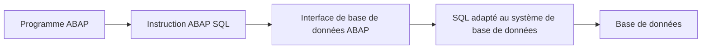
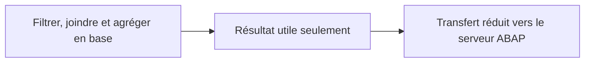

# PRINCIPES D’ABAP SQL

## RÉSULTAT ATTENDU

- Comprendre le rôle d’ABAP SQL
- Distinguer ABAP SQL, SQL natif et traitements ABAP
- Comprendre le passage par l’interface de base de données
- Identifier les opérations de lecture et de modification
- Délimiter le périmètre du dossier

## DÉFINITION

**ABAP SQL** est le langage SQL intégré à ABAP pour accéder aux sources de données gérées par le système ABAP.

Le nom historique **Open SQL** reste très utilisé dans les projets et dans certaines transactions. La documentation récente emploie principalement le nom **ABAP SQL**.

L’interface de base de données assure notamment :

- l’adaptation au système de base de données utilisé ;
- la conversion entre types ABAP et types de base de données ;
- la gestion implicite du mandant pour les sources concernées ;
- l’utilisation éventuelle du buffer de tables ABAP.

## PRINCIPALES INSTRUCTIONS

| Instruction | Fonction                                        |
| ----------- | ----------------------------------------------- |
| `SELECT`    | Lire des données                                |
| `INSERT`    | Ajouter de nouvelles lignes                     |
| `UPDATE`    | Modifier des lignes existantes                  |
| `MODIFY`    | Insérer ou modifier selon l’existence de la clé |
| `DELETE`    | Supprimer des lignes                            |

## ABAP SQL ET SQL NATIF

| ABAP SQL                                     | SQL natif                                     |
| -------------------------------------------- | --------------------------------------------- |
| Syntaxe intégrée au langage ABAP             | Syntaxe propre au système de base de données  |
| Indépendance plus forte vis-à-vis de la base | Dépendance au moteur de base de données       |
| Gestion ABAP du mandant et du buffer         | Accès direct sans ces mécanismes ABAP         |
| Contrôle de syntaxe avec les objets DDIC     | Contrôle dépendant de la technologie utilisée |

Utiliser ABAP SQL par défaut pour les accès classiques depuis un programme ABAP. Le SQL natif, ADBC, AMDP et les CDS seront traités dans des dossiers spécialisés.

## CODE PUSH-DOWN

Une opération réalisable efficacement dans l’instruction SQL doit généralement être exécutée par la base de données plutôt qu’après transfert massif des données vers le serveur ABAP.

Cela ne signifie pas qu’il faut placer toute la logique métier dans SQL. La règle consiste à confier à la base les opérations ensemblistes pour lesquelles elle est conçue.

## TABLES DE DÉMONSTRATION

Les exemples de lecture utilisent principalement `SCARR`, `SPFLI` et `SFLIGHT`, tables de démonstration historiques du modèle de vols SAP.

> [!NOTE]
> Leur disponibilité dépend du système. Adapter les exemples à une table de démonstration ou à un objet client présent dans l’environnement.

Les exemples d’écriture utilisent une table fictive `ZDEV_PRODUCT`. Ils ne doivent pas être exécutés sur une table applicative SAP standard.

## PROCESS

### Étape 1 — Définir le résultat de la requête

Lister les colonnes attendues, les filtres obligatoires, l’unicité éventuelle et l’ordre réellement nécessaire. Déterminer si l’opération est une lecture ou une modification et identifier l’API métier qui pourrait devoir être utilisée à la place d’un accès direct.

### Étape 2 — Examiner la source

Afficher la table ou vue dans `SE11`. Relever clé, dépendance au mandant, types, références devise/unité, bufferisation et volume estimé. Pour un objet SAP, vérifier que la lecture directe est autorisée par le modèle applicatif.

### Étape 3 — Écrire la requête minimale

Sélectionner uniquement les colonnes nécessaires, utiliser les variables hôtes avec `@` et appliquer une condition sélective. Ne pas ajouter `ORDER BY` si l’ordre n’est pas utilisé ; ne jamais supposer un ordre implicite.

### Étape 4 — Traiter tous les résultats

Pour une lecture unique, traiter `SY-SUBRC = 0` et l’absence de ligne. Pour une lecture multiple, distinguer table vide et contenu valide. Pour une modification, contrôler `SY-SUBRC`, `SY-DBCNT` et la responsabilité transactionnelle.

### Étape 5 — Vérifier avec des données connues

Exécuter un cas trouvé, un cas absent et une limite de volume. Comparer le résultat avec les données sources autorisées. La requête est validée lorsque le résultat est déterministe, le mandant correct et chaque absence ou erreur traitée explicitement.

## VÉRIFICATION

- Le lecteur peut expliquer la différence entre cette notion et les concepts proches.
- Le choix technique est justifié par un besoin concret, pas uniquement par habitude.
- Les limites liées à la release, aux autorisations et au contexte d’exécution sont identifiées.

## ERREURS FRÉQUENTES

- Lire toutes les colonnes ou toutes les lignes par défaut.
- Effectuer des commits dans une méthode réutilisable sans contrat explicite.

## TERMES DU LEXIQUE

- [ABAP](<../🧩 00 ├── LEXIQUE SAP ET ABAP/10 └── ACRONYMES SAP.md#acro-abap>)
- [SQL](<../🧩 00 ├── LEXIQUE SAP ET ABAP/10 └── ACRONYMES SAP.md#acro-sql>)
- [MANDT](<../🧩 00 ├── LEXIQUE SAP ET ABAP/05 ├── DONNEES DICTIONNAIRE ET BASE DE DONNEES.md#mandt>)
- [Table transparente](<../🧩 00 ├── LEXIQUE SAP ET ABAP/05 ├── DONNEES DICTIONNAIRE ET BASE DE DONNEES.md#table-transparente>)
- [LUW base de données](<../🧩 00 ├── LEXIQUE SAP ET ABAP/08 ├── EXECUTION EXPLOITATION ET ADMINISTRATION.md#luw-base>)

## MODÈLE DE DÉMONSTRATION SFLIGHT

> [!NOTE]
> Les tables `SCARR`, `SPFLI` et `SFLIGHT` appartiennent au modèle de démonstration SAP et peuvent être absentes ou non alimentées dans certains systèmes. Dans ce cas, remplacer les exemples par une table Z de démonstration ou par une source en lecture seule autorisée, sans modifier une table applicative standard.

## RÉFÉRENCES OFFICIELLES SAP

- [ABAP SQL — ABAP Keyword Documentation](https://help.sap.com/doc/abapdocu_latest_index_htm/latest/en-US/ABENABAP_SQL_OVIEW.html)
- [Implementing Basic SELECT Statements — SAP Learning](https://learning.sap.com/courses/basic-abap-programming/implementing-basic-select-statements_a6d4effa-f6b0-4ef8-96c8-b79baa2da157)
- [SELECT — ABAP Keyword Documentation](https://help.sap.com/doc/abapdocu_latest_index_htm/latest/en-US/ABAPSELECT_SHORTREF.html)

---

[Chapitre suivant — SOURCES DE DONNÉES, MANDANT ET BUFFER](<./02 ├── SOURCES DE DONNEES MANDANT ET BUFFER.md>)
