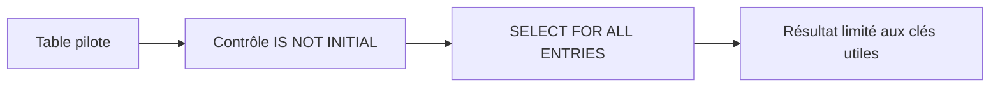

# 11. SELECT FOR ALL ENTRIES

## 11.A RÉSULTAT ATTENDU

- Comprendre le rôle de `FOR ALL ENTRIES`
- Lire des données à partir d’une table interne pilote
- Éviter le cas critique de la table pilote vide
- Supprimer les doublons inutiles
- Choisir entre jointure, `IN` et `FOR ALL ENTRIES`

## 11.B PRINCIPE

`FOR ALL ENTRIES` construit une condition à partir des lignes d’une table interne.

```abap
" Exemple à éviter : identifier le défaut avant de choisir la correction.
IF lt_carriers IS NOT INITIAL.
  SELECT carrid, connid, cityfrom, cityto
    FROM spfli
    FOR ALL ENTRIES IN @lt_carriers
    WHERE carrid = @lt_carriers-carrid
    INTO TABLE @DATA(lt_connections).
ENDIF.
```

## 11.C TABLE PILOTE VIDE

Si la table utilisée après `FOR ALL ENTRIES IN` est vide, la condition issue de cette table est ignorée et la requête peut lire l’ensemble des lignes satisfaisant les autres conditions.

> [!CAUTION]
> Toujours contrôler que la table pilote n’est pas vide avant la requête.



## 11.D DOUBLONS DANS LA TABLE PILOTE

Des clés répétées augmentent inutilement le travail de préparation et peuvent complexifier l’exécution.

```abap
" Modifier uniquement les données de la table cible maîtrisée.
SORT lt_carriers BY carrid.
DELETE ADJACENT DUPLICATES FROM lt_carriers COMPARING carrid.
```

Effectuer cette préparation seulement si le volume et le type de table la rendent utile.

## 11.E DOUBLONS DANS LE RÉSULTAT

La sémantique de `FOR ALL ENTRIES` élimine les doublons complets du résultat comme pour une union d’ensembles. Ne pas l’utiliser pour un traitement qui dépend du nombre d’occurrences de la table pilote.

## 11.F JOINTURE OU FOR ALL ENTRIES

Une jointure est souvent préférable lorsque :

- toutes les sources sont des objets de base de données ;
- une seule requête peut exprimer la relation ;
- les colonnes des deux sources sont requises.

`FOR ALL ENTRIES` reste utile lorsque :

- les clés proviennent déjà d’un traitement ABAP ;
- la table pilote ne peut pas être intégrée simplement dans une jointure compatible ;
- le volume et le plan d’exécution ont été contrôlés.

## 11.G VÉRIFICATION

- Le contrôle syntaxique réussit.
- La version active correspond au code sauvegardé.
- L’exécution produit le résultat décrit dans le chapitre.
- Les cas vide, limite et erreur sont testés séparément lorsque la syntaxe le permet.

## 11.H ERREURS FRÉQUENTES

- Copier un exemple sans adapter les types, noms d’objets et données disponibles dans le système.
- Tester uniquement le cas nominal et ignorer les valeurs initiales, absentes ou invalides.
- Lire toutes les colonnes ou toutes les lignes par défaut.
- Effectuer des commits dans une méthode réutilisable sans contrat explicite.

## 11.I SNIPPET À RÉUTILISER

> [!NOTE]
> Adapter les noms `Z*`, les types DDIC, les données et les autorisations au système cible. Effectuer un contrôle syntaxique avant activation.

```abap
" Lire uniquement les colonnes et les lignes nécessaires.
IF lt_carriers IS NOT INITIAL.
  SELECT carrid, connid, cityfrom, cityto
    FROM spfli
    FOR ALL ENTRIES IN @lt_carriers
    WHERE carrid = @lt_carriers-carrid
    INTO TABLE @DATA(lt_connections).
ENDIF.
```

## 11.J TERMES DU LEXIQUE

- [SQL](<../🧩 00 ├── LEXIQUE SAP ET ABAP/10 └── ACRONYMES SAP.md#acro-sql>)
- [MANDT](<../🧩 00 ├── LEXIQUE SAP ET ABAP/05 ├── DONNEES DICTIONNAIRE ET BASE DE DONNEES.md#mandt>)
- [Table transparente](<../🧩 00 ├── LEXIQUE SAP ET ABAP/05 ├── DONNEES DICTIONNAIRE ET BASE DE DONNEES.md#table-transparente>)
- [LUW base de données](<../🧩 00 ├── LEXIQUE SAP ET ABAP/08 ├── EXECUTION EXPLOITATION ET ADMINISTRATION.md#luw-base>)

## 11.K MODÈLE DE DÉMONSTRATION SFLIGHT

> [!NOTE]
> Les tables `SCARR`, `SPFLI` et `SFLIGHT` appartiennent au modèle de démonstration SAP et peuvent être absentes ou non alimentées dans certains systèmes. Dans ce cas, remplacer les exemples par une table Z de démonstration ou par une source en lecture seule autorisée, sans modifier une table applicative standard.

## 11.L RÉFÉRENCES OFFICIELLES SAP

- [FOR ALL ENTRIES — ABAP Keyword Documentation](https://help.sap.com/doc/abapdocu_latest_index_htm/latest/en-US/ABENWHERE_ALL_ENTRIES.html)
- [FOR ALL ENTRIES — SAP Help Portal](https://help.sap.com/docs/SUPPORT_CONTENT/ABAP/3353526117.html)
- [ABAP Performance and Tuning — SAP Help Portal](https://help.sap.com/docs/SUPPORT_CONTENT/ABAP/3353523595.html)


---

[Chapitre suivant — VALEURS NULL ET CONVERSIONS SQL](<./12 ├── VALEURS NULL ET CONVERSIONS SQL.md>)
