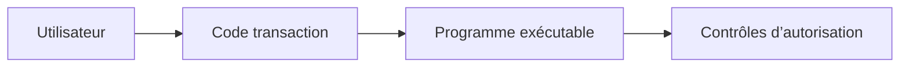

# 2. ATTRIBUTS, EXÉCUTION ET DOCUMENTATION

## 2.A RÉSULTAT ATTENDU

- Comprendre les attributs d’un programme exécutable
- Lancer un programme avec les transactions SAP GUI adaptées
- Distinguer exécution, modification et documentation
- Préparer une utilisation par transaction ou job
- Éviter les dépendances implicites à l’environnement utilisateur

## 2.B ATTRIBUTS DU PROGRAMME

Lors de la création dans `SE38` ou `SE80`, le programme reçoit notamment :

| Attribut    | Rôle                                         |
| ----------- | -------------------------------------------- |
| Titre       | Description fonctionnelle courte             |
| Type        | Programme exécutable                         |
| Statut      | Classification du programme selon le système |
| Application | Domaine applicatif                           |
| Package     | Affectation au Repository et au transport    |

D’autres attributs peuvent apparaître selon la version du système.

## 2.C TRANSACTIONS PRINCIPALES

| Transaction | Usage                                              |
| ----------- | -------------------------------------------------- |
| `SE38`      | Créer, modifier, vérifier et exécuter un programme |
| `SA38`      | Exécuter un programme existant                     |
| `SE80`      | Naviguer dans le package et les objets liés        |
| `SE93`      | Créer ou analyser une transaction associée         |

Avant une modification, vérifier le système, le mandant, le package et l’ordre de transport.

## 2.D PROCESS

Dans `SE38` ou `SA38` :

### 2.D.1 Étape 1 — Identifier le programme actif

Saisir le nom exact dans `SE38` ou `SA38` et choisir **Afficher** avant l’exécution. Vérifier titre, type exécutable, package et documentation. Si le programme n’est pas exécutable ou si son usage n’est pas documenté, ne pas le lancer directement.

### 2.D.2 Étape 2 — Lire les attributs d’exécution

Dans les attributs du programme, relever le type, le statut, l’application et les paramètres qui limitent son lancement. Vérifier également si une transaction dédiée ou un job standard doit être utilisé à la place de `SA38`.

### 2.D.3 Étape 3 — Préparer une sélection contrôlée

Choisir **Exécuter**, puis renseigner l’écran avec un périmètre minimal et vérifiable. Examiner les variantes existantes sans en utiliser une dont le propriétaire ou la finalité est inconnu.

### 2.D.4 Étape 4 — Exécuter et relever le résultat

Lancer avec `F8`. Noter messages, spool, journal, nombre d’objets traités et éventuel job créé. Si l’écran revient sans résultat, vérifier la barre de statut et les journaux prévus par le programme.

### 2.D.5 Étape 5 — Valider l’absence d’effet involontaire

Contrôler les données ou objets ciblés. L’exécution est validée lorsque le programme actif, la sélection réellement appliquée et les effets produits correspondent au scénario prévu.

Le raccourci standard d’exécution dans l’éditeur est généralement `F8`.

## 2.E TRANSACTION DÉDIÉE

Une transaction peut pointer vers le programme et son écran de sélection. Elle simplifie l’accès utilisateur, mais ne constitue pas une protection suffisante.



Les autorisations de transaction et les autorisations métier répondent à des objectifs différents.

## 2.F DOCUMENTATION DU PROGRAMME

La documentation d’un programme exécutable peut être maintenue depuis l’éditeur ABAP. Elle doit préciser :

- l’objectif fonctionnel ;
- les données traitées ;
- les paramètres importants ;
- les restrictions ;
- les impacts d’une exécution productive ;
- le mode d’exécution recommandé.

Ne pas placer uniquement ces informations dans les commentaires du code. La documentation utilisateur et la documentation technique ont des destinataires différents.

## 2.G COMPATIBILITÉ DIALOGUE ET ARRIÈRE-PLAN

Un programme destiné à l’arrière-plan ne doit pas dépendre de fonctions exclusivement disponibles sur le poste SAP GUI, comme certains accès au système de fichiers local ou dialogues interactifs.

La compatibilité doit être pensée dès la conception :

- saisie reproductible par variante ;
- absence de confirmation interactive obligatoire ;
- sortie exploitable dans le spool ou les logs ;
- gestion explicite des erreurs.

## 2.H VÉRIFICATION

- Le lecteur peut expliquer la différence entre cette notion et les concepts proches.
- Le choix technique est justifié par un besoin concret, pas uniquement par habitude.
- Les limites liées à la release, aux autorisations et au contexte d’exécution sont identifiées.

## 2.I ERREURS FRÉQUENTES

- Mettre une logique lourde dans les événements de validation de l’écran.
- Créer une variante contenant des valeurs obsolètes ou sensibles.

## 2.J FICHE DE CONTRÔLE À COPIER

```text
Système / SID       :
Mandant             :
Utilisateur         :
Transaction / outil :
Objet technique     :
Jeu de données      :
Résultat attendu    :
Résultat observé    :
Horodatage          :
Ordre de transport  :
```

## 2.K TERMES DU LEXIQUE

- [Programme exécutable](<../🧩 00 ├── LEXIQUE SAP ET ABAP/06 ├── PROGRAMMES CLASSES ET OBJETS TECHNIQUES.md#programme-executable>)
- [Variante](<../🧩 00 ├── LEXIQUE SAP ET ABAP/06 ├── PROGRAMMES CLASSES ET OBJETS TECHNIQUES.md#variante>)
- [Transaction](<../🧩 00 ├── LEXIQUE SAP ET ABAP/02 ├── SAP GUI NAVIGATION ET TRANSACTIONS.md#transaction>)
- [Dynpro](<../🧩 00 ├── LEXIQUE SAP ET ABAP/02 ├── SAP GUI NAVIGATION ET TRANSACTIONS.md#dynpro>)

## 2.L RÉFÉRENCES OFFICIELLES SAP

- [Accessing and Editing ABAP Repository Objects — SAP Learning](https://learning.sap.com/courses/technical-implementation-and-operation-i-of-sap-s-4hana-and-sap-business-suite/accessing-and-editing-abap-repository-objects)
- [Opening Programs in the ABAP Editor — SAP Help Portal](https://help.sap.com/docs/SAP_NETWEAVER_731_BW_ABAP/cfae740a0a21455dbe6e510c2d86e36a/fceb2d26358411d1829f0000e829fbfe.html)
- [Authorization Checks — SAP Help Portal](https://help.sap.com/docs/SAP_NETWEAVER_731_BW_ABAP/cfae740a0a21455dbe6e510c2d86e36a/9fdbaccb35c111d1829f0000e829fbfe.html)

---

[Chapitre suivant — CYCLE D’EXÉCUTION ET ÉVÉNEMENTS](<./03 ├── CYCLE D EXECUTION ET EVENEMENTS.md>)
