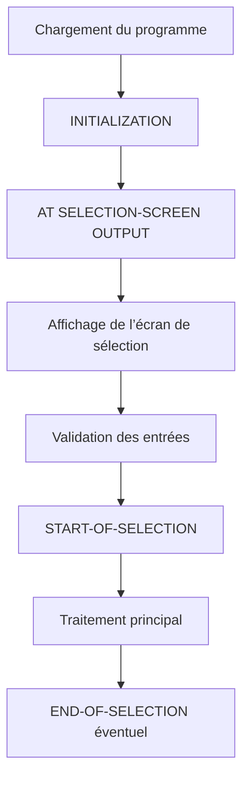

# 3. CYCLE D’EXÉCUTION ET ÉVÉNEMENTS

## 3.A RÉSULTAT ATTENDU

- Comprendre le cycle d’un programme exécutable
- Identifier les principaux blocs événementiels
- Placer le traitement au bon endroit
- Éviter le code implicite avant `START-OF-SELECTION`
- Distinguer événements de sélection et événements de liste

## 3.B PRINCIPE

Le runtime ABAP appelle certains blocs selon le type du programme et les actions de l’utilisateur.



Ce diagramme représente le parcours principal. Des événements supplémentaires peuvent être déclenchés pendant la saisie ou le traitement d’une liste.

## 3.C PRINCIPAUX ÉVÉNEMENTS

| Événement                    | Usage                                                           |
| ---------------------------- | --------------------------------------------------------------- |
| `LOAD-OF-PROGRAM`            | Initialisation technique au chargement du programme             |
| `INITIALIZATION`             | Initialiser les valeurs avant le premier affichage              |
| `AT SELECTION-SCREEN OUTPUT` | Adapter l’écran avant affichage                                 |
| `AT SELECTION-SCREEN ...`    | Valider ou traiter une action utilisateur                       |
| `START-OF-SELECTION`         | Démarrer le traitement principal                                |
| `END-OF-SELECTION`           | Traitement final, notamment dans certains scénarios historiques |
| `TOP-OF-PAGE`                | Construire l’en-tête d’une liste classique                      |

## 3.D START-OF-SELECTION EXPLICITE

```abap
START-OF-SELECTION.
  PERFORM read_data.
  PERFORM display_data.
```

Des instructions exécutables placées avant le premier bloc événementiel peuvent être rattachées à un bloc `START-OF-SELECTION` implicite. Cette écriture nuit à la lisibilité.

```abap
REPORT zdev_bad_example.

DATA gv_text TYPE string.

gv_text = `Exécution implicite`. " À éviter

START-OF-SELECTION.
  WRITE gv_text.
```

Placer explicitement le point d’entrée facilite l’analyse et le débogage.

## 3.E END-OF-SELECTION

`END-OF-SELECTION` n’est pas une fin obligatoire de tout report. Dans un programme sans base de données logique, le traitement principal peut être entièrement orchestré depuis `START-OF-SELECTION`.

Ne pas ajouter cet événement par convention sans besoin réel.

## 3.F ÉVÉNEMENTS DE LISTE

Les événements comme `TOP-OF-PAGE` ou `AT LINE-SELECTION` appartiennent au traitement des listes classiques. Ils ne sont pas déclenchés comme une séquence systématique après `START-OF-SELECTION`.

Pour les restitutions tabulaires professionnelles, un ALV est généralement préférable à une liste interactive classique.

## 3.G VÉRIFICATION

- Le contrôle syntaxique réussit.
- La version active correspond au code sauvegardé.
- L’exécution produit le résultat décrit dans le chapitre.
- Les cas vide, limite et erreur sont testés séparément lorsque la syntaxe le permet.

## 3.H ERREURS FRÉQUENTES

- Copier un exemple sans adapter les types, noms d’objets et données disponibles dans le système.
- Tester uniquement le cas nominal et ignorer les valeurs initiales, absentes ou invalides.
- Mettre une logique lourde dans les événements de validation de l’écran.
- Créer une variante contenant des valeurs obsolètes ou sensibles.

## 3.I SNIPPET À RÉUTILISER

> [!NOTE]
> Adapter les noms `Z*`, les types DDIC, les données et les autorisations au système cible. Effectuer un contrôle syntaxique avant activation.

```abap
REPORT zdev_bad_example.

DATA gv_text TYPE string.

gv_text = `Exécution implicite`. " À éviter

START-OF-SELECTION.
  WRITE gv_text.
```

## 3.J TERMES DU LEXIQUE

- [Programme exécutable](<../🧩 00 ├── LEXIQUE SAP ET ABAP/06 ├── PROGRAMMES CLASSES ET OBJETS TECHNIQUES.md#programme-executable>)
- [Variante](<../🧩 00 ├── LEXIQUE SAP ET ABAP/06 ├── PROGRAMMES CLASSES ET OBJETS TECHNIQUES.md#variante>)
- [Transaction](<../🧩 00 ├── LEXIQUE SAP ET ABAP/02 ├── SAP GUI NAVIGATION ET TRANSACTIONS.md#transaction>)
- [Dynpro](<../🧩 00 ├── LEXIQUE SAP ET ABAP/02 ├── SAP GUI NAVIGATION ET TRANSACTIONS.md#dynpro>)

## 3.K RÉFÉRENCES OFFICIELLES SAP

- [Event Control — SAP Help Portal](https://help.sap.com/docs/ABAP_PLATFORM_NEW/7bfe8cdcfbb040dcb6702dada8c3e2f0/0b32146b63054bb293de32877a6ebfe9.html)
- [START-OF-SELECTION — ABAP Keyword Documentation](https://help.sap.com/doc/abapdocu_latest_index_htm/latest/en-US/abapstart-of-selection.htm)
- [Event Blocks — SAP Help Portal](https://help.sap.com/docs/SAP_NETWEAVER_731_BW_ABAP/cfae740a0a21455dbe6e510c2d86e36a/9fdb9a0735c111d1829f0000e829fbfe.html)


---

[Chapitre suivant — ÉCRAN DE SÉLECTION STANDARD](<./04 ├── ECRAN DE SELECTION STANDARD.md>)
