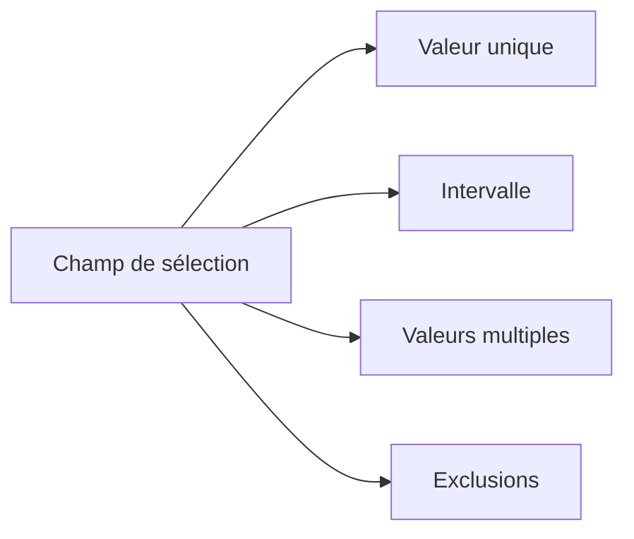

# CRITÈRES AVEC SELECT-OPTIONS

## RÉSULTAT ATTENDU

- Déclarer un critère multivaleur
- Comprendre les bornes basse et haute
- Utiliser les inclusions et exclusions
- Passer directement le critère à ABAP SQL
- Choisir entre `PARAMETERS` et `SELECT-OPTIONS`

## DÉCLARATION

```abap
SELECT-OPTIONS s_carr FOR scarr-carrid.
```

Cette instruction crée :

- un critère de sélection visible sur l’écran ;
- une table de sélection globale nommée `s_carr` ;
- un accès au dialogue de sélection multiple.

La convention habituelle utilise le préfixe `s_`.

## CRITÈRE SIMPLE OU MULTIPLE

L’utilisateur peut saisir :

- une valeur unique ;
- un intervalle ;
- plusieurs valeurs ;
- des exclusions ;
- des motifs lorsque le type et l’opérateur le permettent.



## UTILISATION DANS ABAP SQL

```abap
SELECT carrid, carrname
  FROM scarr
  WHERE carrid IN @s_carr
  INTO TABLE @DATA(lt_carriers).
```

ABAP SQL interprète les lignes de la table de sélection selon `SIGN`, `OPTION`, `LOW` et `HIGH`.

## LIMITER À UNE VALEUR UNIQUE

```abap
SELECT-OPTIONS s_carr FOR scarr-carrid NO INTERVALS NO-EXTENSION.
```

| Addition       | Effet                                       |
| -------------- | ------------------------------------------- |
| `NO INTERVALS` | Masque la borne haute sur l’écran principal |
| `NO-EXTENSION` | Supprime le dialogue de sélection multiple  |

Même avec `NO INTERVALS`, l’objet ABAP reste une table de sélection.

## VALEUR PAR DÉFAUT

```abap
SELECT-OPTIONS s_carr FOR scarr-carrid DEFAULT 'LH'.
```

Pour plusieurs lignes initiales, alimenter la table dans `INITIALIZATION`.

## CHOIX ENTRE PARAMETERS ET SELECT-OPTIONS

| Besoin                            | Instruction                  |
| --------------------------------- | ---------------------------- |
| Une seule valeur métier           | `PARAMETERS`                 |
| Plusieurs valeurs ou intervalles  | `SELECT-OPTIONS`             |
| Critère transmis à `WHERE ... IN` | `SELECT-OPTIONS`             |
| Option binaire                    | `PARAMETERS ... AS CHECKBOX` |

Ne pas utiliser `SELECT-OPTIONS` par habitude lorsque le traitement exige réellement une seule valeur.

## VÉRIFICATION

- Le contrôle syntaxique réussit.
- La version active correspond au code sauvegardé.
- L’exécution produit le résultat décrit dans le chapitre.
- Les cas vide, limite et erreur sont testés séparément lorsque la syntaxe le permet.

## ERREURS FRÉQUENTES

- Copier un exemple sans adapter les types, noms d’objets et données disponibles dans le système.
- Tester uniquement le cas nominal et ignorer les valeurs initiales, absentes ou invalides.
- Mettre une logique lourde dans les événements de validation de l’écran.
- Créer une variante contenant des valeurs obsolètes ou sensibles.

## SNIPPET À RÉUTILISER

> [!NOTE]
> Adapter les noms `Z*`, les types DDIC, les données et les autorisations au système cible. Effectuer un contrôle syntaxique avant activation.

```abap
SELECT carrid, carrname
  FROM scarr
  WHERE carrid IN @s_carr
  INTO TABLE @DATA(lt_carriers).
```

## TERMES DU LEXIQUE

- [Programme exécutable](<../🧩 00 ├── LEXIQUE SAP ET ABAP/06 ├── PROGRAMMES CLASSES ET OBJETS TECHNIQUES.md#programme-executable>)
- [Variante](<../🧩 00 ├── LEXIQUE SAP ET ABAP/06 ├── PROGRAMMES CLASSES ET OBJETS TECHNIQUES.md#variante>)
- [Transaction](<../🧩 00 ├── LEXIQUE SAP ET ABAP/02 ├── SAP GUI NAVIGATION ET TRANSACTIONS.md#transaction>)
- [Dynpro](<../🧩 00 ├── LEXIQUE SAP ET ABAP/02 ├── SAP GUI NAVIGATION ET TRANSACTIONS.md#dynpro>)

## MODÈLE DE DÉMONSTRATION SFLIGHT

> [!NOTE]
> Les tables `SCARR`, `SPFLI` et `SFLIGHT` appartiennent au modèle de démonstration SAP et peuvent être absentes ou non alimentées dans certains systèmes. Dans ce cas, remplacer les exemples par une table Z de démonstration ou par une source en lecture seule autorisée, sans modifier une table applicative standard.

## RÉFÉRENCES OFFICIELLES SAP

- [SELECT-OPTIONS — ABAP Keyword Documentation](https://help.sap.com/doc/abapdocu_816_index_htm/8.16/en-US/ABAPSELECT-OPTIONS.html)
- [SELECT-OPTIONS, Screen Options — ABAP Keyword Documentation](https://help.sap.com/doc/abapdocu_750_index_htm/7.50/en-US/ABAPSELECT-OPTIONS_SCREEN.html)
- [Selection Screens — Overview — ABAP Keyword Documentation](https://help.sap.com/doc/abapdocu_latest_index_htm/latest/en-US/ABENSELECTION_SCREEN_OVERVIEW.html)


---

[Chapitre suivant — STRUCTURE ET SÉMANTIQUE DES TABLES DE SÉLECTION](<./07 ├── STRUCTURE ET SEMANTIQUE DES TABLES DE SELECTION.md>)
