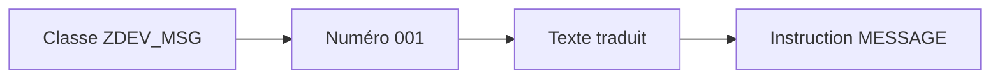

# CLASSES DE MESSAGES ET TRANSACTION SE91

## RÉSULTAT ATTENDU

- Comprendre le rôle d’une classe de messages
- Créer et maintenir des messages avec `SE91`
- Utiliser les numéros et variables de message
- Préparer les traductions
- Éviter les textes codés en dur

## PRINCIPE

Les messages classiques ABAP sont stockés dans des **classes de messages**. Chaque entrée est identifiée par :

- une classe ;
- un numéro sur trois chiffres ;
- un texte dépendant de la langue de connexion.

Les messages sont enregistrés dans le référentiel de textes associé à la table `T100`.



## PROCESS

### Étape 1 — Définir le périmètre de la classe

Regrouper des messages appartenant au même composant ou service. Rechercher une classe client existante avant d’en créer une nouvelle et vérifier son package et ses responsables.

### Étape 2 — Créer la classe

Ouvrir `SE91`, saisir un nom client comme `ZDEV_MSG` et choisir **Créer**. Renseigner une description précise, puis affecter le package et la tâche de transport du composant.

### Étape 3 — Ajouter un message

Choisir un numéro libre, saisir un texte court et utiliser au maximum `&1` à `&4` pour les valeurs dynamiques. Le texte doit rester compréhensible après substitution et ne doit pas exposer de donnée sensible.

### Étape 4 — Enregistrer et contrôler le transport

Enregistrer puis vérifier dans `SE10` que la classe et ses textes sont rattachés à l’ordre attendu. Contrôler que le numéro ajouté n’a pas été simultanément utilisé par un autre changement.

### Étape 5 — Préparer les traductions

Identifier les langues supportées et transmettre les textes au processus de traduction prévu. Tester la classe dans chaque langue disponible plutôt que de supposer un fallback acceptable.

La maintenance peut également être atteinte depuis les outils du Workbench ABAP selon la version du système.

## NUMÉROS DE MESSAGE

Une classe peut contenir des numéros de `000` à `999`.

Exemple :

| Numéro | Texte                                  |
| ------ | -------------------------------------- |
| `001`  | Article & introuvable                  |
| `002`  | Quantité & invalide pour l’article &   |
| `003`  | Traitement terminé : & enregistrements |

Les `&` sont remplacés lors de l’appel du message. Un message T100 accepte jusqu’à quatre variables.

## TEXTE COURT

Le texte doit être :

- compréhensible sans accès au code ;
- précis sur l’objet concerné ;
- neutre et exploitable ;
- compatible avec les traductions ;
- dépourvu de détails techniques inutiles pour l’utilisateur.

Mauvais :

```text
Erreur traitement
```

Meilleur :

```text
Article 000123 introuvable dans la division 1000
```

## TEXTE LONG

Un message peut être associé à une documentation longue. Elle permet d’expliquer :

- la cause probable ;
- l’action attendue ;
- les données à vérifier ;
- les conséquences du problème.

Le texte court indique l’erreur. Le texte long aide à la résoudre.

## TRANSPORT ET TRADUCTION

Une classe de messages est un objet du Repository. Sa création et ses modifications doivent suivre les règles de package et de transport du projet.

La traduction ne doit pas être remplacée par des textes assemblés manuellement dans le code. Les variables doivent contenir les données, pas la structure grammaticale complète du message.

## CONVENTIONS CONSEILLÉES

- regrouper les messages par composant fonctionnel cohérent ;
- éviter une classe globale contenant des messages sans relation ;
- réserver des plages de numéros si l’équipe en a besoin ;
- ne pas réutiliser un numéro avec une nouvelle signification ;
- conserver les messages stables lorsqu’ils constituent un contrat d’interface.

## PROCESS

### Étape 1 — Appeler le message avec des paramètres typés

Créer un report de test et utiliser `MESSAGE` avec la classe, le numéro et le même nombre de paramètres que les placeholders. Fournir des valeurs dont la longueur permet de vérifier une éventuelle troncature.

### Étape 2 — Tester le type de message dans son contexte

Tester le message dans le contexte réel : écran de sélection, traitement de fond, méthode ou dynpro. Les types `E`, `W`, `S`, `I`, `A` et `X` n’ont pas le même effet selon le contexte ; ne déduire pas leur comportement depuis un seul report.

### Étape 3 — Vérifier le texte résolu

Exécuter dans la langue de connexion, contrôler substitutions, ordre des valeurs et lisibilité. Relancer dans une autre langue supportée.

La classe est validée lorsque le bon texte et le bon comportement apparaissent dans chaque contexte prévu, sans dump ni information sensible.

## VÉRIFICATION

- Le lecteur peut expliquer la différence entre cette notion et les concepts proches.
- Le choix technique est justifié par un besoin concret, pas uniquement par habitude.
- Les limites liées à la release, aux autorisations et au contexte d’exécution sont identifiées.

## ERREURS FRÉQUENTES

- Afficher un message technique incompréhensible à l’utilisateur.
- Attraper une exception sans action ni propagation.

## FICHE DE CONTRÔLE À COPIER

```text
Système / SID       :
Mandant             :
Utilisateur         :
Transaction / outil :
Objet technique     :
Jeu de données      :
Résultat attendu    :
Résultat observé    :
Horodatage          :
Ordre de transport  :
```

## TERMES DU LEXIQUE

- [Transaction](<../🧩 00 ├── LEXIQUE SAP ET ABAP/02 ├── SAP GUI NAVIGATION ET TRANSACTIONS.md#transaction>)
- [Classe](<../🧩 00 ├── LEXIQUE SAP ET ABAP/04 ├── LANGAGE ET DEVELOPPEMENT ABAP.md#classe>)
- [Exception](<../🧩 00 ├── LEXIQUE SAP ET ABAP/04 ├── LANGAGE ET DEVELOPPEMENT ABAP.md#exception>)
- [Dump ABAP](<../🧩 00 ├── LEXIQUE SAP ET ABAP/08 ├── EXECUTION EXPLOITATION ET ADMINISTRATION.md#dump-abap>)

## RÉFÉRENCES OFFICIELLES SAP

- [Messages and Message Classes — SAP Help Portal](https://help.sap.com/docs/ABAP_PLATFORM_NEW/c238d694b825421f940829321ffa326a/4ec242f66e391014adc9fffe4e204223.html)
- [Maintaining Messages — SAP Help Portal](https://help.sap.com/docs/SAP_NETWEAVER_AS_ABAP_752/bd833c8355f34e96a6e83096b38bf192/d1801b3e454211d189710000e8322d00.html)
- [MESSAGE — ABAP Keyword Documentation](https://help.sap.com/doc/abapdocu_latest_index_htm/latest/en-US/ABAPMESSAGE_SHORTREF.html)

---

[Chapitre suivant — INSTRUCTION MESSAGE](<./03 ├── INSTRUCTION MESSAGE.md>)
