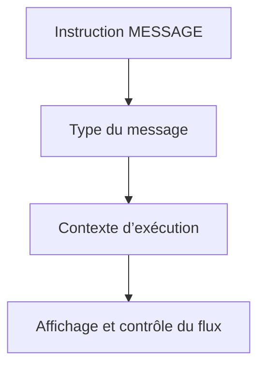

# 4. TYPES DE MESSAGES ET COMPORTEMENT

## 4.A RÉSULTAT ATTENDU

- Connaître les types `S`, `I`, `W`, `E`, `A` et `X`
- Comprendre que le comportement dépend du contexte
- Choisir un type selon l’effet attendu
- Éviter l’usage abusif des messages d’arrêt
- Distinguer comportement et apparence

## 4.B TABLEAU DE SYNTHÈSE

| Type | Signification générale | Effet principal                            |
| ---- | ---------------------- | ------------------------------------------ |
| `S`  | Succès ou statut       | Poursuite normale                          |
| `I`  | Information            | Affichage d’une information puis poursuite |
| `W`  | Avertissement          | Réaction dépendante du contexte            |
| `E`  | Erreur                 | Retour ou arrêt dépendant du contexte      |
| `A`  | Abandon                | Interruption du traitement en cours        |
| `X`  | Erreur fatale          | Erreur d’exécution et dump                 |

Le type ne représente pas uniquement une icône. Il influence le flux du programme.

## 4.C TYPE S

```abap
MESSAGE s003(zdev_msg) WITH lv_count.
```

Le traitement continue normalement. Le message est généralement présenté dans la barre de statut du prochain écran pertinent.

## 4.D TYPE I

```abap
MESSAGE i004(zdev_msg).
```

Le message est présenté comme une information. Après validation par l’utilisateur, le traitement continue après l’instruction `MESSAGE`.

Un message modal rend un traitement dépendant de l’interaction SAP GUI. Il est donc inadapté à un programme destiné à l’arrière-plan.

## 4.E TYPES W ET E

Le comportement exact dépend du contexte :

- écran de sélection ;
- dynpro classique ;
- traitement de liste ;
- bloc événementiel ;
- procédure appelée.

Un type `E` sur un écran de sélection peut maintenir l’utilisateur sur l’écran afin qu’il corrige la valeur. Le même type dans un autre contexte peut interrompre le bloc courant ou revenir à un écran antérieur.

Il faut toujours vérifier la documentation du contexte d’exécution.

## 4.F TYPE A

Le type `A` signale qu’un traitement ne peut pas continuer. Il provoque une interruption contrôlée par le runtime ABAP.

Il ne doit pas être utilisé pour une validation fonctionnelle ordinaire. Une erreur de saisie doit permettre une correction.

## 4.G TYPE X

```abap
MESSAGE x005(zdev_msg).
```

Le type `X` force une erreur d’exécution, généralement visible dans `ST22` avec le contexte du programme.

Son usage doit rester exceptionnel. Il ne remplace ni une exception de classe ni un message fonctionnel.

## 4.H COMPORTEMENT DÉPENDANT DU CONTEXTE



Le même type peut être traité différemment dans un écran, une liste ou un traitement sans interface.

## 4.I RÈGLE DE CHOIX

- `S` : confirmation non bloquante ;
- `I` : information nécessitant une lecture immédiate en dialogue ;
- `W` : situation corrigible mais risquée ;
- `E` : donnée ou action invalide empêchant la poursuite ;
- `A` : impossibilité de poursuivre le traitement courant ;
- `X` : état technique fatal qui doit produire un dump.

## 4.J VÉRIFICATION

- Le contrôle syntaxique réussit.
- La version active correspond au code sauvegardé.
- L’exécution produit le résultat décrit dans le chapitre.
- Les cas vide, limite et erreur sont testés séparément lorsque la syntaxe le permet.

## 4.K ERREURS FRÉQUENTES

- Copier un exemple sans adapter les types, noms d’objets et données disponibles dans le système.
- Tester uniquement le cas nominal et ignorer les valeurs initiales, absentes ou invalides.
- Afficher un message technique incompréhensible à l’utilisateur.
- Attraper une exception sans action ni propagation.

## 4.L SNIPPET À RÉUTILISER

> [!NOTE]
> Adapter les noms `Z*`, les types DDIC, les données et les autorisations au système cible. Effectuer un contrôle syntaxique avant activation.

```abap
MESSAGE s003(zdev_msg) WITH lv_count.
```

## 4.M TERMES DU LEXIQUE

- [Exception](<../🧩 00 ├── LEXIQUE SAP ET ABAP/04 ├── LANGAGE ET DEVELOPPEMENT ABAP.md#exception>)
- [Dump ABAP](<../🧩 00 ├── LEXIQUE SAP ET ABAP/08 ├── EXECUTION EXPLOITATION ET ADMINISTRATION.md#dump-abap>)

## 4.N RÉFÉRENCES OFFICIELLES SAP

- [Message Types — SAP Help Portal](https://help.sap.com/docs/SAP_NETWEAVER_AS_ABAP_752/c238d694b825421f940829321ffa326a/4ec24da36e391014adc9fffe4e204223.html)
- [MESSAGE — ABAP Keyword Documentation](https://help.sap.com/doc/abapdocu_latest_index_htm/latest/en-US/ABAPMESSAGE_SHORTREF.html)
- [Messages in List Processing — ABAP Keyword Documentation](https://help.sap.com/doc/abapdocu_latest_index_htm/latest/en-US/ABENABAP_MESSAGE_LIST_PROCESSING.html)


---

[Chapitre suivant — VARIABLES ET CHAMPS SYSTÈME DE MESSAGE](<./05 ├── VARIABLES ET CHAMPS SYSTEME DE MESSAGE.md>)
