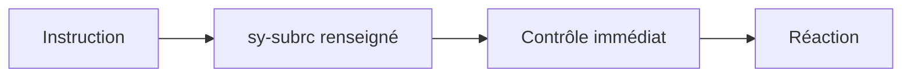

# 7. CODES RETOUR ET SY-SUBRC

## 7.A RÉSULTAT ATTENDU

- Comprendre le rôle de `sy-subrc`
- Contrôler un code retour immédiatement
- Lire la documentation propre à chaque instruction
- Éviter les tests génériques incorrects
- Choisir entre code retour et exception

## 7.B PRINCIPE

Certaines instructions ABAP renseignent le champ système `sy-subrc` afin d’indiquer leur résultat.

```abap
" Exemple à éviter : comparer avec la correction décrite après le bloc.
READ TABLE lt_product
  WITH KEY matnr = lv_matnr
  INTO DATA(ls_product).

IF sy-subrc <> 0.
  MESSAGE e001(zdev_msg) WITH lv_matnr.
ENDIF.
```

La signification des valeurs dépend de l’instruction. `0` signifie généralement que l’opération a réussi, mais les autres valeurs ne sont pas universelles.

## 7.C CONTRÔLE IMMÉDIAT



Mauvais :

```abap
READ TABLE lt_product WITH KEY matnr = lv_matnr INTO ls_product.
PERFORM calculate_price.
IF sy-subrc <> 0.
  " Le code retour peut maintenant appartenir au PERFORM ou à une instruction interne
ENDIF.
```

Le code retour doit être testé avant toute instruction susceptible de le modifier.

## 7.D VALEURS SPÉCIFIQUES

Certaines instructions distinguent plusieurs résultats non nuls.

Exemple conceptuel :

```abap
CASE sy-subrc.
  WHEN 0.
    " Succès
  WHEN 4.
    " Cas documenté numéro 1
  WHEN 8.
    " Cas documenté numéro 2
  WHEN OTHERS.
    " Cas inattendu
ENDCASE.
```

Ne pas inventer la signification de `4`, `8` ou d’une autre valeur. Vérifier la documentation de l’instruction concernée.

## 7.E CONSERVER LE CODE RETOUR

```abap
DATA lv_subrc TYPE sysubrc.

AUTHORITY-CHECK OBJECT 'S_TCODE'
  ID 'TCD' FIELD sy-tcode.

lv_subrc = sy-subrc.
```

La copie permet de différer le traitement sans dépendre de la valeur volatile de `sy-subrc`.

## 7.F CODE RETOUR OU EXCEPTION

| Situation                                         | Mécanisme adapté                                |
| ------------------------------------------------- | ----------------------------------------------- |
| Résultat normal avec présence ou absence          | Code retour                                     |
| Plusieurs états simples d’une instruction         | Code retour documenté                           |
| Erreur nécessitant une propagation entre méthodes | Exception                                       |
| Échec technique avec contexte et cause            | Exception                                       |
| API classique imposant `sy-subrc`                 | Contrôle immédiat puis conversion si nécessaire |

Une interface moderne réutilisable ne doit pas obliger l’appelant à deviner un code numérique non documenté.

## 7.G ERREUR À ÉVITER

```abap
IF sy-subrc = 0.
  " traitement
ENDIF.
```

Sans instruction immédiatement identifiable avant ce test, le code est ambigu et fragile.

## 7.H VÉRIFICATION

- Le contrôle syntaxique réussit.
- La version active correspond au code sauvegardé.
- L’exécution produit le résultat décrit dans le chapitre.
- Les cas vide, limite et erreur sont testés séparément lorsque la syntaxe le permet.

## 7.I ERREURS FRÉQUENTES

- Copier un exemple sans adapter les types, noms d’objets et données disponibles dans le système.
- Tester uniquement le cas nominal et ignorer les valeurs initiales, absentes ou invalides.
- Afficher un message technique incompréhensible à l’utilisateur.
- Attraper une exception sans action ni propagation.

## 7.J SNIPPET À RÉUTILISER

> [!NOTE]
> Adapter les noms `Z*`, les types DDIC, les données et les autorisations au système cible. Effectuer un contrôle syntaxique avant activation.

```abap
CASE sy-subrc.
  WHEN 0.
    " Succès
  WHEN 4.
    " Cas documenté numéro 1
  WHEN 8.
    " Cas documenté numéro 2
  WHEN OTHERS.
    " Cas inattendu
ENDCASE.
```

## 7.K TERMES DU LEXIQUE

- [Exception](<../🧩 00 ├── LEXIQUE SAP ET ABAP/04 ├── LANGAGE ET DEVELOPPEMENT ABAP.md#exception>)
- [Dump ABAP](<../🧩 00 ├── LEXIQUE SAP ET ABAP/08 ├── EXECUTION EXPLOITATION ET ADMINISTRATION.md#dump-abap>)

## 7.L RÉFÉRENCES OFFICIELLES SAP

- [Return Code — ABAP Programming Guideline](https://help.sap.com/doc/abapdocu_latest_index_htm/latest/en-US/ABENRETURN_CODE_GUIDL.html)
- [ABAP Statements Overview — ABAP Keyword Documentation](https://help.sap.com/doc/abapdocu_latest_index_htm/latest/en-US/ABENABAP_STATEMENTS_OVERVIEW.html)


---

[Chapitre suivant — CLASSES D’EXCEPTION ET CATÉGORIES](<./08 ├── CLASSES D EXCEPTION ET CATEGORIES.md>)
