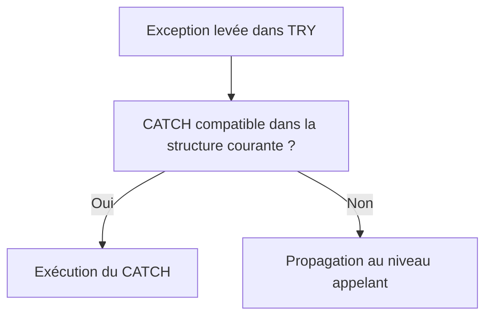

# 9. TRY, CATCH ET ENDTRY

## 9.A RÉSULTAT ATTENDU

- Intercepter une exception de classe
- Délimiter précisément la zone protégée
- Récupérer l’objet d’exception
- Ordonner les blocs `CATCH`
- Éviter les interceptions trop générales

## 9.B STRUCTURE DE BASE

```abap
" Exemple à éviter : comparer avec la correction décrite après le bloc.
TRY.
    lv_result = lv_amount / lv_quantity.
  CATCH cx_sy_zerodivide INTO DATA(lx_zerodivide).
    MESSAGE lx_zerodivide->get_text( ) TYPE 'E'.
ENDTRY.
```

Le bloc `TRY` contient les instructions susceptibles de lever une exception. Le bloc `CATCH` définit la réaction.

## 9.C RECHERCHE D’UN GESTIONNAIRE



Lorsqu’une exception est levée, le traitement séquentiel du bloc courant est interrompu. Le runtime recherche un gestionnaire compatible.

## 9.D RÉCUPÉRER L’OBJET

```abap
" Propager ou traiter l’erreur au niveau qui sait prendre une décision.
CATCH cx_sy_conversion_error INTO DATA(lx_conversion).
  DATA(lv_text) = lx_conversion->get_text( ).
```

La référence permet d’accéder :

- au texte court ;
- au texte long selon la classe ;
- aux attributs spécifiques ;
- à l’exception précédente.

## 9.E PLUSIEURS CATCH

```abap
" Propager ou traiter l’erreur au niveau qui sait prendre une décision.
TRY.
    lo_service->execute( ).
  CATCH zcx_dev_invalid_input INTO DATA(lx_input).
    MESSAGE lx_input->get_text( ) TYPE 'E'.
  CATCH zcx_dev_not_found INTO DATA(lx_not_found).
    MESSAGE lx_not_found->get_text( ) TYPE 'S' DISPLAY LIKE 'W'.
ENDTRY.
```

Les gestionnaires spécifiques doivent être placés avant un gestionnaire plus général compatible.

## 9.F CATCH MULTIPLE

Selon la syntaxe et les besoins, plusieurs classes compatibles peuvent être indiquées dans un même `CATCH` lorsqu’elles déclenchent exactement la même réaction.

Ne pas fusionner des erreurs différentes si l’utilisateur ou l’appelant doit recevoir une réponse différente.

## 9.G ÉVITER CATCH CX_ROOT PAR DÉFAUT

```abap
" Exemple à éviter : comparer avec la correction décrite après le bloc.
CATCH cx_root INTO DATA(lx_root).
```

Cette interception capture un ensemble très large d’exceptions. Elle peut masquer un défaut de programmation ou empêcher la production d’un dump utile.

Elle est acceptable à une frontière technique contrôlée lorsqu’une trace complète est produite et que la stratégie de poursuite est explicite.

## 9.H LIMITER LE BLOC TRY

Mauvais : un bloc `TRY` contenant plusieurs traitements indépendants.

Meilleur : protéger uniquement l’instruction ou l’appel dont l’exception est réellement traitée.

Un bloc court permet d’identifier clairement la cause et évite d’intercepter une exception inattendue provenant d’une autre opération.

## 9.I PROCESS

### 9.I.1 Étape 1 — Identifier les exceptions attendues

Ouvrir la signature de l’appel et relever les classes déclarées ainsi que leurs relations d’héritage. Ne créer pas un `CATCH cx_root` général sans stratégie de traitement ou de retransmission.

### 9.I.2 Étape 2 — Délimiter le bloc TRY

Placer dans `TRY` uniquement les instructions appartenant à la même stratégie de reprise. Un bloc trop large empêche d’identifier quelle opération a échoué et peut laisser un état partiellement modifié.

### 9.I.3 Étape 3 — Ordonner les CATCH

Intercepter d’abord les classes les plus spécifiques, puis leurs superclasses. Dans chaque `CATCH`, décider explicitement : corriger localement, convertir en résultat métier, journaliser puis relancer, ou encapsuler avec `PREVIOUS`.

### 9.I.4 Étape 4 — Protéger les ressources et la transaction

Fermer fichiers, result sets ou connexions dans le chemin d’erreur prévu. Si l’opération a modifié des données, laisser la couche propriétaire de la LUW décider du rollback ou du commit.

### 9.I.5 Étape 5 — Tester chaque branche

Provoquer séparément chaque exception spécifique et une exception non prévue. Vérifier la classe interceptée, le message, le nettoyage et l’état transactionnel.

Le bloc est validé lorsque aucune exception attendue n’est avalée silencieusement et que les erreurs inconnues conservent leur cause technique.

## 9.J VÉRIFICATION

- Le contrôle syntaxique réussit.
- La version active correspond au code sauvegardé.
- L’exécution produit le résultat décrit dans le chapitre.
- Les cas vide, limite et erreur sont testés séparément lorsque la syntaxe le permet.

## 9.K ERREURS FRÉQUENTES

- Copier un exemple sans adapter les types, noms d’objets et données disponibles dans le système.
- Tester uniquement le cas nominal et ignorer les valeurs initiales, absentes ou invalides.
- Afficher un message technique incompréhensible à l’utilisateur.
- Attraper une exception sans action ni propagation.

## 9.L SNIPPET À RÉUTILISER

> [!NOTE]
> Adapter les noms `Z*`, les types DDIC, les données et les autorisations au système cible. Effectuer un contrôle syntaxique avant activation.

```abap
" Propager ou traiter l’erreur au niveau qui sait prendre une décision.
TRY.
    lo_service->execute( ).
  CATCH zcx_dev_invalid_input INTO DATA(lx_input).
    MESSAGE lx_input->get_text( ) TYPE 'E'.
  CATCH zcx_dev_not_found INTO DATA(lx_not_found).
    MESSAGE lx_not_found->get_text( ) TYPE 'S' DISPLAY LIKE 'W'.
ENDTRY.
```

## 9.M TERMES DU LEXIQUE

- [Exception](<../🧩 00 ├── LEXIQUE SAP ET ABAP/04 ├── LANGAGE ET DEVELOPPEMENT ABAP.md#exception>)
- [Dump ABAP](<../🧩 00 ├── LEXIQUE SAP ET ABAP/08 ├── EXECUTION EXPLOITATION ET ADMINISTRATION.md#dump-abap>)

## 9.N RÉFÉRENCES OFFICIELLES SAP

- [TRY — ABAP Keyword Documentation](https://help.sap.com/doc/abapdocu_latest_index_htm/latest/en-US/ABAPTRY.html)
- [System Response After a Class-Based Exception — ABAP Keyword Documentation](https://help.sap.com/doc/abapdocu_latest_index_htm/latest/en-US/ABENEXCEPTIONS_SYSTEM_RESPONSE.html)
- [Handling and Propagating Exceptions — ABAP Programming Guideline](https://help.sap.com/doc/abapdocu_latest_index_htm/latest/en-US/ABENHANDL_PROP_EXCEPT_GUIDL.html)

---

[Chapitre suivant — LEVER UNE EXCEPTION AVEC RAISE EXCEPTION](<./10 ├── LEVER UNE EXCEPTION AVEC RAISE EXCEPTION.md>)
