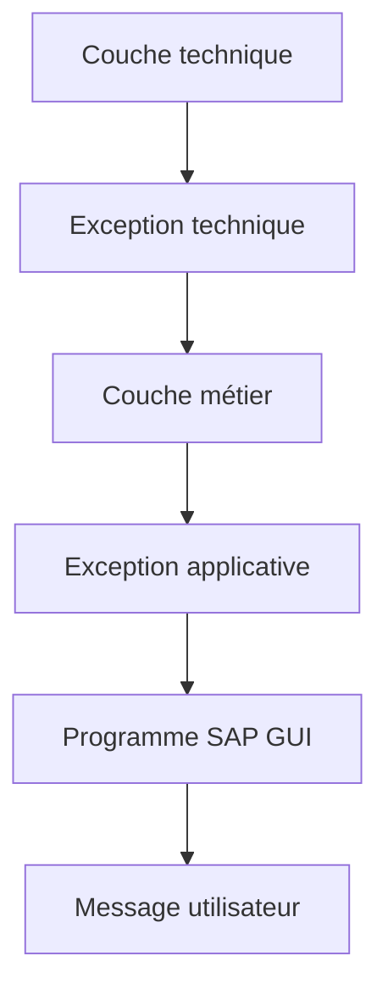

# STRATÉGIE ET BONNES PRATIQUES

## RÉSULTAT ATTENDU

- Construire une stratégie homogène de gestion des erreurs
- Choisir le mécanisme selon la couche
- Préserver les causes techniques
- Produire des messages exploitables
- Vérifier le traitement avant livraison

## STRATÉGIE PAR COUCHE

| Couche                     | Mécanisme principal                           |
| -------------------------- | --------------------------------------------- |
| Écran ou report SAP GUI    | `MESSAGE`, conversion finale d’exceptions     |
| Logique métier             | Exceptions de classes applicatives            |
| Accès technique            | Exceptions techniques converties ou propagées |
| Instruction classique      | Contrôle immédiat de `sy-subrc`               |
| Invariant de programmation | `ASSERT` ou exception technique               |
| Traitement de masse        | Collecte structurée et journalisation         |

## RÈGLES DE CONCEPTION

- détecter l’erreur au plus près de sa cause ;
- ne traiter localement que ce qui peut réellement être corrigé ;
- propager une exception structurée lorsqu’une décision appartient à l’appelant ;
- conserver la cause précédente ;
- ne jamais analyser un texte traduit pour décider du traitement ;
- tester `sy-subrc` immédiatement ;
- éviter les blocs `CATCH` vides ;
- éviter `CATCH cx_root` sans stratégie de traçabilité ;
- ne pas utiliser `MESSAGE X` pour une erreur fonctionnelle ;
- ne pas utiliser `ASSERT` pour une saisie utilisateur invalide.

## MESSAGE UTILISATEUR

Un bon message indique :

- ce qui a échoué ;
- l’objet concerné ;
- la donnée à corriger ;
- l’action possible.

Éviter d’exposer :

- noms de tables internes sans nécessité ;
- classes techniques incompréhensibles ;
- dumps complets ;
- données sensibles ;
- textes génériques sans cause.

## TRAITEMENT PARTIEL

Un traitement de masse ne doit pas nécessairement s’arrêter au premier rejet. Définir explicitement si l’unité de traitement est :

- tout le lot ;
- un document ;
- une ligne ;
- un objet métier.

Collecter les erreurs avec leur contexte, puis produire un résultat global clair.

La journalisation applicative détaillée sera traitée dans son dossier dédié.

## FRONTIÈRE TRANSACTIONNELLE

Une exception n’effectue pas automatiquement un `ROLLBACK WORK`. Un message n’effectue pas automatiquement un `COMMIT WORK`.

La stratégie d’erreur doit être cohérente avec la SAP LUW :

- qui valide ;
- qui annule ;
- quelles opérations sont déjà persistées ;
- quelles mises à jour sont encore en attente.

## CHECKLIST

- [ ] Chaque code retour est-il contrôlé immédiatement ?
- [ ] Les valeurs de `sy-subrc` sont-elles interprétées selon la documentation de l’instruction ?
- [ ] Les messages utilisateur proviennent-ils d’une classe traduisible ?
- [ ] Le type de message correspond-il au comportement souhaité ?
- [ ] Les méthodes métier évitent-elles une dépendance directe à SAP GUI ?
- [ ] Les exceptions importantes possèdent-elles une classe précise ?
- [ ] Les exceptions propagées sont-elles déclarées lorsque leur catégorie l’exige ?
- [ ] Les causes techniques sont-elles conservées avec `PREVIOUS` ?
- [ ] Les blocs `TRY` sont-ils limités au code réellement protégé ?
- [ ] Aucun `CATCH` ne masque-t-il silencieusement une erreur ?
- [ ] Les assertions vérifient-elles uniquement des invariants ?
- [ ] Le comportement en arrière-plan a-t-il été vérifié ?
- [ ] Les erreurs d’un traitement partiel sont-elles restituées avec leur contexte ?
- [ ] Les contrôles syntaxiques et étendus ont-ils été exécutés ?

## CONTRÔLES AVANT LIVRAISON

Exécuter au minimum :

- vérification syntaxique ;
- contrôle étendu du programme ;
- tests des chemins d’erreur ;
- tests sans autorisation ou donnée attendue ;
- tests de volume ;
- tests en arrière-plan si le programme est concerné ;
- analyse d’un éventuel dump dans `ST22`.

## PROCESS

### Étape 1 — Cartographier les frontières

Identifier interface utilisateur, service métier, accès technique et appel distant. Pour chaque frontière, définir quelles erreurs peuvent être corrigées localement et lesquelles doivent remonter.

### Étape 2 — Choisir le mécanisme par couche

Utiliser une exception pour transporter une erreur entre unités de code, un message pour informer l’utilisateur au bord de l’application et un journal pour conserver le diagnostic d’un traitement différé. Ne pas afficher un `MESSAGE` profond dans un service réutilisable.

### Étape 3 — Définir les informations conservées

Conserver classe d’erreur, contexte fonctionnel minimal, clé de corrélation et cause précédente. Exclure mots de passe, jetons et données personnelles non nécessaires.

### Étape 4 — Définir la responsabilité transactionnelle

Nommer la couche qui décide `COMMIT WORK` ou `ROLLBACK WORK`. Les couches inférieures signalent l’échec mais ne valident pas une LUW qu’elles ne possèdent pas.

### Étape 5 — Tester la matrice d’erreurs

Pour chaque erreur recensée, exécuter un test et vérifier mécanisme, texte utilisateur, journal, cause technique et état des données. La stratégie est validée lorsque chaque cas possède un propriétaire et qu’aucune erreur ne disparaît entre les couches.

## VÉRIFICATION

- Le lecteur peut expliquer la différence entre cette notion et les concepts proches.
- Le choix technique est justifié par un besoin concret, pas uniquement par habitude.
- Les limites liées à la release, aux autorisations et au contexte d’exécution sont identifiées.

## ERREURS FRÉQUENTES

- Afficher un message technique incompréhensible à l’utilisateur.
- Attraper une exception sans action ni propagation.

## TERMES DU LEXIQUE

- [Exception](<../🧩 00 ├── LEXIQUE SAP ET ABAP/04 ├── LANGAGE ET DEVELOPPEMENT ABAP.md#exception>)
- [Dump ABAP](<../🧩 00 ├── LEXIQUE SAP ET ABAP/08 ├── EXECUTION EXPLOITATION ET ADMINISTRATION.md#dump-abap>)

## RÉFÉRENCES OFFICIELLES SAP

- [Handling and Propagating Exceptions — ABAP Programming Guideline](https://help.sap.com/doc/abapdocu_latest_index_htm/latest/en-US/ABENHANDL_PROP_EXCEPT_GUIDL.html)
- [Return Code — ABAP Programming Guideline](https://help.sap.com/doc/abapdocu_latest_index_htm/latest/en-US/ABENRETURN_CODE_GUIDL.html)
- [Extended Program Check — ABAP Programming Guideline](https://help.sap.com/doc/abapdocu_latest_index_htm/latest/en-US/ABENEXTENDED_PROGRAM_CHECK_GUIDL.html)
- [MESSAGE — ABAP Keyword Documentation](https://help.sap.com/doc/abapdocu_latest_index_htm/latest/en-US/ABAPMESSAGE_SHORTREF.html)
