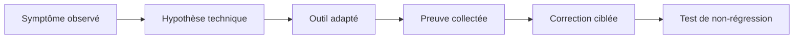

# PRINCIPES DE DEBUG ET D’ANALYSE

## RÉSULTAT ATTENDU

- Distinguer observation, débogage, trace et analyse postérieure
- Choisir l’outil adapté au symptôme
- Reproduire un problème sans modifier son contexte
- Collecter des preuves avant de corriger le code
- Limiter l’impact des outils techniques sur le système

## FINALITÉ

Le débogage ne consiste pas à parcourir le programme au hasard. Il sert à vérifier une hypothèse précise sur :

- le chemin d’exécution ;
- la valeur d’une donnée ;
- le contexte d’appel ;
- le résultat d’une instruction ;
- l’origine d’un arrêt ou d’une lenteur.



## OUTILS PRINCIPAUX

| Besoin                                             | Outil principal  |
| -------------------------------------------------- | ---------------- |
| Suivre le code et les données                      | Débogueur ABAP   |
| Arrêter sur une ligne ou une instruction           | Breakpoint       |
| Arrêter sur la modification d’une donnée           | Watchpoint       |
| Comprendre un arrêt d’exécution                    | `ST22`           |
| Mesurer le temps ABAP                              | `SAT`            |
| Observer les accès SQL et certaines traces système | `ST05`           |
| Corréler une exécution et plusieurs traces         | `ST12`           |
| Comparer des consommations mémoire                 | Memory Inspector |

## OBSERVATION AVANT MODIFICATION

Avant toute correction :

1. relever l’utilisateur, le système et le mandant ;
2. noter l’heure exacte ;
3. identifier la transaction, le programme ou le service ;
4. conserver les paramètres et données d’entrée ;
5. reproduire sur un système adapté ;
6. capturer la première divergence entre résultat attendu et résultat réel.

Modifier une variable dans le débogueur peut aider à tester une hypothèse, mais ne prouve pas que le programme fonctionne normalement.

## REPRODUCTIBILITÉ

Une anomalie exploitable doit décrire :

- les préconditions ;
- les données utilisées ;
- les actions réalisées ;
- le résultat attendu ;
- le résultat constaté ;
- la fréquence ;
- le contexte technique.

Un problème intermittent nécessite souvent une trace ou un point d’arrêt conditionnel plutôt qu’un pas-à-pas complet.

## IMPACT SUR LE SYSTÈME

Le débogage et les traces peuvent :

- ralentir l’exécution ;
- conserver des données techniques sensibles ;
- immobiliser un processus de travail ;
- perturber une transaction utilisateur ;
- produire un volume important de trace.

Activer l’outil le plus tard possible, limiter son périmètre, puis le désactiver immédiatement après la reproduction.

## RÈGLE DE DIAGNOSTIC

Toujours répondre séparément à quatre questions :

1. **Où** le comportement diverge-t-il ?
2. **Quelle donnée** provoque cette divergence ?
3. **Pourquoi** cette donnée ou ce chemin est-il obtenu ?
4. **Quelle correction minimale** rétablit la règle attendue ?

## PROCESS

### Étape 1 — Définir le symptôme

Relever système, mandant, utilisateur, transaction, données d’entrée et résultat attendu. Distinguer résultat faux, message, blocage, lenteur et dump afin de choisir l’outil adapté.

### Étape 2 — Réduire le scénario

Reproduire avec le plus petit jeu de données qui conserve le défaut. Noter l’horodatage et vérifier le symptôme une fois sans débogueur.

### Étape 3 — Placer le premier arrêt utile

Positionner le breakpoint avant la première décision pouvant expliquer l’écart. Confirmer que la ligne appartient au chemin réellement exécuté par l’utilisateur concerné.

### Étape 4 — Chercher la première divergence

Comparer à chaque décision les entrées, valeurs calculées, branche choisie et sortie. La première différence entre attendu et réel localise la cause ; les suivantes peuvent n’être que des conséquences.

### Étape 5 — Corriger et rejouer

Modifier uniquement la cause prouvée, activer puis rejouer le cas fautif et un cas nominal. Le diagnostic est terminé lorsque les deux résultats sont corrects.

## VÉRIFICATION

- Le scénario reproduit correspond au même utilisateur, mandant, transaction et jeu de données.
- L’horodatage et l’identifiant de l’analyse sont conservés.
- La cause retenue est soutenue par une ligne source, une trace ou une valeur observée.
- Après correction, le même scénario ne reproduit plus le défaut et le résultat métier reste identique.

## ERREURS FRÉQUENTES

- Modifier les données dans le débogueur puis considérer le résultat comme reproductible.
- Laisser une trace active trop longtemps.

## FICHE DE CONTRÔLE À COPIER

```text
Système / SID       :
Mandant             :
Utilisateur         :
Transaction / outil :
Objet technique     :
Jeu de données      :
Résultat attendu    :
Résultat observé    :
Horodatage          :
Ordre de transport  :
```

## TERMES DU LEXIQUE

- [Breakpoint](<../🧩 00 ├── LEXIQUE SAP ET ABAP/08 ├── EXECUTION EXPLOITATION ET ADMINISTRATION.md#breakpoint>)
- [Watchpoint](<../🧩 00 ├── LEXIQUE SAP ET ABAP/08 ├── EXECUTION EXPLOITATION ET ADMINISTRATION.md#watchpoint>)
- [Dump ABAP](<../🧩 00 ├── LEXIQUE SAP ET ABAP/08 ├── EXECUTION EXPLOITATION ET ADMINISTRATION.md#dump-abap>)
- [Trace](<../🧩 00 ├── LEXIQUE SAP ET ABAP/08 ├── EXECUTION EXPLOITATION ET ADMINISTRATION.md#trace>)

## RÉFÉRENCES OFFICIELLES SAP

- [ABAP Test and Analysis Tools — SAP Help Portal](https://help.sap.com/docs/ABAP_PLATFORM_NEW/ba879a6e2ea04d9bb94c7ccd7cdac446/491aa66f87041903e10000000a42189c.html)
- [Standard ABAP Debugger — SAP Help Portal](https://help.sap.com/docs/SAP_NETWEAVER_AS_ABAP_751_IP/ba879a6e2ea04d9bb94c7ccd7cdac446/49250c884d7216b5e10000000a42189d.html)
- [ABAP Dump Analysis — SAP Help Portal](https://help.sap.com/docs/ABAP_PLATFORM_NEW/ba879a6e2ea04d9bb94c7ccd7cdac446/b134ab1cd8e44562b0fee9524c638cca.html)


---

[Chapitre suivant — DÉMARRER LE DÉBOGUEUR DANS SAP GUI](<./02 ├── DEMARRER LE DEBUGGER DANS SAP GUI.md>)
