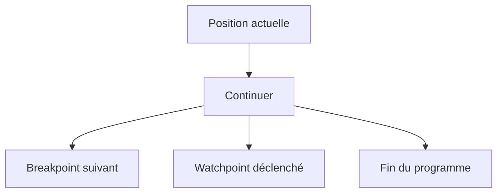

# PILOTER L’EXÉCUTION DU PROGRAMME

## RÉSULTAT ATTENDU

- Distinguer pas simple, exécution, retour et continuation
- Entrer dans une procédure uniquement lorsque nécessaire
- Revenir au programme appelant
- Continuer jusqu’à un breakpoint ou une ligne ciblée

## COMMANDES PRINCIPALES

| Commande                   | Effet                                                   |
| -------------------------- | ------------------------------------------------------- |
| Pas simple                 | Exécute ligne par ligne et entre dans les procédures    |
| Exécuter                   | Exécute la ligne sans détailler les procédures appelées |
| Retour                     | Exécute jusqu’au retour à l’appelant                    |
| Continuer                  | Exécute jusqu’au prochain breakpoint ou à la fin        |
| Continuer jusqu’au curseur | Exécute jusqu’à la ligne ciblée                         |

Les touches de fonction dépendent de la configuration SAP GUI, mais les associations courantes sont `F5`, `F6`, `F7` et `F8`. Se fier au libellé affiché dans le débogueur.

## PAS SIMPLE

Utiliser le pas simple lorsque le contenu de la procédure appelée est potentiellement responsable de l’erreur.

```abap
lo_service->calculate( ).
```

Le pas simple peut entrer dans la méthode `calculate`.

## EXÉCUTER SANS ENTRER

Utiliser **Exécuter** lorsque l’appel est considéré comme fiable ou hors périmètre. Le programme s’arrête à l’instruction suivante du contexte courant.

Cette commande n’empêche pas l’arrêt sur un breakpoint actif dans la procédure appelée.

## RETOUR

**Retour** poursuit l’exécution jusqu’à la fin de la procédure courante et replace l’analyse dans l’appelant.

Elle est utile après être entré trop profondément dans :

- une méthode standard ;
- un module fonction ;
- une routine de conversion ;
- une infrastructure technique.

## CONTINUER

**Continuer** est préférable au pas-à-pas lorsqu’un breakpoint ou watchpoint plus sélectif est déjà préparé.



## NAVIGATION ET EXÉCUTION

Naviguer dans le code ne modifie pas l’instruction courante. La ligne affichée et la prochaine ligne exécutée peuvent être différentes.

Toujours repérer l’indicateur de l’instruction courante avant de reprendre le programme.

## PROCESS

### Étape 1 — Arrêter avant un appel

Placer un breakpoint sur une méthode, un module fonction ou un `PERFORM`. Relever les paramètres et la pile avant l’appel.

### Étape 2 — Comparer F5 et F6

Utiliser `F5` pour entrer et identifier la première instruction. Refaire le scénario avec `F6` : l’exécution doit reprendre après l’appel, avec les sorties déjà calculées.

### Étape 3 — Utiliser F7

Entrer dans l’appel, examiner le contexte puis utiliser `F7`. À l’appelant, comparer immédiatement paramètres de sortie et données modifiées.

### Étape 4 — Continuer avec F8

Placer un second breakpoint à une étape ultérieure puis utiliser `F8`. Si aucun arrêt ne survient, vérifier que ce point appartient à la branche exécutée.

La procédure est validée lorsque chaque commande produit l’effet attendu sur la pile et permet de comparer l’état avant/après l’appel.

## VÉRIFICATION

- Le scénario reproduit correspond au même utilisateur, mandant, transaction et jeu de données.
- L’horodatage et l’identifiant de l’analyse sont conservés.
- La cause retenue est soutenue par une ligne source, une trace ou une valeur observée.
- Après correction, le même scénario ne reproduit plus le défaut et le résultat métier reste identique.

## ERREURS FRÉQUENTES

- Copier un exemple sans adapter les types, noms d’objets et données disponibles dans le système.
- Tester uniquement le cas nominal et ignorer les valeurs initiales, absentes ou invalides.
- Modifier les données dans le débogueur puis considérer le résultat comme reproductible.
- Laisser une trace active trop longtemps.

## SNIPPET À RÉUTILISER

> [!NOTE]
> Adapter les noms `Z*`, les types DDIC, les données et les autorisations au système cible. Effectuer un contrôle syntaxique avant activation.

```abap
lo_service->calculate( ).
```

## TERMES DU LEXIQUE

- [Breakpoint](<../🧩 00 ├── LEXIQUE SAP ET ABAP/08 ├── EXECUTION EXPLOITATION ET ADMINISTRATION.md#breakpoint>)
- [Watchpoint](<../🧩 00 ├── LEXIQUE SAP ET ABAP/08 ├── EXECUTION EXPLOITATION ET ADMINISTRATION.md#watchpoint>)
- [Dump ABAP](<../🧩 00 ├── LEXIQUE SAP ET ABAP/08 ├── EXECUTION EXPLOITATION ET ADMINISTRATION.md#dump-abap>)
- [Trace](<../🧩 00 ├── LEXIQUE SAP ET ABAP/08 ├── EXECUTION EXPLOITATION ET ADMINISTRATION.md#trace>)

## RÉFÉRENCES OFFICIELLES SAP

- [Source Code Execution and Navigation — SAP Help Portal](https://help.sap.com/docs/ABAP_PLATFORM_NEW/ba879a6e2ea04d9bb94c7ccd7cdac446/679664bc4ac74d2d82a05f458396797c.html)
- [Standard ABAP Debugger — SAP Help Portal](https://help.sap.com/docs/SAP_NETWEAVER_AS_ABAP_751_IP/ba879a6e2ea04d9bb94c7ccd7cdac446/49250c884d7216b5e10000000a42189d.html)

---

[Chapitre suivant — ANALYSER VARIABLES, STRUCTURES, RÉFÉRENCES ET OBJETS](<./07 ├── ANALYSER VARIABLES STRUCTURES REFERENCES ET OBJETS.md>)
