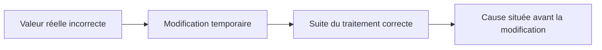

# MODIFIER LES DONNÉES ET LE FLUX D’EXÉCUTION

## RÉSULTAT ATTENDU

- Modifier temporairement une variable dans le débogueur
- Tester une branche alternative
- Comprendre les risques d’un saut d’instruction
- Distinguer diagnostic et correction
- Préserver la cohérence transactionnelle

## MODIFIER UNE VALEUR

Le débogueur peut autoriser la modification de certaines variables :

- variables élémentaires ;
- composants de structures ;
- lignes de tables internes ;
- attributs accessibles ;
- paramètres selon leur mode de passage.

Exemple de diagnostic : remplacer temporairement un statut pour vérifier si la suite du traitement fonctionne.

## TESTER UNE HYPOTHÈSE



Cette conclusion reste une hypothèse à confirmer dans le code qui produit la valeur réelle.

## SAUTER VERS UNE INSTRUCTION

Le débogueur peut proposer une fonction de déplacement de l’instruction courante. Elle peut :

- sauter un bloc ;
- rejouer une instruction ;
- forcer une branche ;
- contourner temporairement un arrêt.

Cette fonction modifie le flux réel. Elle peut rendre incohérents :

- variables ;
- verrous ;
- ressources ;
- mises à jour ;
- état d’un objet ;
- pile d’appels.

## INTERDICTIONS PRATIQUES

Ne pas utiliser un saut pour :

- contourner un contrôle d’autorisation ;
- valider une transaction productive ;
- ignorer une étape de mise à jour ;
- simuler une correction définitive ;
- modifier une donnée métier réelle sans procédure autorisée.

## EFFETS TRANSACTIONNELS

Le débogueur ne neutralise pas les opérations de base de données. Une exécution poursuivie peut atteindre :

- `COMMIT WORK` ;
- appel de mise à jour ;
- création de verrou ;
- envoi de message ou document ;
- interface externe.

Réaliser les manipulations sur un système et des données de test appropriés.

## PREUVE À CONSERVER

Pour toute modification temporaire, noter :

- variable ;
- ancienne valeur ;
- nouvelle valeur ;
- ligne ;
- résultat observé ;
- hypothèse validée ou rejetée.

## PROCESS

### Étape 1 — Conserver l’état initial

Avant toute modification dans le débogueur, relever variable, valeur, pile d’appels et données d’entrée. Exécuter uniquement dans un système non productif avec un scénario dont les effets sont réversibles.

### Étape 2 — Formuler l’hypothèse

Définir la valeur temporaire et le comportement qu’elle doit provoquer. Une modification sans hypothèse produit un résultat impossible à interpréter.

### Étape 3 — Modifier une seule donnée

Changer la variable puis poursuivre jusqu’à la décision concernée. Vérifier que la branche attendue est prise. Ne modifier pas simultanément le code courant, plusieurs paramètres et `SY-SUBRC`.

### Étape 4 — Contrôler les effets

Avant tout commit ou appel externe, examiner données modifiées, messages et pile. Interrompre ou exécuter un rollback si l’hypothèse entraîne un effet non prévu.

### Étape 5 — Reproduire sans modification manuelle

La modification du débogueur prouve une hypothèse, pas une correction. Adapter le code ou les données sources, activer puis rejouer sans intervention. Le diagnostic est validé uniquement si le résultat est reproductible normalement.

## VÉRIFICATION

- Le scénario reproduit correspond au même utilisateur, mandant, transaction et jeu de données.
- L’horodatage et l’identifiant de l’analyse sont conservés.
- La cause retenue est soutenue par une ligne source, une trace ou une valeur observée.
- Après correction, le même scénario ne reproduit plus le défaut et le résultat métier reste identique.

## ERREURS FRÉQUENTES

- Modifier les données dans le débogueur puis considérer le résultat comme reproductible.
- Laisser une trace active trop longtemps.

## FICHE DE CONTRÔLE À COPIER

```text
Système / SID       :
Mandant             :
Utilisateur         :
Transaction / outil :
Objet technique     :
Jeu de données      :
Résultat attendu    :
Résultat observé    :
Horodatage          :
Ordre de transport  :
```

## TERMES DU LEXIQUE

- [Breakpoint](<../🧩 00 ├── LEXIQUE SAP ET ABAP/08 ├── EXECUTION EXPLOITATION ET ADMINISTRATION.md#breakpoint>)
- [Watchpoint](<../🧩 00 ├── LEXIQUE SAP ET ABAP/08 ├── EXECUTION EXPLOITATION ET ADMINISTRATION.md#watchpoint>)
- [Dump ABAP](<../🧩 00 ├── LEXIQUE SAP ET ABAP/08 ├── EXECUTION EXPLOITATION ET ADMINISTRATION.md#dump-abap>)
- [Trace](<../🧩 00 ├── LEXIQUE SAP ET ABAP/08 ├── EXECUTION EXPLOITATION ET ADMINISTRATION.md#trace>)

## RÉFÉRENCES OFFICIELLES SAP

- [Source Code Execution and Navigation — SAP Help Portal](https://help.sap.com/docs/ABAP_PLATFORM_NEW/ba879a6e2ea04d9bb94c7ccd7cdac446/679664bc4ac74d2d82a05f458396797c.html)
- [The Table Tool — SAP Help Portal](https://help.sap.com/docs/ABAP_PLATFORM_NEW/ba879a6e2ea04d9bb94c7ccd7cdac446/492db60934e414d0e10000000a42189b.html)
- [Standard ABAP Debugger — SAP Help Portal](https://help.sap.com/docs/SAP_NETWEAVER_AS_ABAP_751_IP/ba879a6e2ea04d9bb94c7ccd7cdac446/49250c884d7216b5e10000000a42189d.html)

---

[Chapitre suivant — DEBUG SYSTÈME ET TRAITEMENTS SPÉCIAUX](<./11 ├── DEBUG SYSTEME ET TRAITEMENTS SPECIAUX.md>)
