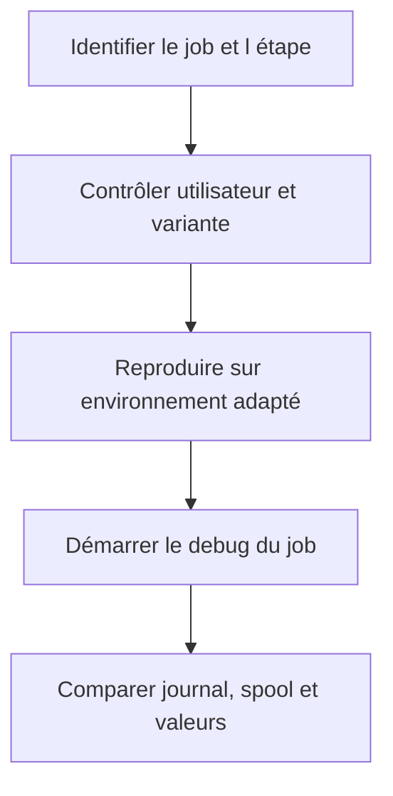

# 12. DEBUG DES JOBS ET TRAITEMENTS EN ARRIÈRE-PLAN

## 12.A RÉSULTAT ATTENDU

- Comprendre les différences entre dialogue et arrière-plan
- Déboguer un job sélectionné dans `SM37`
- Contrôler variante, utilisateur et étape du job
- Identifier les limites de la simulation dialoguée
- Éviter de perturber un job productif

## 12.B CONTEXTE D UN JOB

Un job de fond possède notamment :

- un utilisateur d’exécution ;
- une ou plusieurs étapes ;
- un programme ou une commande ;
- une variante ;
- une condition de démarrage ;
- un journal et éventuellement un spool.

Avant de déboguer, vérifier que le problème ne provient pas simplement de la variante ou de l’utilisateur du job.

## 12.C DÉBOGAGE AVEC SM37

SAP documente une procédure de débogage d’un job sélectionné dans `SM37` à l’aide de la commande `JDBG`. Le job et ses étapes sont alors exécutés dans un processus dialogué afin de permettre l’utilisation des outils habituels du débogueur.

Cette opération doit être réalisée sur un job approprié et avec les autorisations nécessaires.

## 12.D LIMITES DE LA SIMULATION

La simulation conserve certaines caractéristiques d’un traitement de fond, notamment `sy-batch = 'X'`, mais elle ne reproduit pas parfaitement tous les comportements d’un véritable processus de fond.

Différences possibles :

- zones mémoire ;
- absence d’accès réel à SAP GUI ;
- environnement de spool ;
- temporisation ;
- parallélisme ;
- appels externes ;
- ressources disponibles.

## 12.E MÉTHODE



## 12.F POINTS À CONTRÔLER

- `sy-batch` ;
- `sy-uname` ;
- `sy-repid` ;
- variante réellement chargée ;
- paramètres de sélection ;
- droits de l’utilisateur du job ;
- fichiers et chemins serveur ;
- dépendances à une interface graphique ;
- `COMMIT WORK` et mises à jour ;
- temporisation ou volume de données.

## 12.G ALTERNATIVE AU DEBUG

Pour un job long ou difficile à reproduire, préférer parfois :

- journal applicatif ;
- spool ;
- dump `ST22` ;
- analyse `SAT` ou `ST12` ;
- traces d’interface ;
- instrumentation temporaire contrôlée.

## 12.H PROCESS

### 12.H.1 Étape 1 — Identifier l’instance exacte

Ouvrir `SM37`, renseigner nom, utilisateur, statut et intervalle précis. Comparer heure de début et numéro de job avec le symptôme ; deux exécutions du même nom ne sont pas interchangeables.

### 12.H.2 Étape 2 — Lire le contexte avant de relancer

Ouvrir étapes, programme, variante, utilisateur d’exécution, serveur, journal et spool. Relever le premier message en erreur et les traitements déjà terminés.

### 12.H.3 Étape 3 — Déterminer le point de debug

Si le job peut être reproduit sans effet dangereux, utiliser le mécanisme de debug de job disponible depuis `SM37` ou exécuter le programme avec la même variante et le même utilisateur dans un environnement de test.

### 12.H.4 Étape 4 — Comparer dialogue et arrière-plan

Contrôler autorisations, paramètres utilisateur, accès frontend interdit, fichiers serveur, formats de date/nombre et commit. Un succès en dialogue ne prouve pas le succès avec l’utilisateur du job.

### 12.H.5 Étape 5 — Valider sans doublon

Corriger puis créer une nouvelle exécution contrôlée. Vérifier journal, spool et documents déjà créés avant toute reprise. Le diagnostic est terminé lorsque le job finit dans le statut attendu sans répéter un effet métier.

## 12.I VÉRIFICATION

- Le scénario reproduit correspond au même utilisateur, mandant, transaction et jeu de données.
- L’horodatage et l’identifiant de l’analyse sont conservés.
- La cause retenue est soutenue par une ligne source, une trace ou une valeur observée.
- Après correction, le même scénario ne reproduit plus le défaut et le résultat métier reste identique.

## 12.J ERREURS FRÉQUENTES

- Modifier les données dans le débogueur puis considérer le résultat comme reproductible.
- Laisser une trace active trop longtemps.

## 12.K FICHE DE CONTRÔLE À COPIER

```text
Système / SID       :
Mandant             :
Utilisateur         :
Transaction / outil :
Objet technique     :
Jeu de données      :
Résultat attendu    :
Résultat observé    :
Horodatage          :
Ordre de transport  :
```

## 12.L TERMES DU LEXIQUE

- [Breakpoint](<../🧩 00 ├── LEXIQUE SAP ET ABAP/08 ├── EXECUTION EXPLOITATION ET ADMINISTRATION.md#breakpoint>)
- [Watchpoint](<../🧩 00 ├── LEXIQUE SAP ET ABAP/08 ├── EXECUTION EXPLOITATION ET ADMINISTRATION.md#watchpoint>)
- [Dump ABAP](<../🧩 00 ├── LEXIQUE SAP ET ABAP/08 ├── EXECUTION EXPLOITATION ET ADMINISTRATION.md#dump-abap>)
- [Trace](<../🧩 00 ├── LEXIQUE SAP ET ABAP/08 ├── EXECUTION EXPLOITATION ET ADMINISTRATION.md#trace>)

## 12.M RÉFÉRENCES OFFICIELLES SAP

- [Starting and Directly Debugging ABAP Programs — SAP Help Portal](https://help.sap.com/docs/ABAP_PLATFORM_NEW/ba879a6e2ea04d9bb94c7ccd7cdac446/a95208086a6e448aa35f08357d958af5.html)
- [Batch Debugging — SAP Help Portal](https://help.sap.com/docs/ABAP_PLATFORM_NEW/ba879a6e2ea04d9bb94c7ccd7cdac446/bf1a5464da734b559d94199e80926005.html)

---

[Chapitre suivant — ANALYSER LES DUMPS AVEC ST22](<./13 ├── ANALYSER LES DUMPS AVEC ST22.md>)
