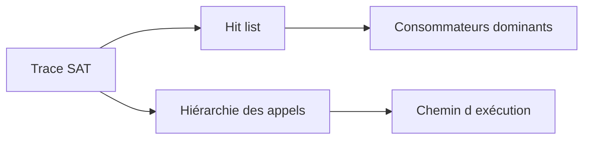

# ANALYSER LE TEMPS D’EXÉCUTION AVEC SAT

## RÉSULTAT ATTENDU

- Mesurer l’exécution d’un programme ABAP
- Distinguer temps ABAP, base de données et système
- Identifier les appels dominants
- Limiter la trace au scénario utile
- Utiliser le résultat pour formuler une hypothèse

## RÔLE DE SAT

La transaction `SAT` réalise une analyse d’exécution ABAP. Elle mesure les appels et temps consommés pendant un scénario enregistré.

Elle convient pour analyser :

- rapport ;
- transaction ;
- module fonction ;
- méthode ;
- unité de traitement reproductible.

## PRÉPARATION

Définir avant l’enregistrement :

- utilisateur ;
- programme ou transaction ;
- scénario exact ;
- variante ou données ;
- durée attendue ;
- filtre ou agrégation souhaitée.

Une trace trop large produit un résultat difficile à exploiter.

## LECTURE DU RÉSULTAT

Analyser notamment :

- temps total ;
- temps propre ;
- temps cumulé ;
- nombre d’appels ;
- hiérarchie des appels ;
- appels SQL ;
- instructions ou procédures dominantes.



## TEMPS PROPRE ET CUMULÉ

- **Temps propre** : temps consommé directement dans l’unité mesurée.
- **Temps cumulé** : temps de l’unité et des traitements qu’elle appelle.

Une méthode peut avoir un temps propre faible mais un temps cumulé élevé parce qu’elle appelle une lecture SQL coûteuse.

## INTERPRÉTATION

Ne pas corriger uniquement la ligne la plus lente sans contexte. Vérifier :

- fréquence d’appel ;
- volume traité ;
- nécessité fonctionnelle ;
- répétition d’un accès ;
- algorithme ;
- possibilité de regrouper le traitement.

## LIMITES

`SAT` mesure une exécution donnée. Un résultat peut varier selon :

- caches ;
- buffer ;
- charge système ;
- données ;
- utilisateur ;
- parallélisme ;
- première exécution ou exécutions suivantes.

Comparer des scénarios similaires et répéter si nécessaire.

## PROCESS

### Étape 1 — Définir une mesure reproductible

Fixer programme ou transaction, utilisateur, sélection, volume et résultat attendu. Exécuter une fois pour confirmer que le scénario est stable.

### Étape 2 — Configurer SAT

Ouvrir `SAT`, créer ou sélectionner une variante et limiter les composants enregistrés à l’analyse nécessaire. Choisir mesure de programme, transaction ou utilisateur selon le point d’entrée réel.

### Étape 3 — Enregistrer une seule exécution

Démarrer la mesure, reproduire uniquement l’action ciblée puis arrêter. Écarter les temps de saisie utilisateur qui ne font pas partie du traitement serveur.

### Étape 4 — Lire du global vers le détail

Examiner temps total, hit list et hiérarchie d’appels. Distinguer temps brut, temps net, nombre d’appels et part base de données. Descendre jusqu’à l’unité consommant réellement le temps.

### Étape 5 — Corriger puis comparer

Modifier une cause, réexécuter avec la même variante et les mêmes données, puis comparer temps et nombre d’appels. La correction est validée si le coût diminue sans modifier le résultat fonctionnel.

## VÉRIFICATION

- Le scénario reproduit correspond au même utilisateur, mandant, transaction et jeu de données.
- L’horodatage et l’identifiant de l’analyse sont conservés.
- La cause retenue est soutenue par une ligne source, une trace ou une valeur observée.
- Après correction, le même scénario ne reproduit plus le défaut et le résultat métier reste identique.

## ERREURS FRÉQUENTES

- Modifier les données dans le débogueur puis considérer le résultat comme reproductible.
- Laisser une trace active trop longtemps.

## FICHE DE CONTRÔLE À COPIER

```text
Système / SID       :
Mandant             :
Utilisateur         :
Transaction / outil :
Objet technique     :
Jeu de données      :
Résultat attendu    :
Résultat observé    :
Horodatage          :
Ordre de transport  :
```

## TERMES DU LEXIQUE

- [Breakpoint](<../🧩 00 ├── LEXIQUE SAP ET ABAP/08 ├── EXECUTION EXPLOITATION ET ADMINISTRATION.md#breakpoint>)
- [Watchpoint](<../🧩 00 ├── LEXIQUE SAP ET ABAP/08 ├── EXECUTION EXPLOITATION ET ADMINISTRATION.md#watchpoint>)
- [Dump ABAP](<../🧩 00 ├── LEXIQUE SAP ET ABAP/08 ├── EXECUTION EXPLOITATION ET ADMINISTRATION.md#dump-abap>)
- [Trace](<../🧩 00 ├── LEXIQUE SAP ET ABAP/08 ├── EXECUTION EXPLOITATION ET ADMINISTRATION.md#trace>)

## RÉFÉRENCES OFFICIELLES SAP

- [Analyzing Performance with the ABAP Runtime Analysis — SAP Help Portal](https://help.sap.com/docs/ABAP_PLATFORM_NEW/ba879a6e2ea04d9bb94c7ccd7cdac446/3c74c6163ce4459888bc06dedda37685.html)
- [Runtime Analysis — SAP Help Portal](https://help.sap.com/docs/SAP_NETWEAVER_750/ba879a6e2ea04d9bb94c7ccd7cdac446/4a2f5264cfc4044fe10000000a421937.html)

---

[Chapitre suivant — ANALYSER LES ACCÈS AVEC ST05](<./15 ├── ANALYSER LES ACCES AVEC ST05.md>)
