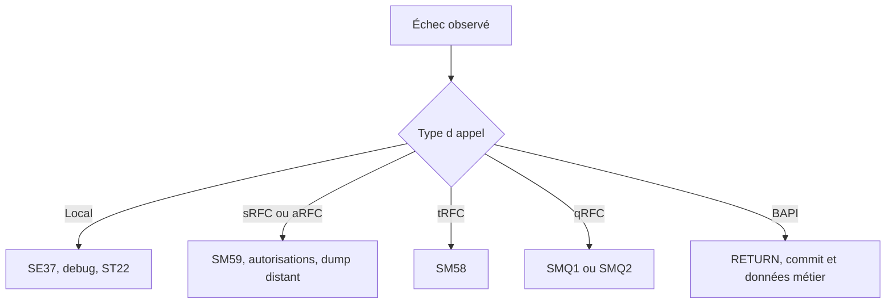

# DIAGNOSTIC ET BONNES PRATIQUES

## RÉSULTAT ATTENDU

- Diagnostiquer un échec local, RFC ou BAPI
- Utiliser les transactions adaptées
- Vérifier le contrat avant de modifier le code
- Appliquer une checklist de conception et d’exploitation

## MÉTHODE DE DIAGNOSTIC



## QUESTIONS PRIORITAIRES

1. Le module appelé est-il le bon ?
2. L’interface active correspond-elle à l’appel ?
3. Les paramètres obligatoires sont-ils fournis ?
4. `sy-subrc` ou `RETURN` ont-ils été analysés immédiatement ?
5. La destination fonctionne-t-elle ?
6. L’utilisateur cible possède-t-il les autorisations ?
7. Un dump existe-t-il dans le système cible ?
8. Une unité tRFC ou qRFC est-elle bloquée ?
9. Le commit attendu a-t-il été exécuté ?
10. Le traitement est-il idempotent avant relance ?

## OUTILS

| Outil           | Usage                                                     |
| --------------- | --------------------------------------------------------- |
| `SE37`          | Interface, test et documentation                          |
| `SE80`          | Groupe de fonctions et dépendances                        |
| `SM59`          | Destinations et tests RFC                                 |
| `SM58`          | tRFC                                                      |
| `SMQ1` / `SMQ2` | qRFC sortant et entrant                                   |
| `SM13`          | Tâches de mise à jour                                     |
| `ST22`          | Dumps locaux ou distants                                  |
| `SU53`          | Dernier échec d’autorisation dans le contexte utilisateur |
| `STAUTHTRACE`   | Analyse d’autorisations selon les droits et procédures    |
| `SLG1`          | Journal applicatif lorsqu’il est utilisé                  |

## CHECKLIST DE CONCEPTION

- Le nom décrit l’action et le périmètre.
- Le groupe de fonctions est cohérent.
- L’interface est minimale et typée.
- Les paramètres facultatifs sont documentés.
- Les erreurs sont structurées.
- Aucun état global caché n’est nécessaire.
- Le module ne déclenche pas de commit imprévu.
- Le module RFC valide toutes les entrées externes.
- Les autorisations métier sont contrôlées.
- Les volumes et temps de réponse sont bornés.
- La compatibilité des consommateurs est prise en compte.

## CHECKLIST D APPEL

- Générer le modèle d’appel depuis l’interface active.
- Contrôler `sy-subrc` immédiatement.
- Intercepter `SYSTEM_FAILURE` et `COMMUNICATION_FAILURE` pour un RFC classique.
- Analyser toute la table `RETURN` d’une BAPI.
- Utiliser commit ou rollback selon le modèle documenté.
- Journaliser la clé métier et l’identifiant de corrélation.
- Ne pas relancer une unité asynchrone sans analyse d’idempotence.

## RÈGLE FINALE

Une fonction visible dans `SE37` n’est pas automatiquement une API stable. Une exécution réussie dans le système de développement ne prouve ni la sécurité, ni la compatibilité, ni la robustesse distribuée du scénario.

## PROCESS

### Étape 1 — Décrire sans interpréter

Noter contexte, données, résultat attendu et résultat observé. Classer le symptôme : erreur fonctionnelle, dump, performance, mémoire, job ou appel distant.

### Étape 2 — Reproduire de façon minimale

Réduire les données et reproduire une fois. Si le défaut disparaît, réintroduire un paramètre à la fois jusqu’à identifier la condition nécessaire.

### Étape 3 — Choisir l’outil

Utiliser débogueur pour le flux, `ST22` pour un dump, `SAT` pour le temps ABAP, `ST05` pour SQL, `ST12` pour une corrélation, `SM37` pour un job et Memory Inspector pour les allocations.

### Étape 4 — Chercher la première divergence

Comparer le chemin attendu au chemin réel. Remonter pile, paramètres et valeurs jusqu’au dernier état correct, puis isoler l’instruction suivante.

### Étape 5 — Corriger une cause

Modifier uniquement la cause prouvée. Contrôler, activer et documenter l’objet réellement responsable.

### Étape 6 — Vérifier et clôturer

Rejouer le cas fautif, un cas nominal et une limite. Retirer traces et breakpoints. Le diagnostic est clos lorsque la preuve avant/après est conservée et qu’aucun effet de bord nouveau n’apparaît.

## VÉRIFICATION

- Le scénario reproduit correspond au même utilisateur, mandant, transaction et jeu de données.
- L’horodatage et l’identifiant de l’analyse sont conservés.
- La cause retenue est soutenue par une ligne source, une trace ou une valeur observée.
- Après correction, le même scénario ne reproduit plus le défaut et le résultat métier reste identique.

## ERREURS FRÉQUENTES

- Modifier les données dans le débogueur puis considérer le résultat comme reproductible.
- Laisser une trace active trop longtemps.

## FICHE DE CONTRÔLE À COPIER

```text
Système / SID       :
Mandant             :
Utilisateur         :
Transaction / outil :
Objet technique     :
Jeu de données      :
Résultat attendu    :
Résultat observé    :
Horodatage          :
Ordre de transport  :
```

## TERMES DU LEXIQUE

- [Breakpoint](<../🧩 00 ├── LEXIQUE SAP ET ABAP/08 ├── EXECUTION EXPLOITATION ET ADMINISTRATION.md#breakpoint>)
- [Watchpoint](<../🧩 00 ├── LEXIQUE SAP ET ABAP/08 ├── EXECUTION EXPLOITATION ET ADMINISTRATION.md#watchpoint>)
- [Dump ABAP](<../🧩 00 ├── LEXIQUE SAP ET ABAP/08 ├── EXECUTION EXPLOITATION ET ADMINISTRATION.md#dump-abap>)
- [Trace](<../🧩 00 ├── LEXIQUE SAP ET ABAP/08 ├── EXECUTION EXPLOITATION ET ADMINISTRATION.md#trace>)

## RÉFÉRENCES OFFICIELLES SAP

- [Looking Up Function Modules — SAP Help Portal](https://help.sap.com/docs/ABAP_PLATFORM_NEW/bd833c8355f34e96a6e83096b38bf192/d1801ec1454211d189710000e8322d00.html)
- [Calling RFC Function Modules in ABAP — SAP Help Portal](https://help.sap.com/docs/ABAP_PLATFORM_NEW/753088fc00704d0a80e7fbd6803c8adb/48a0f18641bc062de10000000a42189d.html)
- [Monitoring the Transactional RFC — SAP Help Portal](https://help.sap.com/docs/SAP_S4HANA_ON-PREMISE/8999cee59b7c44fdb53fbbb4d703f8e6/df6ad0531d8b4208e10000000a174cb4.html)
