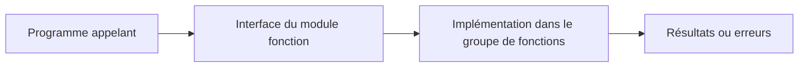

# 1. PRINCIPES DES MODULES FONCTION

## 1.A RÉSULTAT ATTENDU

- Situer le module fonction parmi les unités de modularisation ABAP
- Comprendre son rôle d’interface globale réutilisable
- Distinguer module fonction local, RFC et BAPI
- Identifier les cas où une classe constitue un meilleur choix

## 1.B DÉFINITION

Un **module fonction** est une procédure globale gérée dans le Function Builder. Il appartient obligatoirement à un **groupe de fonctions** et peut être appelé depuis tout programme ABAP autorisé.

Contrairement à un sous-programme `FORM`, son interface est enregistrée dans le Repository ABAP et peut être analysée indépendamment du programme appelant.

## 1.C CARACTÉRISTIQUES

Un module fonction possède :

- un nom global dans le système ABAP ;
- une interface typée ;
- une documentation ;
- une implémentation ABAP ;
- un groupe de fonctions propriétaire ;
- éventuellement des exceptions ;
- un type de traitement : normal, distant ou mise à jour.

## 1.D FAMILLES DE MODULES

| Famille                        | Utilisation                                                         |
| ------------------------------ | ------------------------------------------------------------------- |
| Module fonction normal         | Réutilisation interne au système ABAP                               |
| Module fonction distant        | Appel par RFC depuis un autre système ou processus                  |
| Module fonction de mise à jour | Exécution différée dans la tâche de mise à jour                     |
| BAPI                           | Interface métier stable, généralement implémentée par un module RFC |

## 1.E CHOIX D ARCHITECTURE

Créer un module fonction lorsque :

- une API existante impose cette technologie ;
- le traitement doit être appelé par RFC ;
- un framework SAP attend un module fonction ;
- une BAPI ou une interface classique doit être consommée ;
- un traitement doit être enregistré en tâche de mise à jour.

Pour une nouvelle logique purement interne et orientée objet, préférer généralement une classe et des méthodes. Ne pas créer un module fonction uniquement pour éviter de structurer correctement le code.

## 1.F RÈGLE ESSENTIELLE

Un module fonction constitue une **frontière d’interface**. Le contrat d’entrée, de sortie et d’erreur doit être plus stable que son implémentation.

## 1.G PROCESS

### 1.G.1 Étape 1 — Identifier le service attendu

Définir entrées, sorties, erreurs, effets de bord et responsabilité transactionnelle. Vérifier qu’une classe ou une API publiée n’est pas déjà la cible imposée avant de choisir un module fonction.

### 1.G.2 Étape 2 — Rechercher un module existant

Dans `SE37`, rechercher par nom ou groupe de fonctions, puis lire documentation et statut de publication. Ne réutiliser un module non documenté ou interne que si sa stabilité est explicitement garantie.

### 1.G.3 Étape 3 — Lire le contrat complet

Examiner Import, Export, Changing, Tables et Exceptions. Pour chaque paramètre, relever type DDIC, caractère obligatoire, passage par valeur/référence et valeur par défaut.

### 1.G.4 Étape 4 — Identifier les effets invisibles

Lire le source pour repérer mises à jour, commits, appels distants, autorisations et données globales. Un résultat correct dans `SE37` ne garantit pas l’absence d’effet de bord.

### 1.G.5 Étape 5 — Tester le contrat

Exécuter cas nominal, donnée absente et entrée invalide dans un système de test. Le module est compris lorsque sorties, exceptions et effets transactionnels sont prévisibles pour chaque cas.

## 1.H VÉRIFICATION

- Le lecteur peut expliquer la différence entre cette notion et les concepts proches.
- Le choix technique est justifié par un besoin concret, pas uniquement par habitude.
- Les limites liées à la release, aux autorisations et au contexte d’exécution sont identifiées.

## 1.I ERREURS FRÉQUENTES

- Appeler un module fonction sans lire sa documentation et ses exceptions.
- Supposer qu’une BAPI effectue automatiquement le commit.

## 1.J TERMES DU LEXIQUE

- [Module fonction](<../🧩 00 ├── LEXIQUE SAP ET ABAP/06 ├── PROGRAMMES CLASSES ET OBJETS TECHNIQUES.md#module-fonction>)
- [Function group](<../🧩 00 ├── LEXIQUE SAP ET ABAP/06 ├── PROGRAMMES CLASSES ET OBJETS TECHNIQUES.md#function-group>)
- [RFC](<../🧩 00 ├── LEXIQUE SAP ET ABAP/10 └── ACRONYMES SAP.md#acro-rfc>)
- [BAPI](<../🧩 00 ├── LEXIQUE SAP ET ABAP/10 └── ACRONYMES SAP.md#acro-bapi>)
- [Destination RFC](<../🧩 00 ├── LEXIQUE SAP ET ABAP/07 ├── INTERFACES ET INTEGRATION.md#destination-rfc>)

## 1.K RÉFÉRENCES OFFICIELLES SAP

- [Modularization with Function Modules — SAP Help Portal](https://help.sap.com/docs/SAP_NETWEAVER_AS_ABAP_752/c238d694b825421f940829321ffa326a/4ec1cbf46e391014adc9fffe4e204223.html)
- [Working with ABAP Function Groups and Modules — SAP Help Portal](https://help.sap.com/docs/ABAP_PLATFORM_NEW/c238d694b825421f940829321ffa326a/5b3370ee088a4e2b9579da3f6e994456.html)
- [Describing Remote Function Calls and BAPIs — SAP Learning](https://learning.sap.com/courses/technical-implementation-and-operation-i-of-sap-s-4hana-and-sap-business-suite/describing-remote-function-calls-and-bapis)

---

[Chapitre suivant — GROUPES DE FONCTIONS ET PROGRAMMES GÉNÉRÉS](<./02 ├── GROUPES DE FONCTIONS ET PROGRAMMES GENERES.md>)
