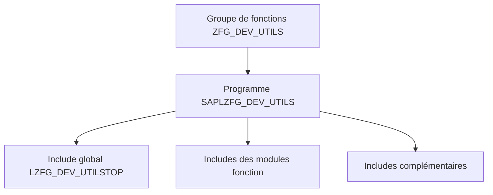

# GROUPES DE FONCTIONS ET PROGRAMMES GÉNÉRÉS

## RÉSULTAT ATTENDU

- Comprendre le rôle d’un groupe de fonctions
- Identifier les programmes et includes générés
- Maîtriser la portée des données globales
- Éviter les dépendances cachées entre modules

## GROUPE DE FONCTIONS

Un groupe de fonctions est le conteneur technique de modules fonction liés. À l’exécution, il correspond à un programme de type **Function Pool**.

## OBJETS GÉNÉRÉS

Pour un groupe fictif `ZFG_DEV_UTILS`, le système génère notamment :

| Objet                            | Rôle                                 |
| -------------------------------- | ------------------------------------ |
| `SAPLZFG_DEV_UTILS`              | Programme principal du Function Pool |
| `LZFG_DEV_UTILSTOP`              | Données et types globaux             |
| `LZFG_DEV_UTILSUXX`              | Include d’inclusion des modules      |
| `LZFG_DEV_UTILSU01`, `U02`, etc. | Code des modules fonction            |

Les noms exacts des includes techniques sont gérés par le Workbench. Ne pas les renommer manuellement.

## CHARGEMENT EN MÉMOIRE

Lorsqu’un module fonction est appelé, le groupe de fonctions est chargé dans la session interne du programme appelant. Les données globales du groupe peuvent alors rester disponibles pour les appels suivants dans cette même session.

Conséquences :

- une variable globale peut conserver un état ;
- deux modules du même groupe peuvent partager des données ;
- une dépendance invisible peut apparaître ;
- le comportement peut différer entre deux sessions.

## DONNÉES GLOBALES

Utiliser les données globales uniquement lorsqu’elles sont réellement communes au groupe. Éviter de les employer comme cache implicite ou comme moyen de transmettre des valeurs entre deux modules.

Préférer :

- des paramètres explicites ;
- des variables locales ;
- une classe dédiée pour un état complexe ;
- un cache documenté et invalidé correctement lorsqu’il est nécessaire.

## COHÉSION

Un groupe de fonctions doit regrouper des fonctions cohérentes. Éviter les groupes génériques de type `ZUTILS` contenant des traitements sans relation métier ou technique.

Exemples de regroupements cohérents :

- gestion d’une interface métier précise ;
- fonctions techniques relatives à un même format ;
- modules générés par un framework ;
- fonctions d’une même API classique.

## PROCESS

### Étape 1 — Ouvrir le groupe depuis un module

Afficher le module dans `SE37`, relever son groupe de fonctions puis naviguer vers celui-ci dans `SE80`. Vérifier le programme généré `SAPL...` et les includes proposés.

### Étape 2 — Cartographier les includes

Identifier l’include TOP, les includes de modules fonction, les écrans éventuels et les includes client. Distinguer code généré et zones prévues pour la maintenance.

### Étape 3 — Relever les données globales

Examiner types, constantes et variables du groupe. Utiliser la liste d’utilisation pour déterminer quels modules lisent ou modifient chaque globale.

### Étape 4 — Vérifier le couplage

Tester deux modules du groupe dans une même séquence puis séparément. Si le résultat dépend d’un état global conservé, documenter ce contrat ou supprimer la dépendance.

### Étape 5 — Contrôler activation et transport

Activer le groupe complet et vérifier ses sous-objets dans l’ordre. La structure est maîtrisée lorsque chaque source modifiable, globale partagée et objet transporté est identifié.

## VÉRIFICATION

- Le lecteur peut expliquer la différence entre cette notion et les concepts proches.
- Le choix technique est justifié par un besoin concret, pas uniquement par habitude.
- Les limites liées à la release, aux autorisations et au contexte d’exécution sont identifiées.

## ERREURS FRÉQUENTES

- Appeler un module fonction sans lire sa documentation et ses exceptions.
- Supposer qu’une BAPI effectue automatiquement le commit.

## TERMES DU LEXIQUE

- [Module fonction](<../🧩 00 ├── LEXIQUE SAP ET ABAP/06 ├── PROGRAMMES CLASSES ET OBJETS TECHNIQUES.md#module-fonction>)
- [Function group](<../🧩 00 ├── LEXIQUE SAP ET ABAP/06 ├── PROGRAMMES CLASSES ET OBJETS TECHNIQUES.md#function-group>)
- [RFC](<../🧩 00 ├── LEXIQUE SAP ET ABAP/10 └── ACRONYMES SAP.md#acro-rfc>)
- [BAPI](<../🧩 00 ├── LEXIQUE SAP ET ABAP/10 └── ACRONYMES SAP.md#acro-bapi>)
- [Destination RFC](<../🧩 00 ├── LEXIQUE SAP ET ABAP/07 ├── INTERFACES ET INTEGRATION.md#destination-rfc>)

## RÉFÉRENCES OFFICIELLES SAP

- [Understanding Function Module Code — SAP Help Portal](https://help.sap.com/docs/ABAP_PLATFORM_NEW/bd833c8355f34e96a6e83096b38bf192/d1801f1c454211d189710000e8322d00.html)
- [Creating New Function Modules — SAP Help Portal](https://help.sap.com/docs/ABAP_PLATFORM_NEW/bd833c8355f34e96a6e83096b38bf192/d1801ee8454211d189710000e8322d00.html)
- [Overview of Function Modules — SAP Help Portal](https://help.sap.com/docs/SAP_NETWEAVER_702/ff59ad5d6c55101492f7f1c64dee0529/d1801ea7454211d189710000e8322d00.html)

---

[Chapitre suivant — RECHERCHER ET ANALYSER AVEC SE37](<./03 ├── RECHERCHER ET ANALYSER AVEC SE37.md>)
