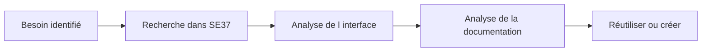

# RECHERCHER ET ANALYSER AVEC SE37

## RÉSULTAT ATTENDU

- Rechercher un module fonction existant avant d’en créer un
- Lire son interface, son code et sa documentation
- Identifier son groupe, son package et son type de traitement
- Analyser ses appels et dépendances

## TRANSACTION SE37

`SE37` ouvre le **Function Builder**. Elle permet de créer, afficher, modifier, tester et documenter un module fonction.

Avant toute création, rechercher une fonction existante.



## RECHERCHE

Dans `SE37` :

1. ouvrir **Utilitaires → Rechercher** ;
2. saisir un nom générique, un groupe de fonctions ou un package ;
3. filtrer éventuellement par type de module ;
4. examiner les résultats ;
5. confirmer la compatibilité fonctionnelle et technique.

Utiliser les jokers uniquement comme support. Une fonction trouvée par son nom n’est pas automatiquement une API autorisée.

## ONGLETS À CONTRÔLER

| Zone          | Vérification                       |
| ------------- | ---------------------------------- |
| Attributs     | Groupe, type de traitement, statut |
| Import        | Données reçues par le module       |
| Export        | Données retournées                 |
| Modification  | Données reçues puis modifiées      |
| Tables        | Paramètres tabulaires classiques   |
| Exceptions    | Erreurs déclarées                  |
| Code source   | Implémentation et dépendances      |
| Documentation | Contrat, contraintes et effets     |

## ANALYSE DES DÉPENDANCES

Utiliser notamment :

- **Liste d’utilisation** pour identifier les appelants ;
- navigation vers les types DDIC ;
- navigation vers le groupe de fonctions ;
- recherche de messages, classes, tables et modules appelés ;
- documentation du module et de ses paramètres.

## ATTENTION AUX MODULES SAP

La présence d’un module standard dans `SE37` ne garantit pas qu’il constitue une API publique. Vérifier :

- sa documentation ;
- son statut de libération lorsqu’il est disponible ;
- l’existence d’une BAPI ou API officielle ;
- les recommandations propres au produit SAP ;
- les dépendances internes et les notes SAP applicables.

Ne pas appeler directement une fonction standard non documentée comme API simplement parce qu’un test `SE37` fonctionne.

## PROCÉDURE PAS À PAS

1. Saisir `/nSE37`.
2. Entrer le nom du module fonction puis choisir **Afficher**, **Modifier** ou **Créer** selon l’autorisation.
3. Analyser les onglets Import, Export, Changing, Tables et Exceptions.
4. Lire la documentation et le code source avant tout appel.
5. Utiliser **Test/Exécuter** avec des données non destructives.
6. Pour un module Z, contrôler, activer puis tester les cas nominal et d’erreur.

## VÉRIFICATION

- Le lecteur peut expliquer la différence entre cette notion et les concepts proches.
- Le choix technique est justifié par un besoin concret, pas uniquement par habitude.
- Les limites liées à la release, aux autorisations et au contexte d’exécution sont identifiées.

## ERREURS FRÉQUENTES

- Appeler un module fonction sans lire sa documentation et ses exceptions.
- Supposer qu’une BAPI effectue automatiquement le commit.

## FICHE DE CONTRÔLE À COPIER

```text
Système / SID       :
Mandant             :
Utilisateur         :
Transaction / outil :
Objet technique     :
Jeu de données      :
Résultat attendu    :
Résultat observé    :
Horodatage          :
Ordre de transport  :
```

## TERMES DU LEXIQUE

- [Module fonction](<../🧩 00 ├── LEXIQUE SAP ET ABAP/06 ├── PROGRAMMES CLASSES ET OBJETS TECHNIQUES.md#module-fonction>)
- [Function group](<../🧩 00 ├── LEXIQUE SAP ET ABAP/06 ├── PROGRAMMES CLASSES ET OBJETS TECHNIQUES.md#function-group>)
- [RFC](<../🧩 00 ├── LEXIQUE SAP ET ABAP/10 └── ACRONYMES SAP.md#acro-rfc>)
- [BAPI](<../🧩 00 ├── LEXIQUE SAP ET ABAP/10 └── ACRONYMES SAP.md#acro-bapi>)
- [Destination RFC](<../🧩 00 ├── LEXIQUE SAP ET ABAP/07 ├── INTERFACES ET INTEGRATION.md#destination-rfc>)

## RÉFÉRENCES OFFICIELLES SAP

- [Looking Up Function Modules — SAP Help Portal](https://help.sap.com/docs/ABAP_PLATFORM_NEW/bd833c8355f34e96a6e83096b38bf192/d1801ec1454211d189710000e8322d00.html)
- [Calling Function Modules From Your Programs — SAP Help Portal](https://help.sap.com/docs/ABAP_PLATFORM_NEW/bd833c8355f34e96a6e83096b38bf192/d1801edb454211d189710000e8322d00.html)


---

[Chapitre suivant — CRÉER UN GROUPE ET UN MODULE FONCTION](<./04 ├── CREER UN GROUPE ET UN MODULE FONCTION.md>)
