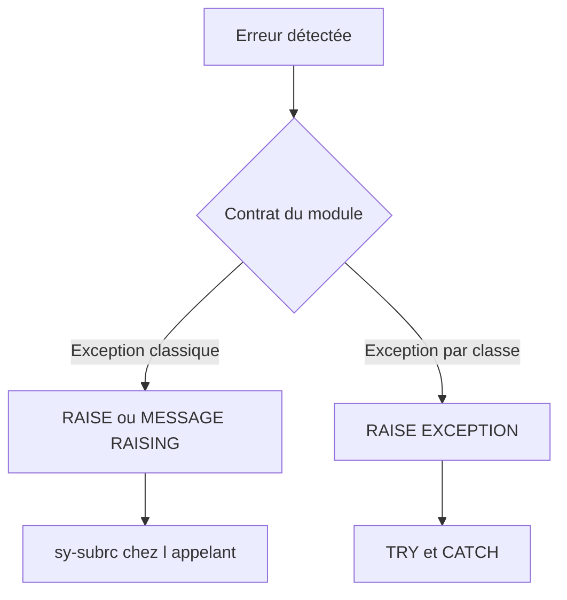

# EXCEPTIONS CLASSIQUES ET MESSAGES

## RÉSULTAT ATTENDU

- Déclarer et lever une exception classique
- Associer les exceptions à `sy-subrc`
- Gérer les messages émis par un module
- Distinguer exceptions classiques et exceptions par classes

## EXCEPTION CLASSIQUE

Une exception classique est déclarée dans l’onglet **Exceptions** du Function Builder.

Exemple :

```text
INVALID_INPUT
NOT_FOUND
```

Dans le module :

```abap
IF iv_matnr IS INITIAL.
  RAISE invalid_input.
ENDIF.
```

Dans l’appel :

```abap
CALL FUNCTION 'Z_DEV_PRODUCT_GET'
  EXPORTING
    iv_matnr      = lv_matnr
  IMPORTING
    es_mara       = ls_mara
  EXCEPTIONS
    invalid_input = 1
    not_found     = 2
    OTHERS        = 3.
```

## MESSAGE RAISING

Un message peut déclencher une exception déclarée :

```abap
MESSAGE e001(zdev_msg) RAISING invalid_input.
```

Le comportement dépend de la gestion mise en place par l’appelant.

## ERROR MESSAGE

L’exception prédéfinie `ERROR_MESSAGE` dans l’appel permet d’intercepter certains messages d’erreur ou d’abandon émis par le module.

```abap
CALL FUNCTION 'Z_DEV_VALIDATE'
  EXCEPTIONS
    invalid_input = 1
    error_message = 2
    OTHERS        = 3.
```

## EXCEPTIONS PAR CLASSES

Le Function Builder peut également déclarer des classes d’exception selon la version et le type d’interface. Elles offrent une information structurée et une propagation plus riche.

Ne pas mélanger sans conception claire :

- interface classique avec `EXCEPTIONS` et `sy-subrc` ;
- interface par classes avec `RAISING`, `TRY` et `CATCH`.

Les deux approches ont des règles différentes. Pour un module RFC, vérifier spécifiquement les contraintes de transport des erreurs entre systèmes.



## BONNES PRATIQUES

- Définir une exception par situation utile à l’appelant.
- Éviter `OTHERS` comme seul traitement métier.
- Ne pas convertir toutes les erreurs en message générique.
- Documenter les conditions exactes de chaque exception.
- Conserver le contexte technique nécessaire au diagnostic.

## PROCESS

### Étape 1 — Définir les cas d’échec

Lister les erreurs que l’appelant peut traiter séparément. Créer une exception classique par décision utile ; ne multiplier pas des noms différents si le traitement appelant reste identique.

### Étape 2 — Déclarer dans SE37

Ajouter les exceptions dans l’onglet correspondant et documenter leur condition. Si le module utilise des messages avec `RAISING`, vérifier le contrat exact produit pour l’appelant.

### Étape 3 — Déclencher au point de cause

Dans l’implémentation, lever l’exception dès que la condition est prouvée, avant toute sortie incohérente. Éviter les effets persistants avant une validation susceptible d’échouer.

### Étape 4 — Mapper dans l’appelant

Dans `CALL FUNCTION`, affecter des valeurs de `SY-SUBRC` distinctes et les traiter immédiatement. Conserver le message système pertinent lorsque l’API le prévoit, sans exposer un texte technique brut à l’utilisateur final.

### Étape 5 — Tester chaque exception

Préparer une entrée par cas, vérifier le code reçu et l’absence d’effet partiel. Le contrat est validé lorsque toutes les erreurs déclarées sont déclenchables et interprétées sans ambiguïté.

## VÉRIFICATION

- Le contrôle syntaxique réussit.
- La version active correspond au code sauvegardé.
- L’exécution produit le résultat décrit dans le chapitre.
- Les cas vide, limite et erreur sont testés séparément lorsque la syntaxe le permet.

## ERREURS FRÉQUENTES

- Copier un exemple sans adapter les types, noms d’objets et données disponibles dans le système.
- Tester uniquement le cas nominal et ignorer les valeurs initiales, absentes ou invalides.
- Appeler un module fonction sans lire sa documentation et ses exceptions.
- Supposer qu’une BAPI effectue automatiquement le commit.

## SNIPPET À RÉUTILISER

> [!NOTE]
> Adapter les noms `Z*`, les types DDIC, les données et les autorisations au système cible. Effectuer un contrôle syntaxique avant activation.

```abap
CALL FUNCTION 'Z_DEV_PRODUCT_GET'
  EXPORTING
    iv_matnr      = lv_matnr
  IMPORTING
    es_mara       = ls_mara
  EXCEPTIONS
    invalid_input = 1
    not_found     = 2
    OTHERS        = 3.
```

## TERMES DU LEXIQUE

- [Exception](<../🧩 00 ├── LEXIQUE SAP ET ABAP/04 ├── LANGAGE ET DEVELOPPEMENT ABAP.md#exception>)
- [Module fonction](<../🧩 00 ├── LEXIQUE SAP ET ABAP/06 ├── PROGRAMMES CLASSES ET OBJETS TECHNIQUES.md#module-fonction>)
- [Function group](<../🧩 00 ├── LEXIQUE SAP ET ABAP/06 ├── PROGRAMMES CLASSES ET OBJETS TECHNIQUES.md#function-group>)
- [RFC](<../🧩 00 ├── LEXIQUE SAP ET ABAP/10 └── ACRONYMES SAP.md#acro-rfc>)
- [BAPI](<../🧩 00 ├── LEXIQUE SAP ET ABAP/10 └── ACRONYMES SAP.md#acro-bapi>)
- [Destination RFC](<../🧩 00 ├── LEXIQUE SAP ET ABAP/07 ├── INTERFACES ET INTEGRATION.md#destination-rfc>)

## RÉFÉRENCES OFFICIELLES SAP

- [Understanding Function Module Code — SAP Help Portal](https://help.sap.com/docs/ABAP_PLATFORM_NEW/bd833c8355f34e96a6e83096b38bf192/d1801f1c454211d189710000e8322d00.html)
- [Exceptions in Function Modules and Methods — SAP Help Portal](https://help.sap.com/saphelp_scm700_ehp02/helpdata/en/9e/d58167116711d5b2f40050dadfb92b/content.htm)
- [Calling Function Modules From Your Programs — SAP Help Portal](https://help.sap.com/docs/ABAP_PLATFORM_NEW/bd833c8355f34e96a6e83096b38bf192/d1801edb454211d189710000e8322d00.html)

---

[Chapitre suivant — TEST, DOCUMENTATION ET LIBÉRATION](<./10 ├── TEST DOCUMENTATION ET LIBERATION.md>)
