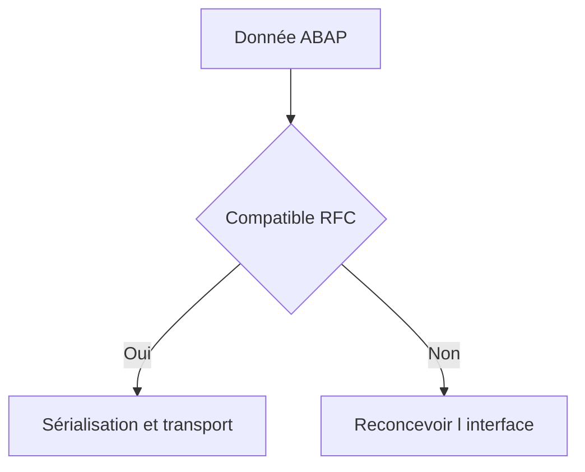

# MODULES FONCTION DISTANTS ET CONTRAINTES

## RÉSULTAT ATTENDU

- Marquer un module comme RFC
- Concevoir une interface transportable
- Comprendre les restrictions d’exécution
- Séparer erreurs métier et erreurs techniques

## ACTIVATION RFC

Dans les attributs du module fonction, sélectionner le type de traitement **Module distant** ou **Remote-Enabled Module** selon la langue du système.

Cette option génère les éléments nécessaires à l’appel via l’interface RFC.

## INTERFACE

Pour un module RFC :

- utiliser le passage par valeur pour `IMPORTING`, `EXPORTING` et `CHANGING` ;
- choisir des types compatibles RFC ;
- éviter les références d’objet et données non sérialisables ;
- limiter la taille du payload ;
- documenter les formats et longueurs ;
- fournir un résultat d’erreur structuré.

## CONTEXTE D EXÉCUTION

Le module s’exécute dans le système cible avec :

- l’utilisateur de la connexion ;
- son mandant ;
- ses autorisations ;
- les paramètres régionaux applicables ;
- une unité de travail propre au scénario RFC.

Ne pas supposer que `sy-uname`, `sy-mandt` ou la langue correspondent au système appelant.

## INTERDICTIONS ET RESTRICTIONS

La documentation RFC impose des restrictions supplémentaires, notamment sur les instructions qui ferment ou modifient le contexte de traitement. Vérifier la version cible avant d’utiliser :

- traitements de dialogue ;
- changements de mode interne ;
- opérations transactionnelles internes ;
- appels récursifs ou callbacks ;
- types non pris en charge.

## ERREURS

Séparer :

- erreur métier : donnée invalide, objet absent, règle non respectée ;
- erreur système : dump distant, indisponibilité ;
- erreur de communication : réseau, connexion, timeout ;
- erreur d’autorisation : utilisateur RFC insuffisamment autorisé.

## STABILITÉ

Une interface RFC peut avoir des consommateurs invisibles depuis le système fournisseur. Toute modification doit être gouvernée comme une modification d’API distribuée.

## PROCESS

### Étape 1 — Activer RFC uniquement si nécessaire

Ouvrir les attributs du module et cocher l’accès distant seulement si un consommateur hors du système est prévu. Un module RFC devient une surface d’interface et de sécurité à maintenir.

### Étape 2 — Vérifier les types

Contrôler chaque paramètre avec les restrictions RFC de la release. Utiliser des types DDIC stables et éviter références d’objet ou types locaux impossibles à sérialiser.

### Étape 3 — Éliminer les dépendances de session

Ne dépendre ni de mémoire ABAP, ni d’état global laissé par un appel précédent, ni de paramètres utilisateur non documentés. Fournir toutes les données nécessaires dans l’interface.

### Étape 4 — Appliquer les contrôles dans la cible

Valider les entrées et exécuter les `AUTHORITY-CHECK` métier dans le système où l’action a lieu. L’autorisation d’utiliser la destination ne remplace pas ces contrôles.

### Étape 5 — Tester local et distant

Comparer le test `SE37` local et l’appel via destination, puis provoquer une coupure ou un refus. Le module est validé lorsque les erreurs de communication, système et métier sont distinctes.

## VÉRIFICATION

- Le lecteur peut expliquer la différence entre cette notion et les concepts proches.
- Le choix technique est justifié par un besoin concret, pas uniquement par habitude.
- Les limites liées à la release, aux autorisations et au contexte d’exécution sont identifiées.

## ERREURS FRÉQUENTES

- Appeler un module fonction sans lire sa documentation et ses exceptions.
- Supposer qu’une BAPI effectue automatiquement le commit.

## TERMES DU LEXIQUE

- [Module fonction](<../🧩 00 ├── LEXIQUE SAP ET ABAP/06 ├── PROGRAMMES CLASSES ET OBJETS TECHNIQUES.md#module-fonction>)
- [Function group](<../🧩 00 ├── LEXIQUE SAP ET ABAP/06 ├── PROGRAMMES CLASSES ET OBJETS TECHNIQUES.md#function-group>)
- [RFC](<../🧩 00 ├── LEXIQUE SAP ET ABAP/10 └── ACRONYMES SAP.md#acro-rfc>)
- [BAPI](<../🧩 00 ├── LEXIQUE SAP ET ABAP/10 └── ACRONYMES SAP.md#acro-bapi>)
- [Destination RFC](<../🧩 00 ├── LEXIQUE SAP ET ABAP/07 ├── INTERFACES ET INTEGRATION.md#destination-rfc>)

## RÉFÉRENCES OFFICIELLES SAP

- [RFC Restrictions — ABAP Keyword Documentation](https://help.sap.com/doc/abapdocu_816_index_htm/8.16/en-US/ABENRFC_LIMITATIONS.html)
- [RFC Call Restrictions — SAP Help Portal](https://help.sap.com/docs/ABAP_PLATFORM_NEW/753088fc00704d0a80e7fbd6803c8adb/4889340284b84e6fe10000000a421937.html)
- [RFC Interface — SAP Help Portal](https://help.sap.com/docs/ABAP_PLATFORM_NEW/753088fc00704d0a80e7fbd6803c8adb/4889653184b84e6fe10000000a421937.html)

---

[Chapitre suivant — DESTINATIONS RFC AVEC SM59](<./14 ├── DESTINATIONS RFC AVEC SM59.md>)
